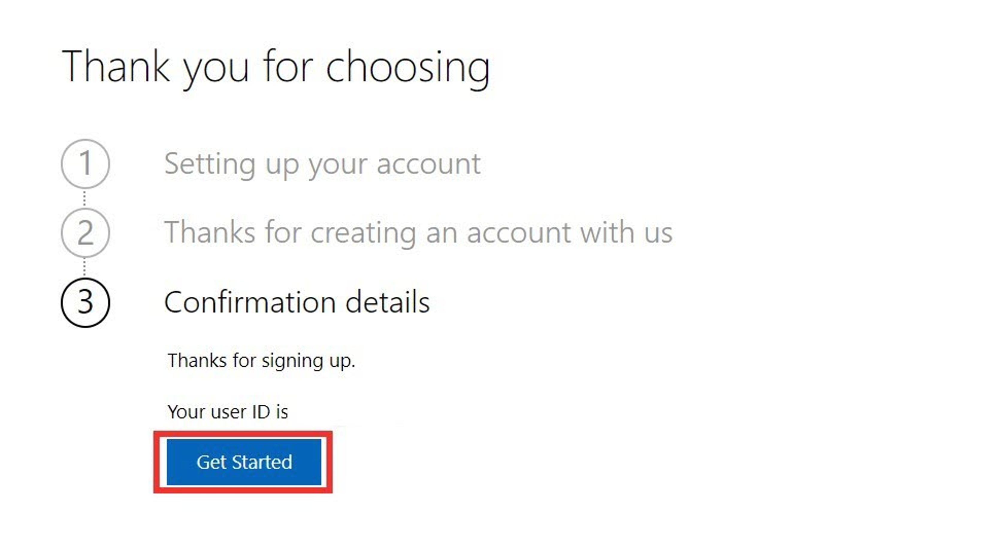
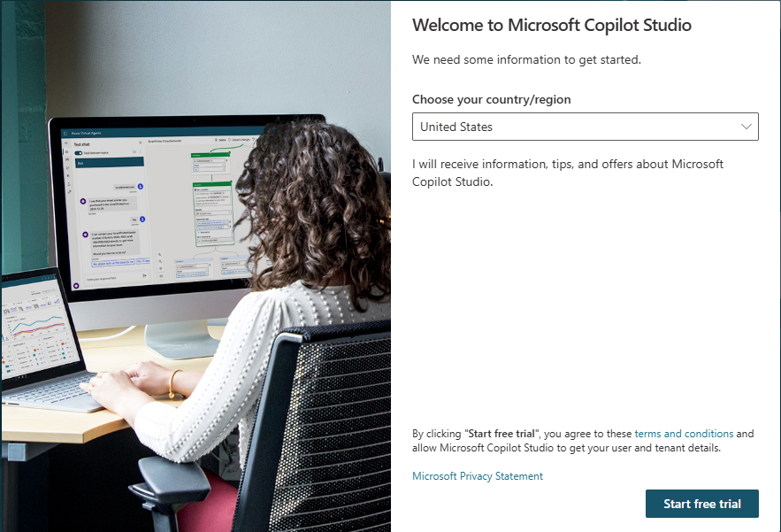
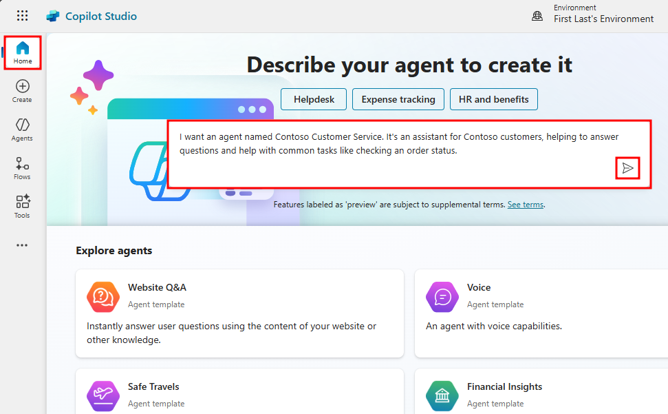
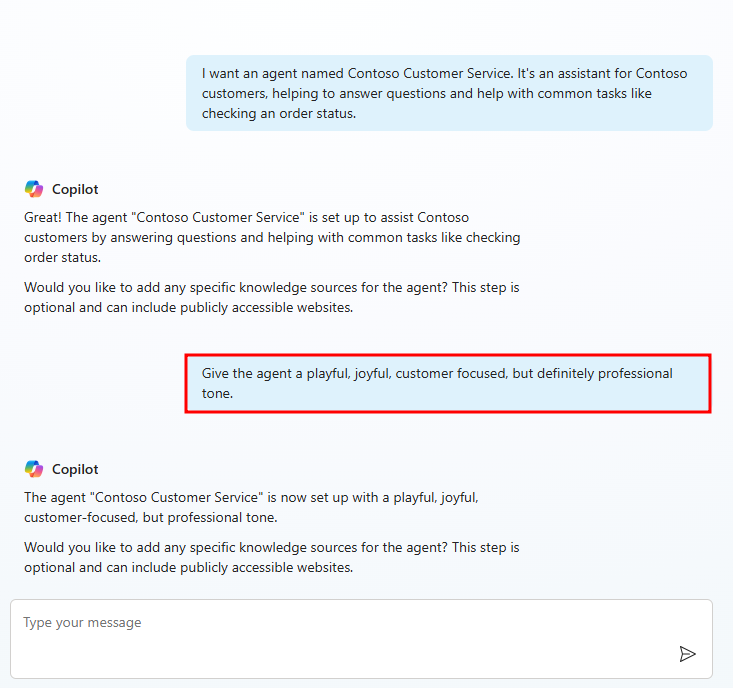
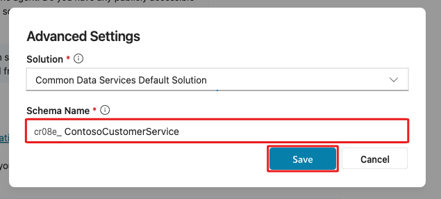
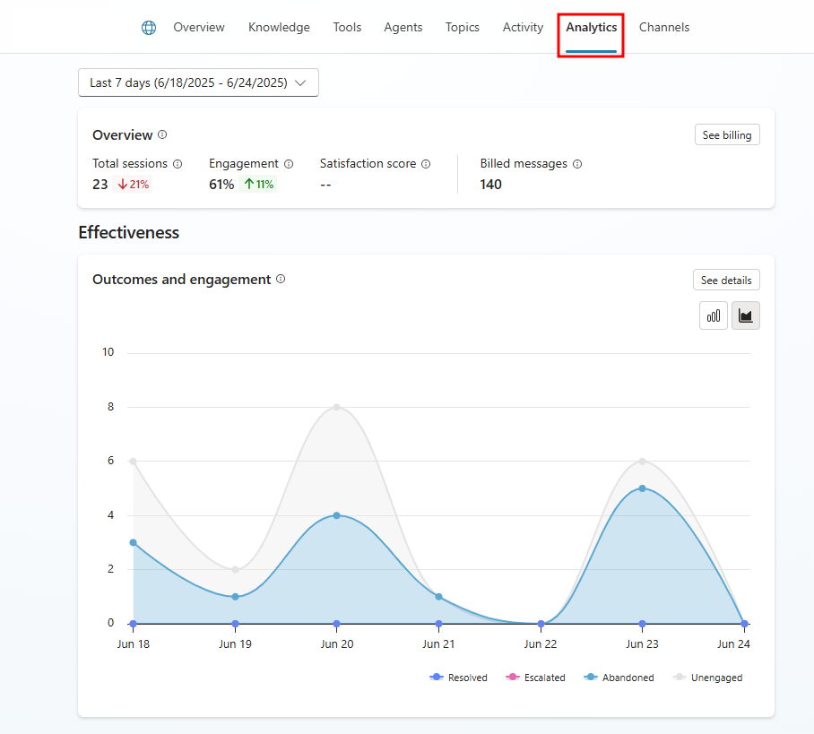

# Get started with Generative AI - agent creation

You'll likely be excited to get started with building an agent using Microsoft Copilot Studio. This first lab, Planning your first agent, helps you see what can be achieved with Generative AI in Copilot Studio before you choose which topics to author.

## Section 1: Sign in to create an agent

1. Go to https://copilotstudio.microsoft.com/ and sign in with your work, school, or developer account.

   Note: Your account might already be set up. If the following screens don't appear, skip to step 7.

2. Select Next.

   

3. Select Get started.

   

4. Select Get started under Confirmation details.

   

5. Select your country/region and then select Start free trial.

   

   Important: Skip to here if your account was already set up.

6. You should be redirected to `copilotstudio.microsoft.com`. If not, go to the maker environment URL for Microsoft Copilot Studio: `copilotstudio.microsoft.com`. An Environment selector is in the upper-right corner.

   

7. If you're working with an instructor, confirm which environment to use.

8. If you're using your own environment, you can use the default environment or have an admin create one at `admin.powerplatform.com`. See [Manage default environment](https://learn.microsoft.com/en-us/power-platform/guidance/adoption/manage-default-environment/).

## Section 2: Create an agent

1. From the Microsoft Copilot Studio Home page, describe your agent to create it. Example description:

   ```
   I want an agent named Contoso Customer Service. It's an assistant for Contoso customers, helping to answer questions and help with common tasks like checking an order status.
   ```

  
2. You'll be redirected to an optional conversational experience to further customize your agent. Provide more details and choose a tone of voice.

3. Start by adding a tone of voice. Prompt:

   ```
   Give the agent a playful, joyful, customer focused, but definitely professional tone.
   ```

   

4. Next, you'll be asked to provide sources for important information. We'll be using publicly accessible websites. Type and enter the following:

   ```
   Information should come from https://learn.microsoft.com/en-us/microsoft-copilot-studio/ and from https://www.microsoft.com/en-us/microsoft-copilot/
   ```

5. You'll also be asked for topics or tasks the agent shouldn’t help with or talk about. Type and enter the following:

   ```
   We don't want to discuss other brands like Fabrikam. Never provide product comparisons with competitor technologies.
   ```

6. In the right side of the window, you'll see a summary pane that displays all the parameters and information you provided to the agent.

   

7. Next, above the summary pane, select the ellipses (...) and select Edit advanced settings.

   

8. In the Advanced Settings window, change the Schema Name from the default agent, to `ContosoCustomerService`.

   

9. Finally, select Create in the top-right corner to finalize your adjustments.

   Notes:
   - After you've selected Create, the process of creating the first agent within a new environment can take up to 15 minutes. Subsequent agents are created much faster.
   - After creating the agent, a pop-up window may appear showing new features in Copilot Studio. To continue past this, click Next three times and Done at the end.

10. After a few minutes, you'll be redirected to your agent's Overview page.

    

Tip: If you've created an agent in this environment before, to create another, select Agents in the navigation bar and then New Agent.

11. Within the Agents menu, you can select from the agents that are available to you. Selecting the ellipses next to an agent brings up a drop-down with controls like open the agent, export the agent, and delete. You can also select the name of the agent, which opens it.

    

## Section 3: Take a quick tour of the user interface

Microsoft Copilot Studio makes it easier for you to build basic to advanced agents. The following section reviews the main pages of the maker experience for Microsoft Copilot Studio.

Because the Agents area was explained in the preceding section, the ensuing section will cover the main options that are available after you select an agent.

   

- Overview - Displays your home page, including a summary of the agent's Details, Knowledge, Topics, Actions, and Publish status.

- Knowledge - Where you can provide a knowledge base as grounding data for your agent that enables it to pull information from specific data you provide.

- Topics - Provides a list of all the Topics available to your agent. These Topics are conversation paths you develop to determine how your agent responds to specific scenarios.

- Tools - Where you can add Tools that your agent can use. Tools are similar to Power Automate actions, which give your agent access to real-world tools like updating a Dataverse table or sending an email.

- Analytics - Provides view metrics to monitor how well your agent is operating. The various Analytics sections include: Overview, Effectiveness, Usage, and Satisfaction.

- Channels - Allows you to publish and connect your agent with various websites, web-services, and integrations into your own website.

## Section 4: Take a tour of Analytics

Microsoft Copilot Studio makes it easy to analyze the results of your agent's sessions with users. To view the analytics of your selected agent, select Analytics from the top navigation bar of your agent's home page.

When you first explore the Analytics section, you'll be taken to a summary page. This page displays key performance indicators (KPIs) from your agent's session logs. These KPIs are split into different sections that provide a snapshot of indicator domains. The different sections include:

- Overview - Key data and trends for the agent. The KPIs in this section include:

  - Total sessions - A session starts when a conversation starts, and each time the user changes the subject. The total includes engaged and unengaged sessions.
  - Engagement - The percentage of sessions where the user replied to your agent at least once. High engagement is good news.
  - Satisfaction score - The satisfaction score is based on user survey responses.
  - Billed messages - The number of messages during the selected period that you'll be billed for. It takes a while for this data to update, so this number might not reflect all billed messages.

- Effectiveness - Effectiveness of the agent in solving user issues. This section includes an outcomes and engagement chart that displays how many users chatted with your agent, and whether it was able to answer their questions. The outcomes and engagement chart displays the following tracked outcomes:

  - Resolved - A session ends and is considered resolved when the End of Conversation topic is triggered and the user confirms that the interaction was a success or lets the session time out.
  - Escalated - A session ends and is considered escalated when the Escalate topic is triggered or a Transfer to agent node is run (the current analytics session ends, whether the conversation transfers to a live agent or not).
  - Abandoned - A session ends and is considered abandoned when an engaged session times out after 36 minutes and didn't reach a resolved or escalated state.
  - Unengaged - A session starts when a user interacts with your agent or the agent sends a proactive message to the user. The session begins in an unengaged state.

  

Note: The following screenshots display the analytics data from a sample agent. When you first create an agent, there's no session history to pull data from. To review analytics for your agent, you'll need to first publish the agent to a channel, and have end-users interact with it.

- Usage - Agent usage and answer quality. This section includes the following KPIs:

   - Answered questions - Total number of questions that were answered by your agent.
   - Unanswered questions - Total number of questions that weren't answered by your agent.
   - Answer rate and quality - Your agent's performance in answering user questions. This includes the percentage of questions answered and the quality of AI-generated answers. The answer quality chart is split between two answer quality indicators: Good and Poor.
      - Good - A good answer quality indicates the answer is complete, relevant, and based on the agent's knowledge sources.
      - Poor - A poor answer quality indicates the answer was incomplete, irrelevant, or an available knowledge source wasn't used to answer the user's query.

   

- Satisfaction - Customer satisfaction with the agent. This section includes two tracked subsections:

   - Reactions - Users can react to agent messages. The tally of positive and negative reactions appears here.
   - Survey results - The satisfaction score is based on user surveys.


## Section 5: Take a tour of Settings

- The settings panel, which you can navigate to by selecting the Settings button in the top-right of Copilot Studio, contains all the settings available to an agent. Settings allowing you to quickly make security changes, add skills, or set the agent's orchestration mode.


- Generative AI – Where you can configure the orchestration mode of your agent and advanced Generative AI features like deep reasoning, multi-agent orchestration, response models, moderation settings, knowledge grounding, file processing, and tenant graph grounding.

- Agent details – Where you can update the agent display name, icon, and view its attached solution.

- Security – Where you can share your agent with other users (to coauthor it) or with security groups (to use it). This is also where you configure end-user authentication settings (the type of authentication and whether it's enforced or not), and web channel security that allows you to further secure the Direct Line channel that is used for any web or custom application deployment.

- Entities – Copilot Studio comes with many prebuilt entities to help identify key information in a user utterance (e.g. a city, date, number, etc.). This menu is also where you can define your own closed-list entities or regular expression entities.

- Skills – Where you can extend your agent using skills. If you have already built and deployed bots in your organization (using pro-code tools, including the Microsoft 365 Agents SDK) for specific scenarios, you can convert such a bot to a skill and embed the skill within a Microsoft Copilot Studio agent.

- Languages – Where you can configure additional languages your agent can be used in and localized into.

- Language understanding – Where you can configure custom language models developed and trained on Azure AI Language, in Azure Conversational Language Understanding (CLU). When configured, this effectively replaces the out-of-the-box natural language understanding model (NLU) for intent detection, and can also replace entity detection and extraction.

## Next unit: Funamental knowledge - Natural Language Understanding with Microsoft Copilot Studio
[Continue to Funamental knowledge - Natural Language Understanding with Microsoft Copilot Studio →](4-add-knowledge.md)

