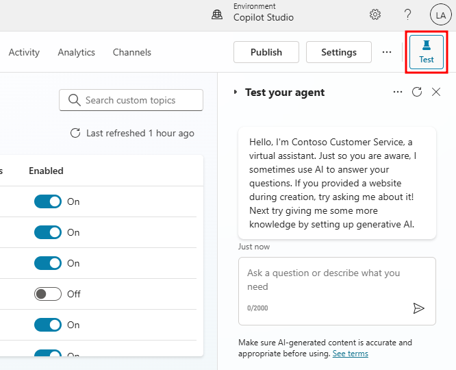

# 1. Exercise - Try out a conversation in the Test agent pane

In this next exercise, you'll try out your agent by using one of the prebuilt topics that are included when you create a new agent.

To show the Test your agent pane, select the **Test** button from the top navigation bar.

The Test your agent pane shows that a message has already been sent to you from the agent. This message was sent from the Conversation Start topic and is presented at the start of every new conversation. At the bottom of the Test your agent pane, enter **Hello** and then select the Send button or press enter.

The agent offers a greeting in the Test your agent pane that is preconfigured from the Greeting topic. You will also see an activity map from the current conversation. Activity maps are like a high-level view of what topics, knowledge, and tools your agent has used throughout the current conversation. Since the Greeting topic is triggered from your previous message, it will show up as the active item in the activity map.

In the Test your agent pane, send **Goodbye** as a message and then select the Send button. One of the prebuilt topics (Goodbye) will be triggered by the agent, asking if you'd like to end the conversation.

In the test window, notice you're given options to choose from that were pre-configured in the Goodbye topic. Select the **No** button under the Would you like to end our conversation message. The agent responds with specific information based on your selection. Notice how the activity map responds to your inputs in the test pane.

Now that you've reviewed a few prebuilt topics, you can move on to the next exercise to create a new topic.

## Next Section

[Continue to Exercise 2: Create your first topic →](2-exercise-create-first-topic.md)
