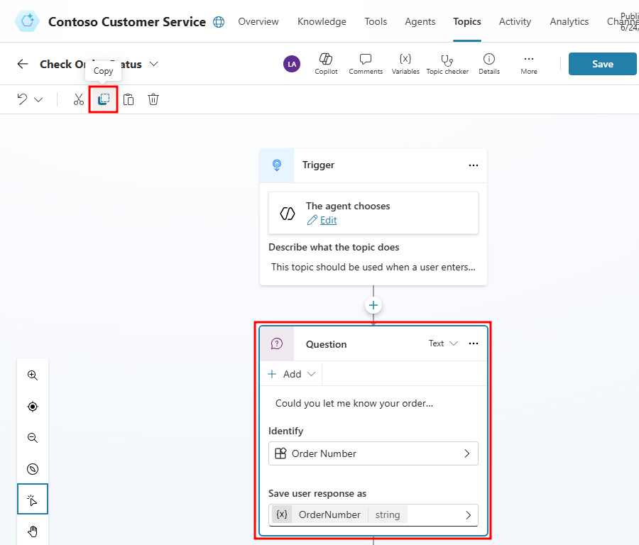
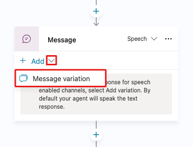
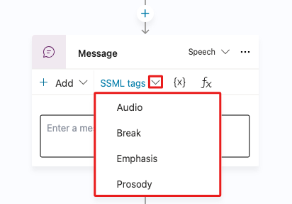

# 10. Code view and Power Fx

**Completed**  
**100 XP**  
**5 minutes**

Now that you're more familiar with the authoring fundamentals in Microsoft Copilot Studio, you can explore some extended capabilities that you can use to set up and further customize the agent experience. The following sections cover two capabilities: code view for pro developers and Power Fx (for Microsoft Power Platform makers and professional developers).

Microsoft Copilot Studio now has the capability to view the code behind a topic. This capability is incredibly useful for pro-code developers, where they can view and edit the syntax directly within the web browser, and when saved, the syntax is immediately visible in the graphical authoring canvas. As a result, the process of creating topics is faster and easier, empowering developers to extend beyond the authoring canvas if necessary.

## Section 1: Access the code editor

Follow these steps to access the code editor.

Open the topic that you've been working with in this lab titled Check Order Status.

In the upper right of the topic, next to the Save icon, select the extended (...) menu and then select Open code editor, as shown in the following screenshot.



The code editor should open, where you can view your dialog in the code view (YAML code).


Select Close code editor in the upper right after exploring this feature.

## Section 2: Use Power Fx across Microsoft Copilot Studio unified authoring

Power Fx is now available in Microsoft Copilot Studio. With Power Fx, you can add functions, similar to how makers currently do in canvas apps from Microsoft Power Apps, within the Microsoft Copilot Studio authoring canvas. You can use Power FX in Message and Question nodes, when you're using the variable node, and in other areas such as Question behavior and Adaptive cards. This feature gives you greater control over the data that's displayed to customers and users within the conversational interface. Additionally, it allows you to perform common operations at runtime.

The following task goes through a basic scenario of using Power Fx within a variable and then displaying the value to the user.

## Section 3: Use Power Fx to modify how the date is displayed

Follow these steps to use Power Fx to modify how the date is displayed.

Open the Check Order Status topic that you've been working with during these labs.

Add a new Set a variable value node after your first Message node in the topic, then select the Set variable box and Create a new variable.



Selecting the new variable opens the Variable properties window to the right. Change the name of the variable to EstDeliveryDateCurrent.



On the Set variable value node, under To Value, select the flyout menu and then select Formula to open the Enter formula panel, then select the expand icon.

Set variable formula bar with the expansion icon highlighted.

In the formula bar, enter the following function and then select Insert:

```powerfx
Text(
	DateAdd(
		Now(),
		2,
		TimeUnit.Days
	),
	DateTimeFormat.LongDate
)
```


This function takes today's date and time, which technically has a specific date and time format (for example, 5/31/2024 8:00 AM), adds 2 days to it, and then formats it in a long date format (for example, Friday, May 31, 2024). This approach is important if you want to display simple date formats that are user-friendly or if you want to store the date as a string in text format.

For demo purposes, you can update the last Message in the Update path, to use the new variables you have configured. Add the following line to the Update path's message:

Your order {Topic.OrderNumber} should be delivered by {Topic.EstDeliveryDateCurrent}.

Check path's message with the delivery date and order number

Save the topic.

Now, test your agent by opening the testing pane and enter the Order status prompt.

Next, after the agent asks for your order number, respond with: Can I get an update on order ORD-001342?

Testing the Check message process

> **Note**: Since we provided both values for Topic.OrderNumber (ORD-001342) AND Global.CustomerAction (update), the agent uses slot-filling to navigate through the conversation path without asking for information you already provided.

Congratulations, you've successfully worked through all labs on the central authoring features in Microsoft Copilot Studio unified authoring.

## Next Section

[Continue to Check your knowledge →](11-check-your-knowledge.md)
