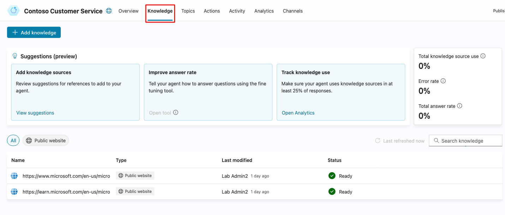
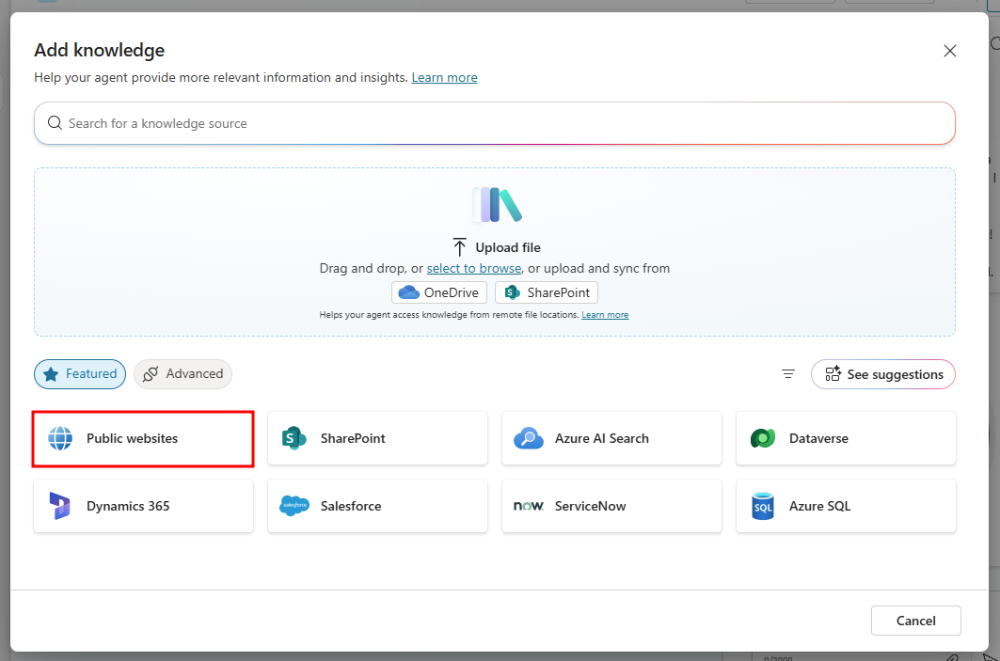
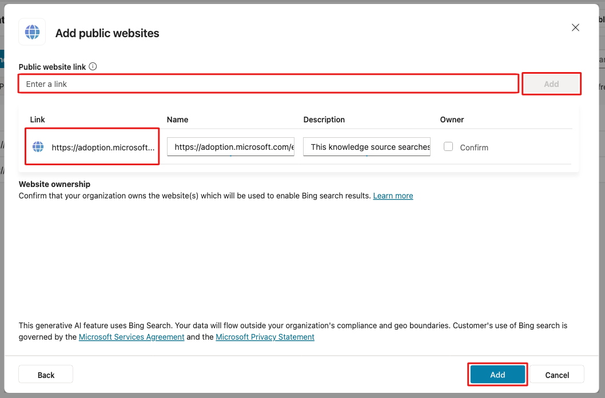
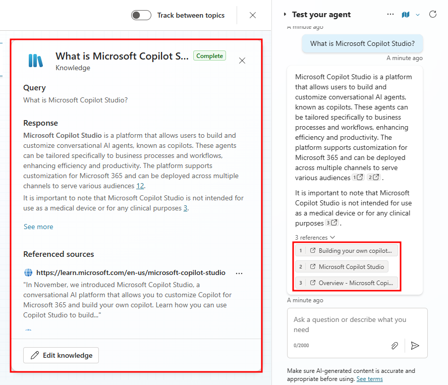
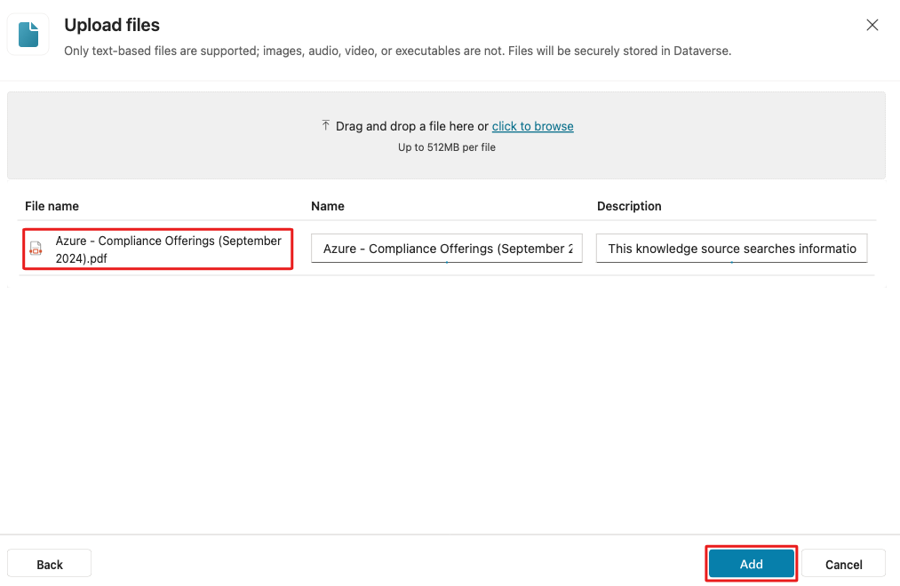
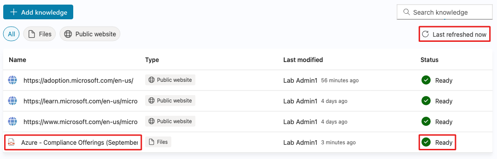
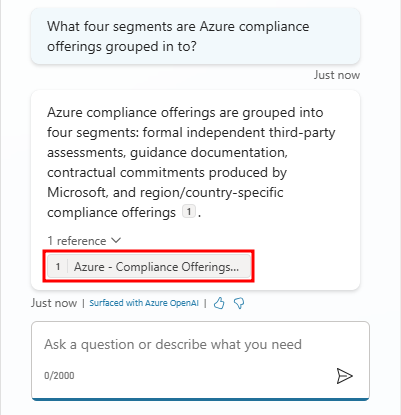

# Add knowledge sources

## Knowledge sources
Knowledge in Microsoft Copilot Studio allows you to add enterprise data from Power Platform, Dynamics 365 data, and external systems, so your agents provide relevant information and insights for your end users. In addition, knowledge can be incorporated with [Generative answers](https://learn.microsoft.com/en-us/microsoft-copilot-studio/nlu-boost-conversations) in agents. Published agents that contain knowledge use the configured knowledge sources to ground the published agent.

## Supported knowledge sources

When adding knowledge to an agent, Microsoft Copilot Studio offers the following knowledge sources:

#### Public Website

- Source: External
- Description: Searches the query input on Bing, only returns results from provided websites
- No. of inputs supported: 4 public URLS (like microsoft.com)
- Authentication: None

#### Documents

- Source: Internal
- Description: Searches documents uploaded to Dataverse, returns results from the document contents
- No. of inputs supported: Limited by Dataverse file storage allocation
- Authentication: None

#### SharePoint

- Source: Internal
- Description: Connects to a SharePoint URL, uses GraphSearch to return results
- No. of inputs supported: 4 URLs
- Authentication: Agent user's Microsoft Entra ID authentication

#### OneDrive for Business

- Source: Internal
- Description: Connects to a OneDrive URL, uses GraphSearch to return results
- No. of inputs supported: 4 URLs
- Authentication: Agent user's Microsoft Entra ID authentication

#### Dataverse

- Source: Internal
- Description: Connects to the connected Dataverse environment and uses retrieval-augmented generative technique in Dataverse to return results
- No. of inputs supported: Two Dataverse knowledge sources (and up to 15 tables per knowledge source)
- Authentication: Agent user's Microsoft Entra ID authentication

#### Enterprise data via graph connections

- Source: Internal
- Description: Connects to the connected Dataverse environment and uses retrieval-augmented generative technique in Dataverse to return results
No. of inputs supported: Two per custom agent
Authentication: Agent user's Microsoft Entra ID authentication

## Task 1: Configure website knowledge sources
Sign in to Microsoft Copilot Studio and open the Contoso Customer Service agent created in previous modules. If you did not complete the previous modules, create a test agent with generic settings.

When modifying your agent's knowledge sources, you'll need to consider if you want your agent to pull information only from knowledge you provide or a mixture of its own general knowledge along with the provided knowledge.

For the purpose of testing knowledge we provide, we'll turn off the agent's general knowledge in order to experience the agent's responses when only given knowledge you explicitly provided.

1. Start by navigating to the agent's Settings menu.
   
   

2. Scroll down to the Knowledge section. Next to where it says Allow the AI to use its own general knowledge, select the status flag to turn this feature Off.
   
   

   Select Continue after selecting the status flag to finalize turning off general knowledge. The general knowledge field should now have a Disabled flag to the right.

3. Go to the Knowledge tab.
   
   

   If you completed the previous modules in this learning path, you may see existing knowledge sources, such as the following public websites:

   - https://learn.microsoft.com/en-us/microsoft-copilot-studio/
   - https://www.microsoft.com/en-us/microsoft-copilot/

4. Select + Add knowledge, and on the Add knowledge page, choose Public websites.

   
   

5. From the Add public websites window, enter `https://adoption.microsoft.com/en-us/` into the Public website link field, select Add from the right-hand side, then select Add from the bottom of the window.
   
   

6. The website should now be added to the list of knowledge sources as a Public website and is available to your agent.
   
   

   When Generative Orchestration is enabled, the large language model looks at each knowledge source model description to know what data source to use to answer a user query.

7. Now open the Test pane.
8. Ask What is Microsoft Copilot Studio to trigger the knowledge sources we added.
9. Notice that it generates an answer and includes citations to ground its answer on and offers the user the option to navigate to the sources that were used to generate this answer.

   

10. Now ask What knowledge sources does it support? as a follow-up question.

   

Notice that even though the follow-up question didn’t refer to the specific product this question applied to, the generative answers features made sure context was preserved and that the follow-up question was interpreted in context of the previous messages in the conversation.

## Task 2: Configure files as knowledge sources
Start by downloading the Azure - Compliance Offerings. This provides an overview of Microsoft Azure compliance offerings intended to help customers meet their own compliance obligations across regulated industries and markets worldwide. We'll be adding this file to our agent's knowledge sources.

1. First, navigate to the Knowledge tab of your agent and select + Add knowledge
2. Next, drag and drop the Azure - Compliance Offerings PDF from your downloads folder, or select click to browse and add the file from your file browser, then select Add at the bottom of the window.

   

3. Now navigate back to the Knowledge tab of your agent.
4. Wait for the status of the uploaded file to be Ready. Click the refresh button to get an update on the status.

   

5. To test the new knowledge source, open the Test pane.
6. Ask a question that can be answered from the PDF you just uploaded like `Give me a summary of the Azure compliance offerings`
7. Notice how the citation is rendered differently. Since the agent is pulling knowledge from a direct file, it cites the name of the file.

   

## Next unit: Configure generative AI orchestration
[Continue to Configure generative AI orchestration →](3-generative-ai-orchestration.md)
