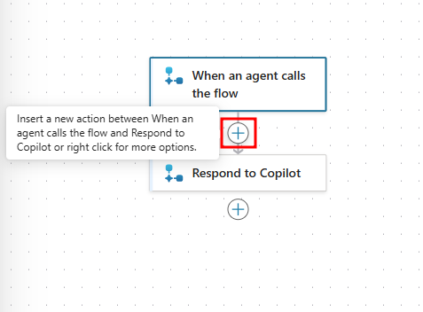
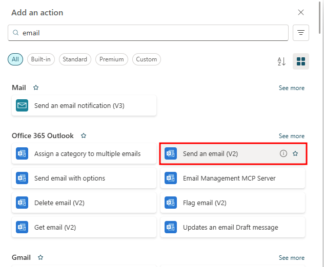
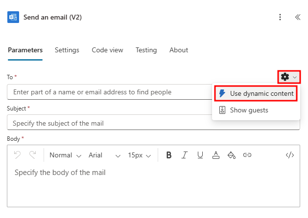
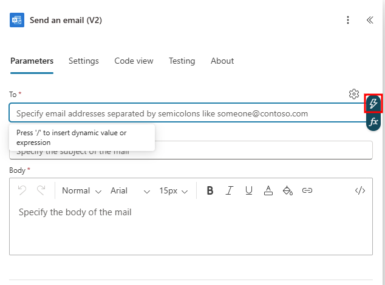
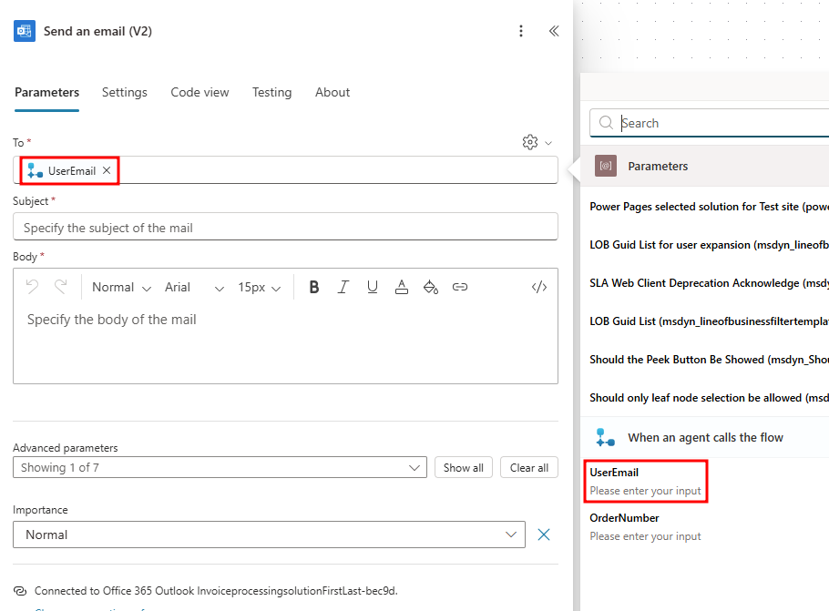
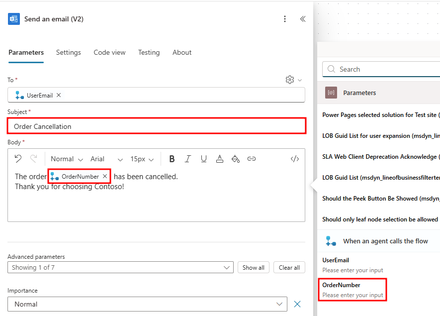

Exercise - Build a basic Power Automate flow in Microsoft Copilot Studio
Completed
100 XP
12 minutes
It’s highly beneficial for companies to connect to their data because they can provide users with up-to-date information and insights that are often relevant for customer or user questions.

In this exercise, you go through the process of adding a flow that sends users a cancellation email after canceling an order.

Section 1: Prepare the cancellation topic
Navigate to the Contoso Support agent you've been working with and open the Topics page from the navigation menu.

Open the Check Order Status topic and select the Variables menu.

Choose OrderNumber, change the Usage from Topic to Global, and Save the topic.

 Tip

Global variables can be used between topics, while Topic variables can only be referenced within a single topic.

Next, navigate to the Order Cancellation topic created in previous exercises.

Add a Question node below the Trigger node, and in the message box, enter: Can you provide me with an email address to send a confirmation email to?

Under Identify, choose the User's entire response option. Next, select the Save your response as variable, and create a new variable named UserEmail.

Next, modify the message node to say: Your order has been cancelled, and a confirmation email has been sent.

Save your topic before the next step.

Now, between the Question and Message nodes, select the + symbol and under Add a tool select New Agent flow. This process will open a new Power Automate flow in a separate tab.

Section 2: Create your Power Automate flow
Next, create your Power Automate flow by following these steps:

Notice the scaffolding that occurs when you create a new Power Automate flow by using Microsoft Copilot Studio. Two nodes are automatically created. The first node is the input that the flow expects from Microsoft Copilot Studio. You don't need to set inputs within this action; however, a common input would be a user utterance or variable, such as the country/region specified in the example. The second node is the output that a maker can return to Microsoft Copilot Studio after the flow retrieves or completes the operations within the automation.

 Note

The following screenshots and instructions may appear different in your environment depending on multiple factors. These factors include the age of your environment and the solution your agent is saved to. All functionality remains the same, but the titles of the input and output actions may be different.

 Important

Make sure that you keep the Microsoft Copilot Studio pre and post actions at the top and bottom of your Power Automate flow to ensure that the data can be passed to and from Power Automate from Microsoft Copilot Studio.

In the new flow window that opens, select the When an agent calls the flow action. Then, select + Add an input in the pane that opens to the left.

Under Choose the type of user input select Text.

Next, change the name of Input to UserEmail.

Select + Add an input and add another Text input. Name this input OrderNumber.

Then, click the + button below the When an agent calls the flow action to add a new action.

Enter Email in the search bar and then select Send an email (V2) under Office 365 Outlook.

If you do not already have a connection set, you will need to create one. Select Sign in within the Send an email (V2) action window.

After setting up your Outlook connection, the Send an email (V2) action window prompts you to input a To address. To use the input variable we created previously, select the Gear icon and choose the Use dynamic content option under the gear menu.

Dynamic content is real-time data, and in this scenario, the UserEmail would be the data passed from Microsoft Copilot Studio that you set up at the beginning of the topic and requested from your user.

Click in the To field and select the Lightning bolt icon to the right to pull up the Dynamic content menu. This will fill the To address with what the user responded with.

In the Dynamic content menu, select UserEmail under When an agent calls the flow.

In the Subject field enter: Order Cancellation.

In the Body, type The order followed by OrderNumber from Dynamic content has been cancelled. Thank you for choosing Contoso!

 Note

Make sure you add a space before and after dynamic content when used in a sentence.

Select Publish in the top-right corner of the flow designer to save the flow. Wait a moment until the green banner appears, indicating success.

After publishing, select the Go back to agent button in the publish success screen to navigate back to your agent.

You completed your work in Power Automate. Next, you'll switch back to Microsoft Copilot Studio.

# Section 3: Connect a Power Automate flow with Microsoft Copilot Studio
In this task, you connect a Power Automate flow with Microsoft Copilot Studio.

You should now be navigated back to your Order Cancellation topic with your new agent flow added between the question node and message node.

In the new Action node that's added, select Enter or select a value and then select the Global.OrderNumber variable for OrderNumber (String), and Topic.UserEmail for UserEmail (String).

Screenshot of mapping the Microsoft Copilot Studio variable to the flow.

To end the conversation, select the Add node button below the Message node. Select Topic management and then choose End conversation.

Screenshot of selecting the End of conversation node.

Save your topic using the button found in the top right corner of the screen.

You might notice an authentication error when saving due to the flow requiring a connection to Outlook. The following steps include testing the conversation flow via the testing pane, which allows you to form this connection directly in the testing pane and fixing the error message.

Screenshot of a Power Automate AAD auth error.

Start the conversation by saying Order status, then when asked for an order number enter ORD-102938. When asked what to do with your order, select Cancel. When asked for an email address, enter an email address you have access to.

The first time the flow you created is called, you will need to add permissions to connect to the email server. Select Connect in the test window to create a connection.

Screenshot of the permission connection conversation.

A new tab will open showing the agent's connections. To the right of the Cancellation Confirmation flow, select Connect under Status.

Screenshot of Cancellation Confirmation flow and connect link highlighted

Make sure there is a checkmark next to the Office 365 Outlook connection in the Create or pick connections window, and select Submit.

Screenshot of Office 365 Outlook connection.

Now with the connection set, go back to the agent test pane and select Retry.

Screenshot with retry highlighted.

After selecting Retry, the email flow will run and send you a confirmation email with the order number.

Screenshot of Order Cancellation email.

You successfully created a Power Automate flow in Microsoft Copilot Studio that uses user-submitted data to populate a confirmation email.

Next unit: Build an HTTP request node query
