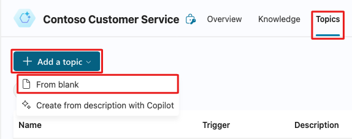
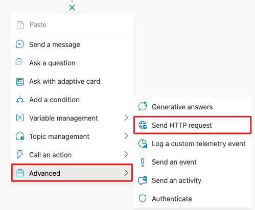
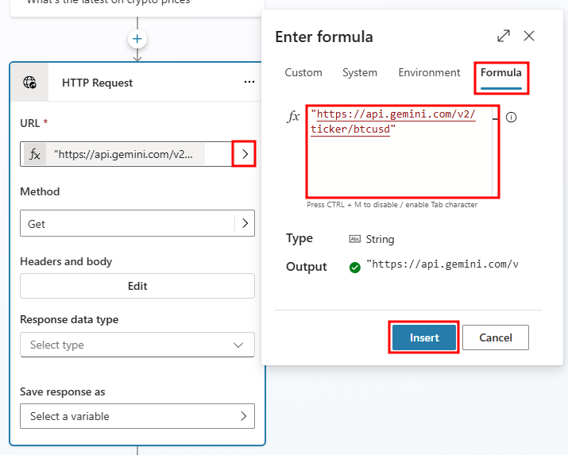
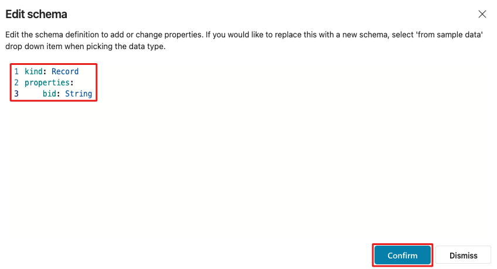
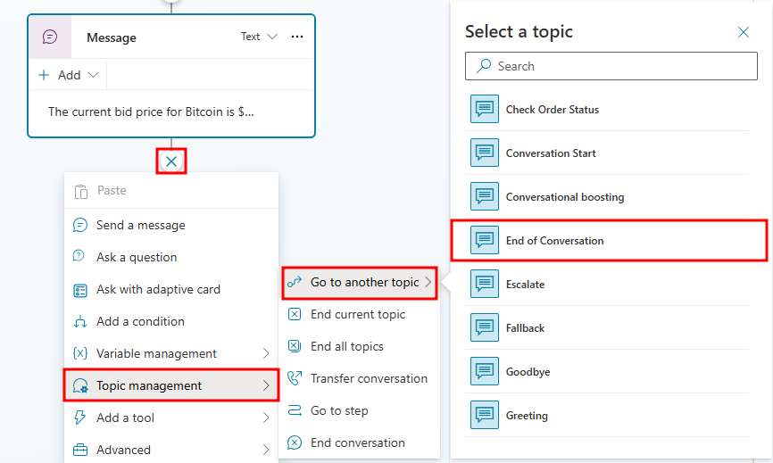

# Build an HTTP request node query

## (Optional) Build an HTTP request node query
Connecting to data provides companies with some of the most benefits as it provides information and insight to users that is up to date and often the relevant for customer or user questions.

In this exercise, you will go through creating a new topic, adding a simple HTTP Request node to retrieve information from an external service, and display that data back to the user.

## Task 1: Create a new topic
1. Log in to Copilot Studio and open the Contoso support agent we created in previous labs.
2. Go to the **Topics** tab of the navigation menu.
3. Select **Add a topic** and select the **From blank** option. Name the topic `Crypto Currency Price`.

    

4. Add the following **topic description** to the **Trigger** node: `This topic should trigger when a user asks about cryptocurrencies or Bitcoin.`

5. Add a Send **HTTP request** node, from the **Advanced** tab, below the **Trigger** node.

    

6. Now we need to provide a link for the API to retrieve the information we need.

7. To do this, select the **URL** fly-out menu, then select **Formula** and paste the following URL into the **Formula** field: `https://api.gemini.com/v2/ticker/btcusd` and select **Insert**.

    

8. Next, we need to tell the node what data type the API call will return. Change the **Response data type** field to **Record**.

    

    Note:

    When setting a response data type of Record, 
    we need to give the node a Schema so that it can correlate the data types of individual variables.

9. Select **Edit schema** and clear what's already filled in. Paste the following schema into the **Edit schema** window and hit **Confirm**.

    ```
    kind: Record
    properties:
        bid: String
    ```

    

    Note:

    The following schema has been kept simple for the purposes of this lab. Typically, a schema for this request would have multiple properties and can be generated from a sample JSON payload.

10. Now we need to create a variable to store the results from the API request.

11. Select the field under **Save response as**, then choose **Create a new variable**. Name the variable `CurrentCryptoPrice`.

    

12. Now add a message node that gives users a formatted response with the current price of Bitcoin.

13. Click the + symbol below the **HTTP Request** node and select **Send a message**.

14. In the newly created message node, add the following message: `The current bid price for Bitcoin is ${Topic.CurrentCryptoPrice.bid}.`

    

15. To end the conversation, add a Go to another topic node under Topic Management and select End of Conversation.

    

16. Save the topic.

17. Now open the Test pane and test your agent with the following phrase: `What's the current price of Bitcoin?`

    


#

### Next unit: Add a tool
[Continue to Add a tool →](5-add-tool.md)
