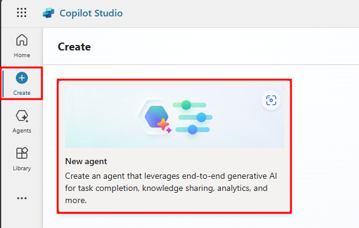
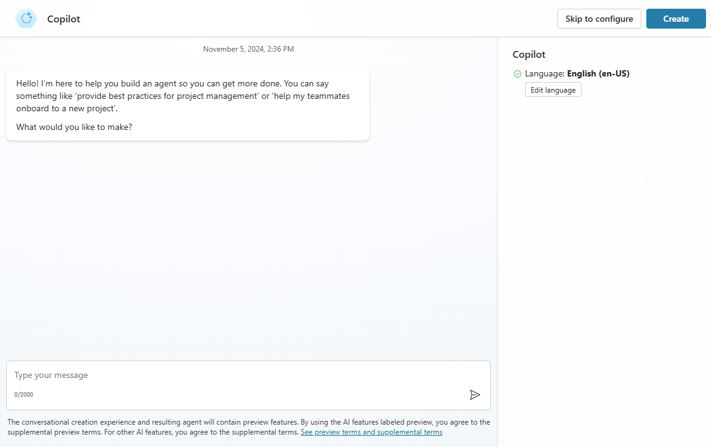
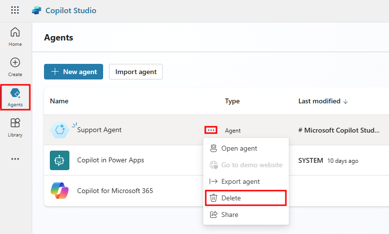
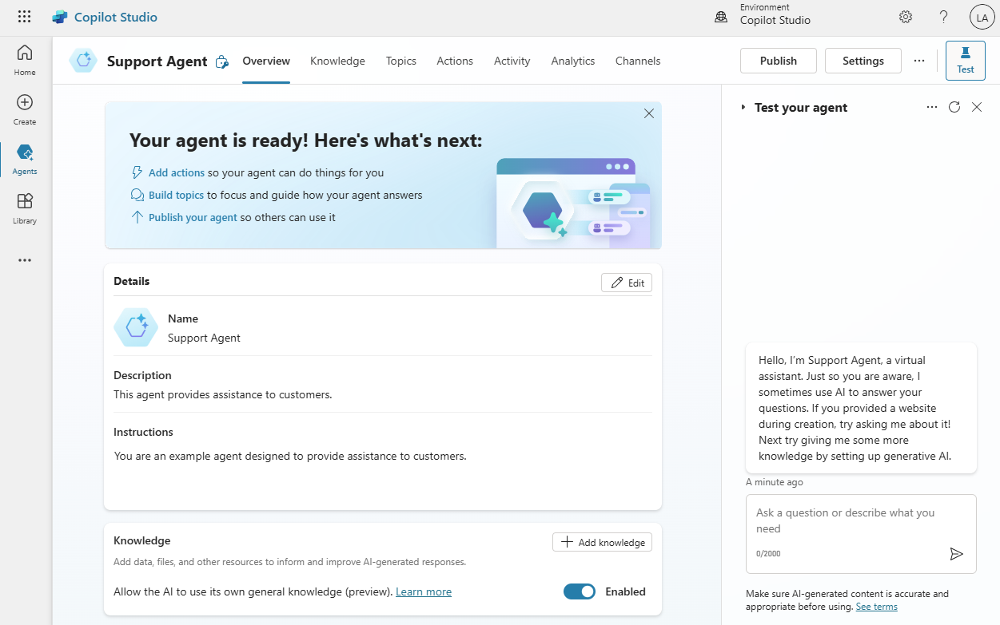

# Create agents and work with the Microsoft Copilot Studio interface
5 minutes

Before you start creating an agent, it's important to consider what it will be used for. For example, you might use it to manage account inquiries, or you could use it for self-service support cases such as knowledge base access. Knowing how you plan to use the agent helps you define and plot out conversation paths and determine how many topics the agent handles. Other functions that you could consider include using it to look up basic account details, perform more advanced account operations, or implement some type of action. The more scenarios that you initially consider, the easier it's to determine the topics that your agent needs for you to facilitate it.

Agents can be created in one of two ways. You can use the chat interface to describe what functionality you want the agent to have. The other way it to leverage one of the several built templates. Either way provides a quick and simple way to build a basic agent that you can tailor to your specific needs.

If you want to build an agent from scratch, you can navigate to the + Create tab from the Microsoft Copilot Studio left navigation bar.

Agents are created for each environment. By default, all agents are created in the default Power Apps environment for your organization or tenant, unless otherwise specified. You can choose which environment that you want to use by selecting the Environments drop down to see a list of available environments.

In the New agent conversational creation experience, you have the ability to build your agent by describing, with natural language, what you want in an agent. Users also have the ability to skip the conversational building process and go straight to manually configuring the agent by selecting Skip to configure. Selecting Create begins the agent-building process, which can take up to 15 minutes for the first agent that you create in an environment. You can also use generated answers in your agent, by selecting a website to attach to.

Delete an agent
Agents that are no longer needed can be removed from your environment. This situation might occur when the agent is being replaced with a different agent, or if the agent no longer fits the needs of your organization. Using the agent's menu, select agent that you want to delete. Select the Delete button on the command bar to delete the agent.

Work with the Microsoft Copilot Studio user interface
The Microsoft Copilot Studio user interface provides you with all the tools necessary to create, test, publish, and monitor the performance of your agent. When the application is loaded after the agent is created, you see multiple areas that can help you throughout the process of working with your agent.

The following image shows an example of what the user interface looks like.

The following list describes the Microsoft Copilot Studio user interface features:

Create – Allows you to create an agent from scratch or from a template.

Agents – Provides you with access to the main agents page where all your agents are displayed.

Library – Provides access to available connectors and component collections.

Overview – Provides access to the home screen of the current agent that you're working with.

Knowledge – Allows you to provide knowledge sources to your agent.

Topics – Provides access to the different topics actions that are available for the agent.

Actions – Allows you to create and import Conversational and AI Plugins that can be used in your agent.

Activity – Displays the agent's Generative AI activity, including calls to the Azure OpenAI GPT service.

Analytics – Provides analytical details that are related to the performance and usage of the agent.

Channels – Provides tools for publishing your agent and deploying it to different channels.

Settings – Toolset that helps with management items such as which channels your agent is deployed to, agent authentication, and skills management.

Test your agent panel – Lets you test your agent as an end user to ensure that it's performing as expected.