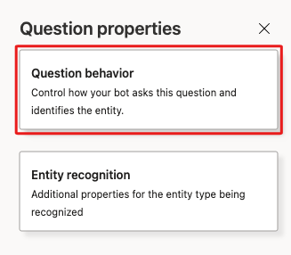
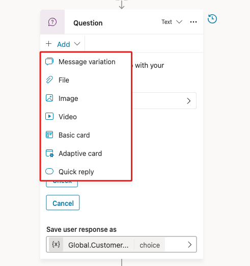
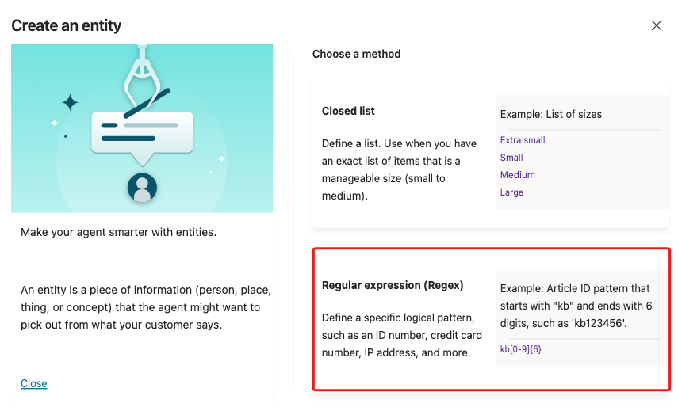

# 6. Rich text options for message and question nodes

Microsoft Copilot Studio includes several extended capabilities for creating agents that help provide positive conversational experiences for customers. One central feature is the rich text authoring capabilities that are available for the Message and Question nodes.

The types of rich text authoring options that are available include:

- **File** - Allows uploading file content to be served to the user through a node. These files can be accessed through environmental or agent variables.
- **Image** - You can add an image, which is displayed on the card. Add the URL of the image and a title (optional).
- **Video** - You can add a video URL, which needs to be a publicly available MP4 or a YouTube video URL.
- **Basic card** - This option includes simple cards that provide adaptive cards, such as visuals; however, this option requires standard input such as the title, messages, and the ability to add buttons with basic actions.
- **Adaptive card** - You can add adaptive cards, which are platform-agnostic cards that are designed to be flexible to suit the needs at the time, including requesting action, displaying information so that it's displayed with emphasis on specific information, or more. Microsoft Copilot Studio supports Adaptive Cards v.1.3 at the time when these labs were written.
- **Quick reply** - This option allows users to select from specific options rather than needing to enter the response in text-based scenarios. Quick replies are optional, so a user can still type or speak their own response. You should use these replies to provide common suggestions or to help give the user ideas about the type of information that's being asked.

Message variations are covered in the next task. Now, you set up a few of these options so that you can become familiar with their behavior.

## Task: Use rich text capabilities in a message node

In this task, you learn how to use rich text capabilities in a message node.

First, go to Topics tab, select the System tab, then open the Conversation Start topic.

In the existing Message node, select + Add, and then choose Image. Select the image block that appears, as shown in the following screenshot. The Title and Image text boxes display. You need to enter the Image URL to a publicly available image. Optionally, you can also add a name for the image by using the Title field.

Enter into the Image URL field the following link: https://learn.microsoft.com/training/achievements/build-effective-bots.svg

Finally, Save the Conversation Start topic.

Next, navigate to the Check Order Status topic.

Add a Question node below the trigger node with the following question: Could you let me know your order number?

Then, select the Identify property and choose Create an Entity.

From the Create an entity window, choose Regular expression (Regex).

Create entity dialog.

In the Regex window, enter Order Number into the Name field, then put the following pattern ORD-[0-9]{6} and select Save.

Regular expression window filled out.

Select the Save user response as variable menu in the new Question node, and in the variable properties panel to the right, change the variable name to OrderNumber.

From the Add dropdown within the Question node, select Quick reply. A Quick replies box appears within the Question node. Enter at least two options to your question, as shown in the following screenshot. Options begin to appear on the right side of the screen for those quick replies so that you can set up the associated message behavior, such as send a message text or open a URL, text, and title.

> **Important**: When adding Quick replies to a question node that identifies entity data and the quick replies don't provide a value for the stored variable, the conversation redirects to the Escalate topic. The Escalate topic is beyond the scope of this course, but is used primarily to hand off the conversation to a live agent.

To keep the topic flowing smoothly without redirecting to the Escalate topic, remove the Quick replies that were added in the previous step by selecting the X next to each quick reply.

Next steps: Take some time to repeat this process with the following different rich response types to become familiar with the different properties before you move on to the next task. For more information, see Send a message.

- Image
- Video
- Basic card
- Adaptive card
- Quick reply

## Next Section

[Continue to Exercise 7: Message variations →](7-exercise-message-variations.md)
