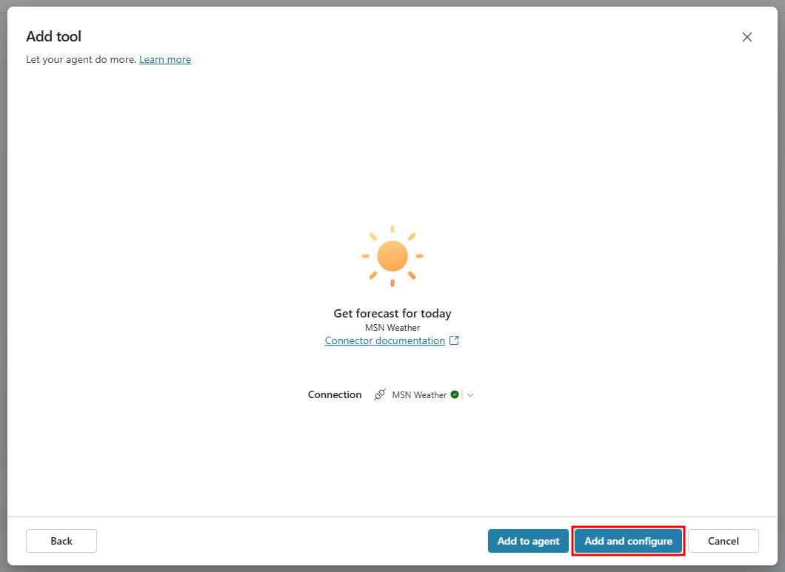
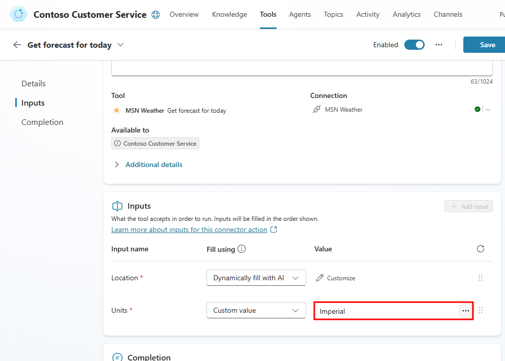
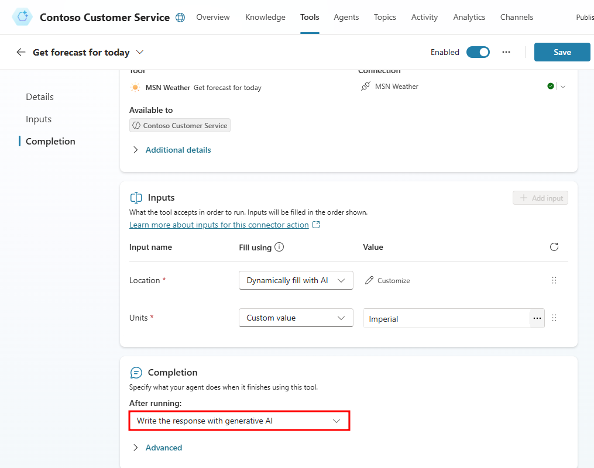
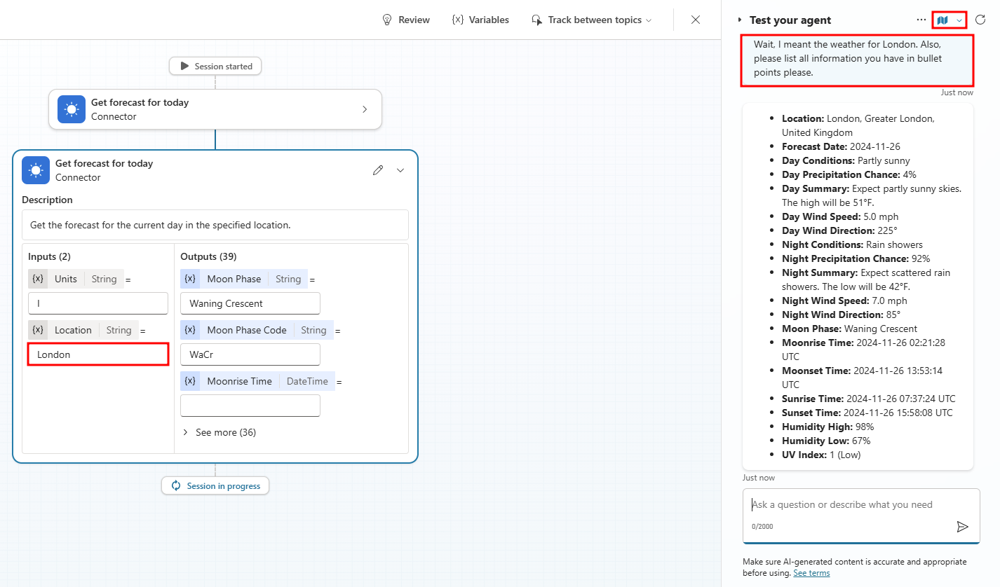
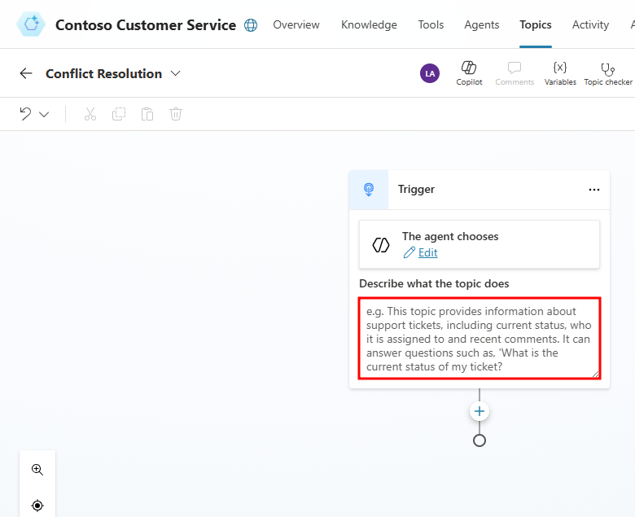
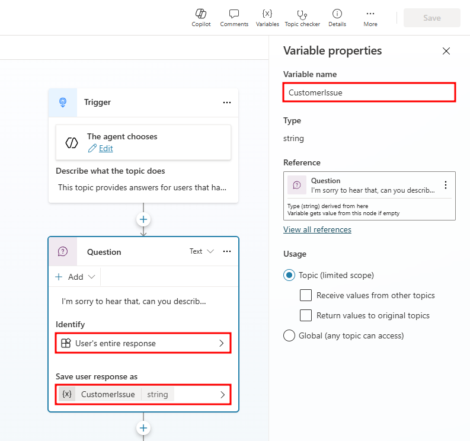
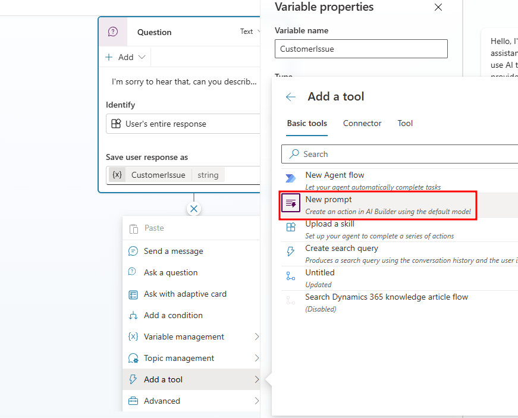
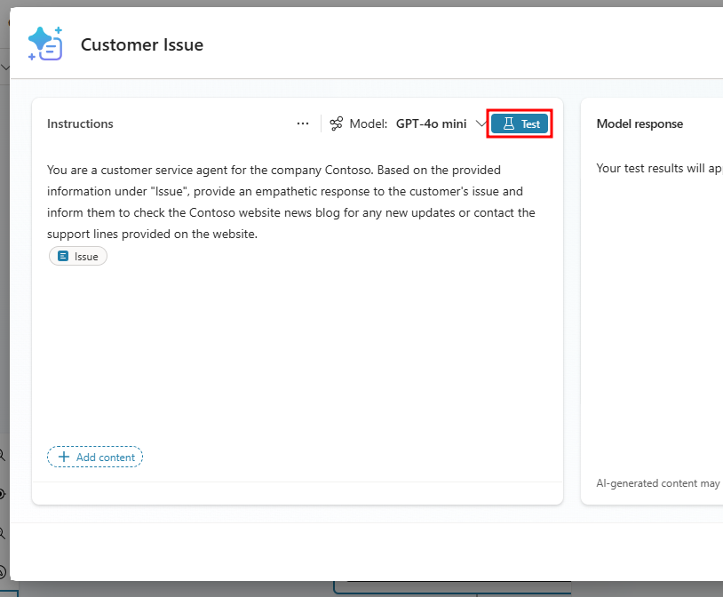
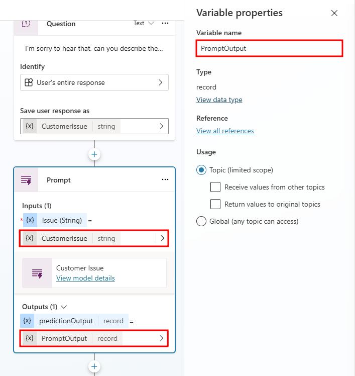
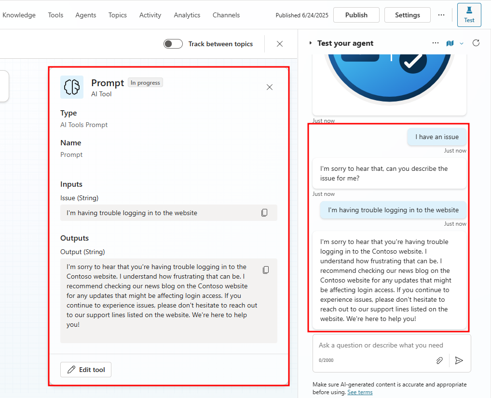

# Add a tool

## Generative AI orchestration
By default, an agent responds to users by triggering the topic whose trigger phrases match the user's query, filling topic inputs from the conversation context. You can configure your agent to use generative AI to choose not only from topics you created, but also from tools you added to extend the agent. In generative mode, an agent can fill topic inputs, not only from the conversation context but also by generating questions to prompt the user for values.

Using generative AI to determine how your agent responds can make the conversation more natural and fluid for the users. When a user sends a message, your agent selects one or more tools or topics to prepare its response. Multiple factors determine the selection. The most important factor is the description of the topics and tools. Other factors include the name of a topic or tools, any input or output parameters, and their names and descriptions. Descriptions make it possible for your agent to be more accurate when it associates a user's intent with tools and topics.

In generative mode, an agent can select multiple tools or topics at once, to handle multi-intent queries. Once tools and topics are selected, the agent generates a plan that determines their execution order.

When you test an agent that uses generative mode in Copilot Studio, you can open the conversation map to follow the execution of the plan.

## (Optional) Task 1: Add a tool
When you turn on generative mode, your agent can automatically select the most appropriate tool or topic, to respond to a user at runtime. In classic mode, an agent can only use topics to respond to the user. However, you can still design your agent to call tools explicitly from within topics.

Tools are based on one of the following core tool types:

- Prebuilt connectors
- Custom connectors
- Power Automate cloud flows
- AI Builder prompts
- Bot Framework skills

Each core tool has additional information that describes its purpose, allowing the agent to use generative AI to generate questions. These questions are required to fill the inputs needed to perform the tool. Therefore, you don't need to manually author question nodes to gather all inputs needed, such as the inputs on a flow. Inputs are handled for you during runtime.

Tools can generate a contextual response to a user's query, using the results of the tool. Alternatively, you can explicitly author a response for the tool.

1. From the Navigation menu, go to the Tools tab.
2. Select **Add a tool**.

3. In the **Add tool** window that opens, search for `MSN Weather` and choose the **Get forecast for today (MSN Weather)** connector.

    

4. If a connection is not already established, create a connection to MSN Weather by selecting the *Not connected* drop-down and choosing *Create new connection*.

    

5. In the Connect to **MSN Weather** window, select **Create**.

6. After a connection is formed, select the Add and configure button in the Add tool window to configure the tool.

    

7. Scroll down to the Inputs section and select the **Dynamically fill** with AI **drop-down** next to **Units**. Choose the **Custom value** option.

    

8. After selecting **Custom value** for the **Fill using** field of the **Units** input, a new customizable drop-down appears under **Value**. Select this new field and choose the **Imperial** option.

    

9. Scroll to the bottom of the **Get forecast for today** window, and in the Completion section, select **Write the response with generative AI** under **After running**.

    

10. Save the tool by selecting **Save** in the top-right of the tool window.

## (Optional) Task 3: Test your tool
When adding a prebuilt connector to your agent, it's ready to test as soon as the connector is configured.

1. Open the Test pane on the right-side of the screen.

2. Ask the following question: `What is the weather?`

3. In the Test pane, select on the **Conversation map** to see how the agent interprets questions and prompts for answers.

    

4. In the Test pane, answer with: `Chicago`

5. Notice the agent **automatically** updates the inputs with the city and provides an answer.

6. Tell the agent you made a mistake with the following prompt: `Wait, I meant the weather for London. Also, please list all information you have in bullet points please.`

    

You have successfully:

- Added a tool in Copilot Studio
- Displayed dynamic data back to the user in Copilot Studio
- Leveraged conversational context to ask follow-up questions

## AI Builder prompts

Think of a prompt as a task or a goal you give to the large language model (LLM). With prompt builder, you can build, test, and save your custom prompts. You can also use input variables to provide dynamic context data at runtime. You can share these prompts with others and use them in Power Automate, Power Apps, or Copilot Studio. For instance, you could make a prompt to pick out action items from your company emails and use it in a Power Automate flow to build an email processing automation.

Prompt builder enables makers to devise custom prompts that cater to their specific business needs using natural language. These prompts can be employed for many tasks or business scenarios, such as summarizing content, categorizing data, extracting entities, translating languages, assessing sentiment, or formulating a response to a complaint.

Prompts can be integrated into flows to build intelligent hands-off automation. Makers can also build advanced generative AI capabilities for their applications by describing them as natural language prompts. These prompts can be used to extend a custom agent, thereby streamlining your daily business operations and boosting efficiency.

Custom prompts give makers the freedom to instruct the GPT model to behave in a certain way or to perform a specific task. By carefully crafting a prompt, you can generate responses that suit your specific business needs. This transforms the GPT model into a flexible tool to accomplish various tasks.

## (Optional) Task 4: Implement AI Builder prompts
Often customers will utilize a chatbot to vent their frustrations about a company's product or service. We'll be using an AI Builder prompt to respond to customer complaints.

1. Go to Topics and add a new topic From blank named: `Conflict Resolution`

2. Notice that since we have generative orchestration enabled, the trigger now requires a Description instead of trigger phrases.

    

3. In the Trigger node, add the following trigger description: `This topic provides answers for users that have an issue or problem with the service.`

    

4. Below the Trigger node, add a Question node with the question: `I'm sorry to hear that, can you describe the issue for me?`

5. In the **Question** node, select the **Identify** option, choose **User's entire response**, and name the variable `CustomerIssue`.

    

6. Next we will use the **CustomerIssue** variable in a custom AI Builder prompt to craft a response to the user.

7. Below the **Question** node, select the + icon, expand the **Add a tool** option, and in the **Add a tool** window, select **New prompt**.

    

8. Name the prompt `Customer Issue` in the upper-left corner of the prompt window.

9. Select the **+ Add content** option in the **Instructions** section, then select **Text** in the menu that opens.

    

10. Name the input `Issue` and add the following text to the **Sample data** field: `I'm having trouble logging in to the Contoso website.`

    

11. Insert the following text into the Instructions field. Make sure you line up your **Issue** input in the instructions where it's marked as **[Issue input]**:

        You are a customer service agent for the company Contoso. Based on the provided information under [Issue input], provide an empathetic response to the customer's issue and inform them to check the Contoso website news blog for any new updates or contact the support lines provided on the website.  

12. To test the AI Builder prompt, select the **Test** icon in the top-right corner of the Instructions pane. This tests the instructions you have with the sample data you provided in the Issue input.

    

13. The **Model response** field should populate with an example response to a user having trouble logging in.

14. Next, save the prompt by selecting **Save** at the bottom of the window.

15. After saving, the **Prompt builder** window will automatically close and the **Customer Issue** prompt will be added below the **Question** node.

    

        Tip:

        If the prompt does not show up after saving, save the topic and refresh the page.

16. In the **Prompt** node, select the input field below **Issue (String)** and choose **Topic.CustomerIssue**.

17. Next, select the output field below **predictionOutput** and create a new variable named **PromptOutput**.

    

18. Now add a **Message** node below the **Prompt** node and insert the **Topic.PromptOutput.text** variable as its message.

    

    Important:

    Make sure to select the **PromptOutput.text** variable instead of **PromptOutput**. PromptOutput is a record with multiple properties and the .text property holds the text response.

19. Finally, add an **End conversation topic management** node below the **Message** node.

20. To test the prompt, save the topic and open the Test pane. Enter `I have an issue`, then after the agent responds, respond with `I'm having trouble logging in to the website`. The agent should respond empathetically and direct users to where they can find more assistance.

    

Congratulations, you have finished the section on Tools in Microsoft Copilot Studio.

You have successfully:

 - Added a tool in Copilot Studio
 - Displayed dynamic data back to the user in Copilot Studio
 - Leveraged conversational context to ask follow-up questions
 - Built a custom AI Builder prompt
 - Implemented AI Builder prompts to write responses to customer complaints

#
## Next unit: Check your knowledge
[Continue to Check your knowledge →](6-check.md)