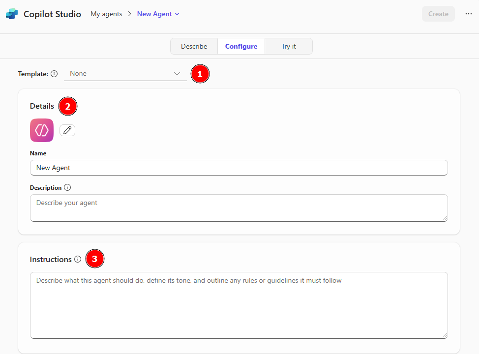
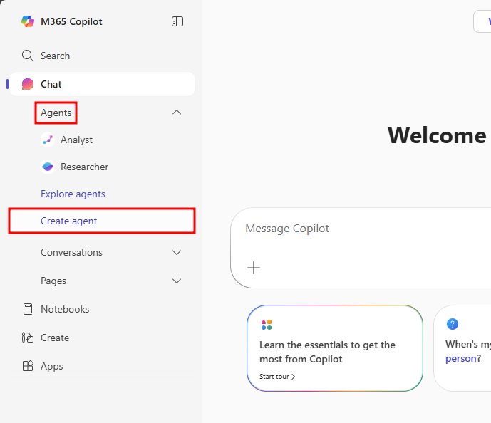
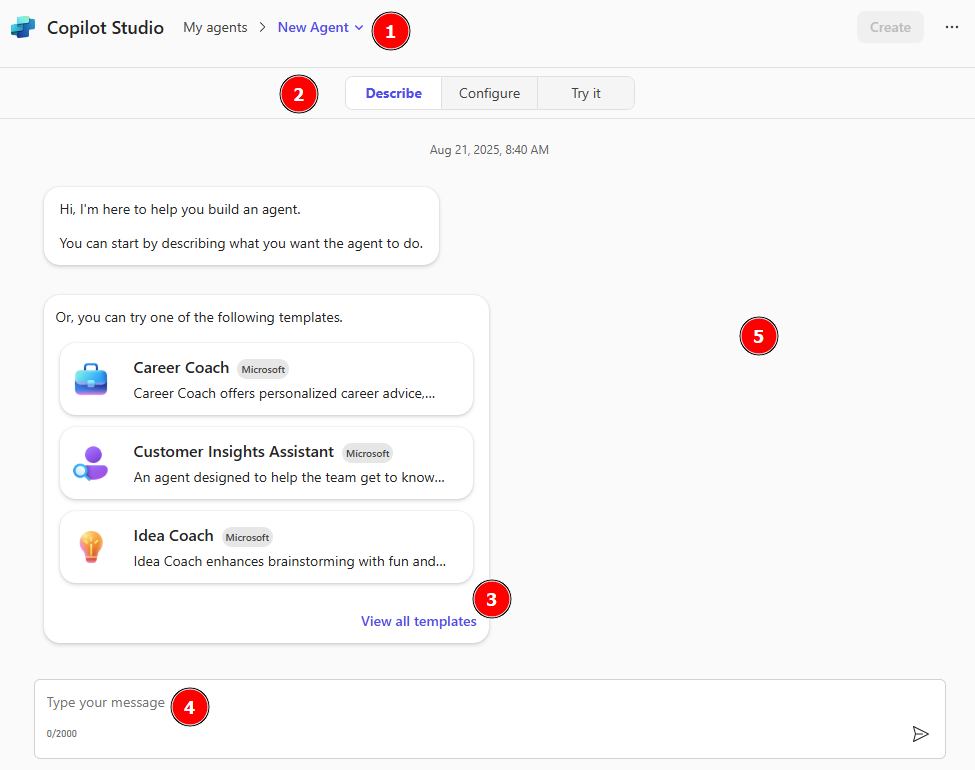
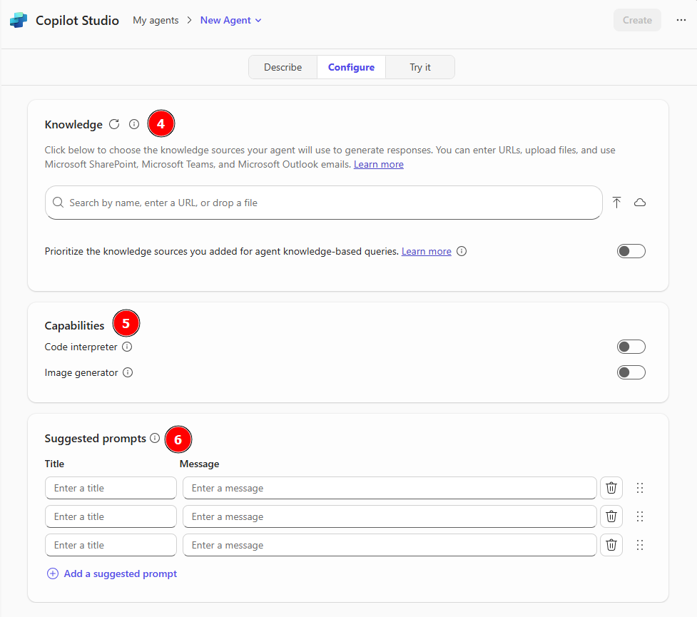

# Copilot chat

The Agents in a Day Learning Path focuses on understanding and building agents. These agents can be built and customized directly in Microsoft 365 Copilot Chat. Recent advancements in AI technologies have made key aspects of Copilot Studio's interface and functionality available in Microsoft 365 Copilot Chat.

## What is Copilot Chat?

Microsoft 365 Copilot Chat is an AI chat tool built specifically for work. It uses the latest AI models and data from the web to answer your questions, generate content and ideas, and find information. It also protects your data so information from your chat conversation doesn't get exposed to the public.

With Copilot Chat you can:
- Build custom agents or start with prebuilt template agents.
- Develop code through natural language.
- Interact with the base Microsoft 365 Copilot agent that's grounded in general knowledge.
- Ask Copilot questions and interact in a conversational experience to solve problems or learn about new topics.

To get started, go to [Copilot Chat](https://m365.cloud.microsoft/chat). The Microsoft 365 Copilot home page has the following options available in the left navigation pane:

- **Chat** - The main page of Copilot Chat, selecting this option opens the base Copilot Chat agent that has access to your Microsoft 365 data. Prompting this agent is best used for topics that may require web page searching and includes Microsoft 365 Copilot's pretrained data. The Chat tab also has three sublevels you can select:
  - **Agents** - Custom and prebuilt agents your tenant has access to that were either created by you, your organization, or added from the agent store. These agents have customized functionality that is designed for specific use-cases.
  - **Conversations** - Recent conversations you've had with individual agents. Selecting one of these conversations pulls up all messages you received and sent during that conversation, allowing you to pick up where you left off on a conversation or retrieve information you received that you may need.
  - **Pages** - Saved conversation snippets that can be customized and shared with team members, enabling a constructive space for you and others to work with information received from Copilot Chat sessions.

- **Notebooks** - Notebooks are customized sessions built specifically for you to ask questions about files you have hosted in your Microsoft 365 tenant. These are helpful for when you have large documents you'd like Copilot to assist with analyzing.

- **Create** - Allows you to build custom AI-generated images, videos, and forms. This section is a great way to quickly generate marketing material, storyboards, documents, and spreadsheets.

- **Apps** - List of associated Microsoft 365 apps like Outlook, Word, Excel, and Teams.

## Create an agent in Copilot Chat

Agents use AI to make Copilot Chat even more personalized and intelligent for your daily work. Agents automate repetitive tasks and processes - think of them like apps for Copilot. Copilot Chat comes with a set of agent templates to get started with, or you can create custom agents for your own needs.

A quick way to check if you have access to this capability is paying attention to the Agents tab of the left navigation menu in Copilot Chat under Chat. If there's an option for Create an agent you have access to this functionality. Having a Microsoft 365 Copilot license or an associated Copilot Studio pay-as-you-go plan have this option, Microsoft 365 users without a role that includes agent building should only see the Get agents option along with organization-enabled agents.

   

> **Note**
> 
> If you can't find the Create an agent option, and you have a Microsoft 365 Copilot license or associated Copilot Studio pay-as-you-go plan, check with an admin in your organization to see if they can enable this capability in the [Microsoft 365 Admin Center](https://admin.microsoft.com/) by assigning you a role that allows agent building.

After selecting Create an agent, a window similar to the natural language agent builder in Copilot Studio opens. The Describe window is the home page for defining and building a new agent in Copilot Chat. These are the following options available to you when building an agent in Copilot Chat via the Describe screen:

1. **Currently selected agent** - This area displays the currently edited agent's title, and when selected, allows you to navigate to other agents you'd like to edit.

2. **Describe or Configure** - This toggle allows you to choose whether you'd like to edit the agent using natural language with the Describe tab or manually configure agent details with the Configure tab.

3. **Templates** - Every time a new agent is created, you're presented with templates as an option for configuring your agent. Templates are preconfigured agents like Career Coach, Idea Coach, and Learning Coach. Selecting View all templates will present you with all templates available, you can also use templates directly without configuration via the Get agents option in Copilot Chat.

4. **Chat box** - The chat box at the bottom of the Describe window is where you input text to define your agent's settings. Think of this area as talking to the agent in the form of instructions. If you need ideas, checking the Configure window for available agent settings may be beneficial for understanding what you can modify about your agent.

5. **Test pane** - This pane displays a test screen of the currently submitted settings for the selected agent.

   

Selecting Configure navigates you to a classic experience for agent building, allowing you to modify agent settings directly. The following options are available in the Configure screen when a user has only a base Microsoft 365 E5 license:

1. **Template** - Drop-down menu for the quick implementation of templates when building an agent.

2. **Details** - This menu provides allows changing the agent's profile image, name, and the user-facing description of the agent's purpose.

3. **Instructions** - Instructions for the agent to follow when responding to users. Think of this as a checklist of rules the agent should follow before responding to a user. If you're having trouble with ideas, selecting a template will fill this section out with preconfigured information that can help spark creativity or provide a faster agent building experience.

   

4. **Knowledge** – Add knowledge sources to ground your agent's responses on relevant data. These knowledge sources include:
   - **Uploaded files** – Accepted file sources include: Text files, Word docs, PowerPoint decks, PDFs, and Excel sheets/workbooks.
   - **Website URLs** – These links need to be publicly available sites and are restricted to 2-levels deep e.g. www.website.com/two/levels
   - **Recent files** – Recently opened files from OneDrive and SharePoint.
   - **SharePoint sites** – Individual SharePoint sites you have access to.
   - **Teams chats & channels** – Individual Teams channels, meetings, and group chats.
   - **All websites** – Gives your agent the ability to search to web.
   - **My SharePoint files** – Allows agent access to all available SharePoint files, folders, and sites you have access to.
   - **My Teams chats** – Allows agent access to all your available Teams groups, chats, channels, and meetings.
   - **My emails** – Allows agent access to all emails in your Outlook inbox.

> **Note**
> 
> Users without a Microsoft 365 Copilot license are restricted to only website URLs as knowledge sources.

   

5. **Capabilities** - Preset capabilities the agent can access, these include:
   - **Code interpreter** - Convert natural language into code to create visualizations, solve math problems, and analyze data. Customizes agents with the ability to run code for interpreted languages like Python.
   - **Image generator** - Create visual aids (like images and art) in response to user prompts. Enables image generation through natural language. Allowing your agent to interpret prompts and conversations through visual media extends your conversation from text-based chats to a multi-modal experience.

6. **Suggested Prompts** - Preset prompts available to Agent users that suggest ways of starting conversations. These can be tailored to the Agent's purpose and can help users better understand how to interact with the Agent.

Now that you have a general understanding of the options available when building an agent in Copilot Chat, in the next unit, we'll create a prebuilt agent by utilizing the Templates available in Agent Builder.

---

**Previous:** [Introduction](./1-introduction.md)

**Next Unit:** [Use agent templates in Agent Builder](./3-use-agent-templates-in-agent-builder.md)
