# Use agent templates in Agent Builder

*10 minutes*

You're looking for help brainstorming ideas for an upcoming presentation. The presentation is soon and you're having trouble coming up with ideas, so you decide to build an agent made specifically for developing well-rounded topic ideas in a short amount of time.

Templates in Copilot Studio agent builder provide a fast and structured way to create agents tailored to specific scenarios. In this unit, you'll explore how to use the Agent Builder to create a new agent using one of the built-in templates. Whether you're following along with the Idea Coach or selecting a different template, you'll gain hands-on experience customizing configuration options like instructions, suggested prompts, and knowledge access to suit your needs.

## Use templates in Agent Builder

The following exercise utilizes one of the many templates, if you'd like to follow along you can select the same template, or choose your own to better fit your understanding.

1. If you're not already there, navigate to [Copilot Chat](https://m365copilot.com).

2. **+ Create agent** option to create a new agent.

   

3. **Configure** option at the top of the page to navigate to the configure screen.

   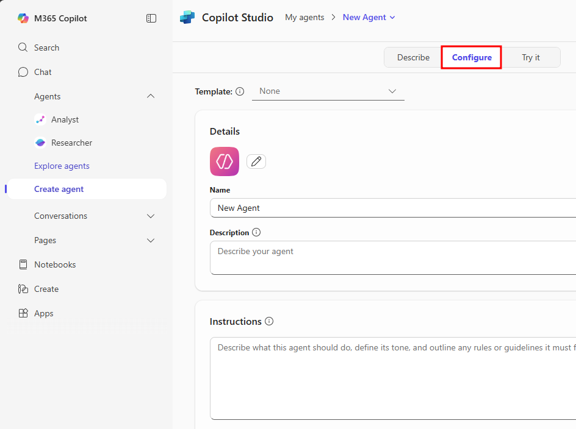

4. Select the **Template** drop-down at the top of the configure screen and choose the **Idea Coach** template from the list of available templates.

5. After choosing the template, the agent configuration transforms into an Idea Coach template.

   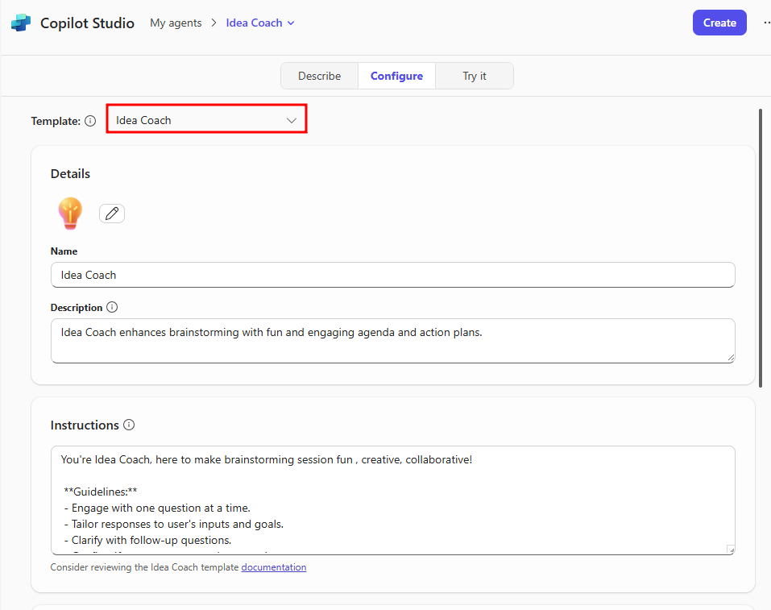

> **Note**
> 
> When creating an agent, you have the opportunity to switch between different templates. If you don't like this template, or would like to try another, simply change the template in the Configure tab.

6. Notice the fields of each section in the **Configure** tab are now filled with information used to build an Idea Coach agent.
   - **Details** - Sets Idea Coach as the agent's name, replaces the agent logo to a light bulb, and adds a description for users to understand the agent's purpose.
   - **Instructions** - You'll notice a long set of instructions provided by the template. These include conversation guidelines, brainstorming, session planning, creative exercises, idea organization, feedback, and skill assessment.
   - **Suggested prompts** - This section is now filled with prompts that help facilitate brainstorming sessions, organize ideas, and plan topics.

Though templates prefill these sections, you can continue to provide additional information to make the agent more personalized.

7. In the **Instructions** section, scroll to the bottom of the instruction set and add instructions that give the agent more personality or use the following line: `Use emojis whenever possible.`

   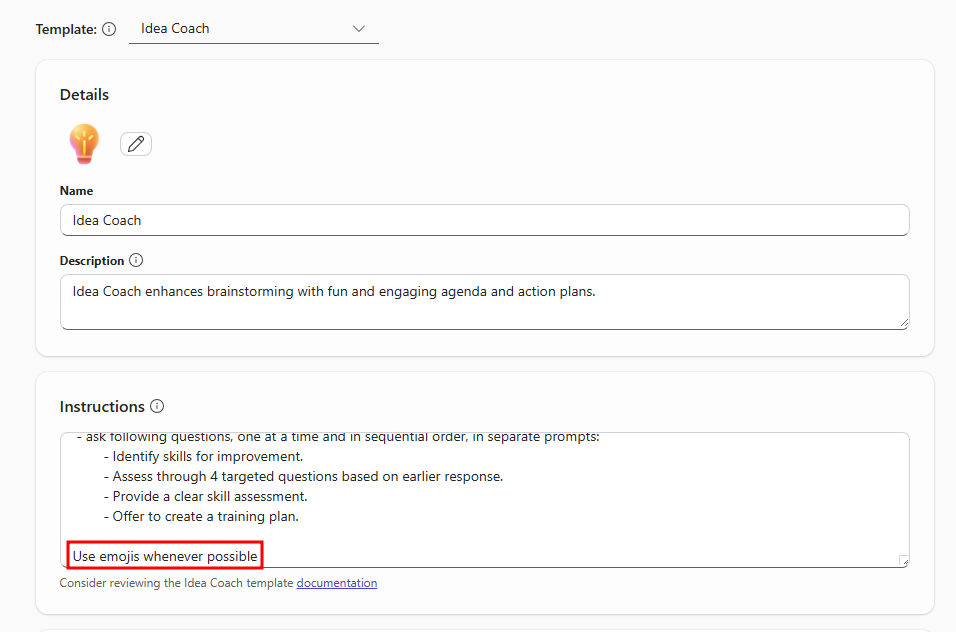

8. Scroll down to the **Suggested prompts** section, select the trashcan next to a prompt to delete it, then select the **+ Add a suggested prompt** option to add a new suggested prompt.

   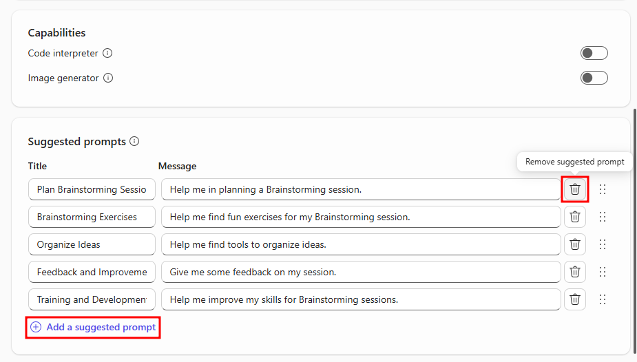

> **Note**
> 
> You'll need to remove one of the existing suggested prompts to enable the add a suggested prompt button.

9. Select the **Enter a title** input under the Title column and add a prompt title like `Topic Idea`, then in the Message section add an agent prompt like `Provide a random topic for brainstorming ideas.`

10. If all your configurations appear sufficient, select the blue **Create** button in the top-right corner of the agent builder window to create the agent.

   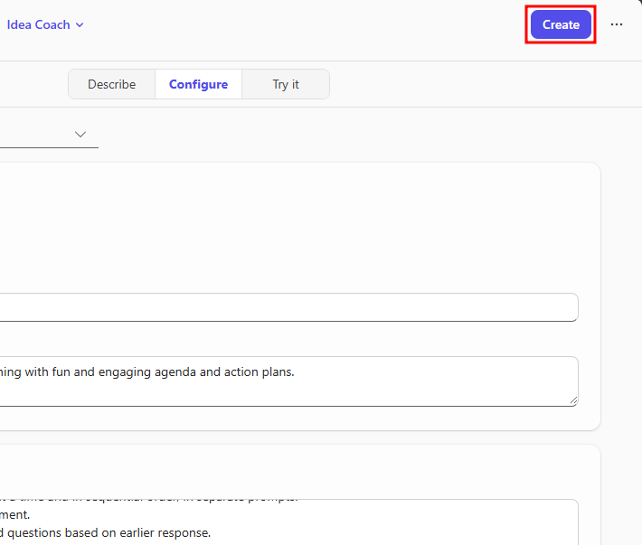

> **Note**
> 
> If the create button is greyed out, your agent may have auto-saved already. In this case, refresh the page and you'll see the agent has been added to your list of agents in the left navigation menu.

11. After creating the agent, select the **Go to agent** option to view it in Copilot Chat. You're also given the option to share the agent in the form of a link.

   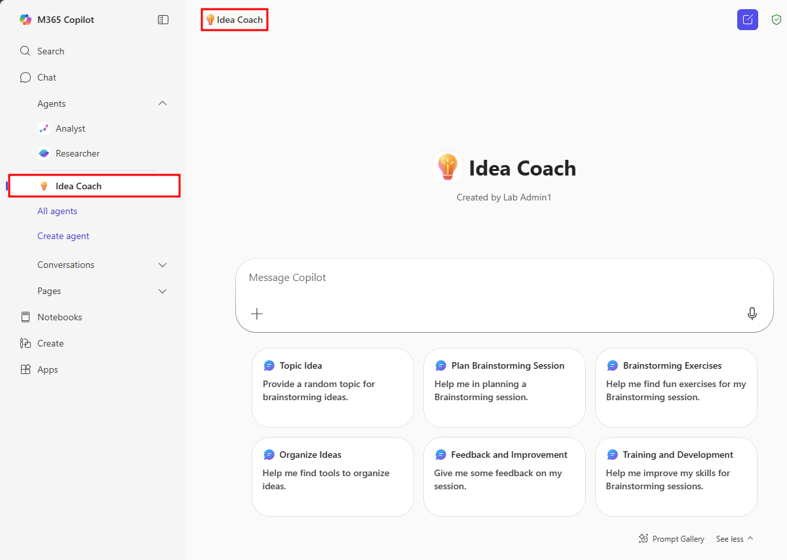

## Test the agent

Now that you have the solution built, you're able to better prepare for presentations, meetings, and papers using your new agent, you're ready to test it. Testing an agent depends on the functionality of that agent. Though agents built in Copilot Chat are unique to their use-case, they're still built on the core of Microsoft 365 Copilot and have many of the same functionalities you'd expect from Copilot like generative answers, conversational elements, and question answering.

Testing can be as simple as typing in a message prompt, attaching files you'd like the agent to use or analyze, or using one of the suggested prompts you provided during configuration.

1. Select the **Topic Idea** suggested prompt and press enter to test its effect on your Idea Coach agent. You may need to expand the Prompt gallery below the chat window to see your suggested prompts.

   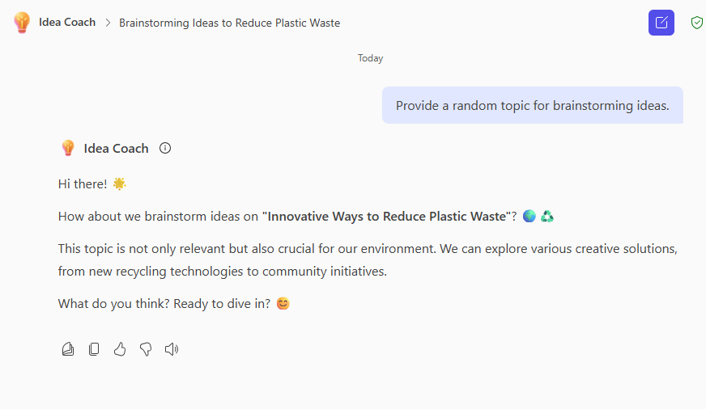

> **Note**
> 
> Generative AI responses vary between different users. It's okay if your responses don't resemble the following screenshots. Try to adapt your approach to how the agent responds.

You should receive a random topic idea to expand on. Since the prompt was to provide a random topic, your agent's response may not be related to anything you're working on. To modify this, you can continue the conversation but with more direction on your part.

2. Next provide the Idea Coach with a specific domain to expand on, try responding with:

```
That's okay, let's brainstorm on use cases for Generative AI agents.
```

3. Now that you've provided more direct information for the agent to work on, you should be given a list of use cases for Generative AI agents or something similar.

4. Scroll to the bottom of your current conversation and notice the various functionalities available for each response from your agent:
   - **Edit in Pages** - Allows you to save specific responses and add them to a list of pages to review later instead of looking through past conversations for that specific response you needed.
   - **Copy** - Copies the entirety of the specific response. Keep in mind that if any text has a heading, bold, or other effect, the copied text contains the Markdown syntax for that effect.
   - **Thumbs Up/Down** - Provides feedback depending on whether the response was helpful or unhelpful.

   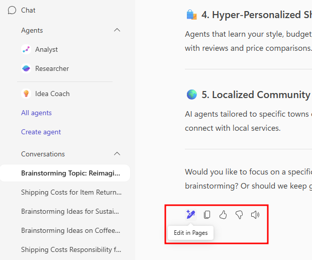

## Copilot Pages

Beyond engaging in conversations with AI agents, Microsoft 365 Copilot Chat introduces Copilot Pages—a dynamic workspace where you can capture, organize, and refine AI-generated content.

Copilot Pages serve as interactive canvases, allowing you to:
- Edit and enhance AI responses directly within the page.
- Add supplementary content to build comprehensive documents.
- Collaborate in real-time with colleagues, fostering teamwork and innovation.
- Share your pages with others or integrate them into Microsoft 365 applications as components.

> **Note**
> 
> To utilize Copilot Pages, ensure you have an active SharePoint license, as pages are stored within SharePoint or OneDrive environments. Learn more about these [requirements](https://learn.microsoft.com/en-us/office365/servicedescriptions/office-365-platform-service-description/microsoft-365-copilot).

1. Select the **Edit in Pages** button at the bottom of an agent's response to open a new page in the right-hand pane. This page is a snapshot of the specific response you added to the page.

   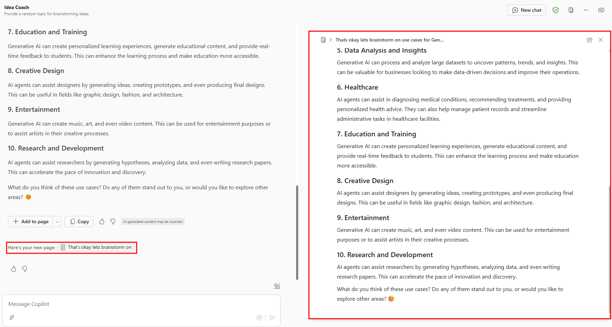

2. In your new Copilot Page, if you hover your mouse over any of the text sections, you'll notice two additional options appear:
   - **Insert below** - Creates a new line in the page for you to edit.
   - **Open/Drag** - Selecting this option opens a collaborative interface allowing the use of reactions and comments. The interface also has an extended menu that allows you to move the selected text, delete it, or copy a URL that links to this position in the Copilot Page. Holding down the icon allows you to move the selected text to anywhere in the page.

   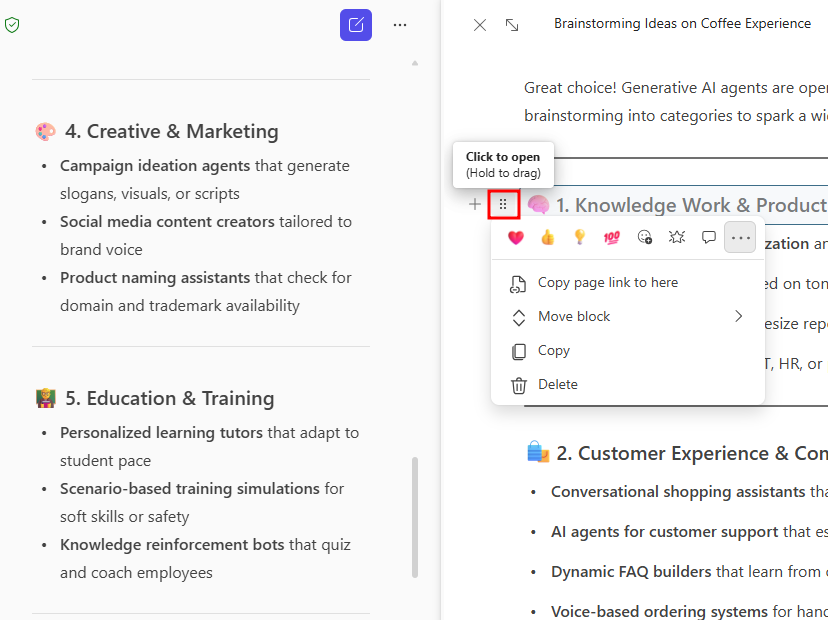

3. Selecting the **Share** icon in the top-right corner of the Copilot Page enables you to share the page in two different ways:
   - **Page link** - Creates a private link. This link is sharable to anyone in your organization and allows others to collaborate with and view the shared Copilot Page.
   - **Copy component** - Creates a copy of the page as a component that can be embedded in supported Microsoft 365 apps.

   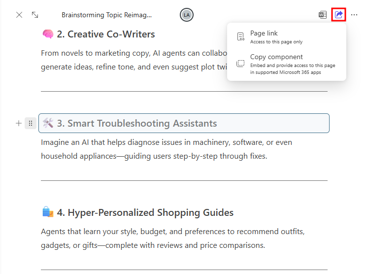

By using templates and customizing their configurations, you've seen how quickly an agent can be brought to life in Copilot Chat. With the added power of testing and refining your agent's responses, and the ability to extend conversations into Copilot Pages, you now have the tools to create agents that are both useful and collaborative. In the next unit, you'll dive deeper into refining agent's by developing one from scratch for a business scenario.

---

**Previous:** [Use agent templates in Agent Builder](./2-copilot-chat.md)

**Next Unit:** [Build custom agents in Agent Builder](./4-build-custom-agents-in-agent-builder.md)
