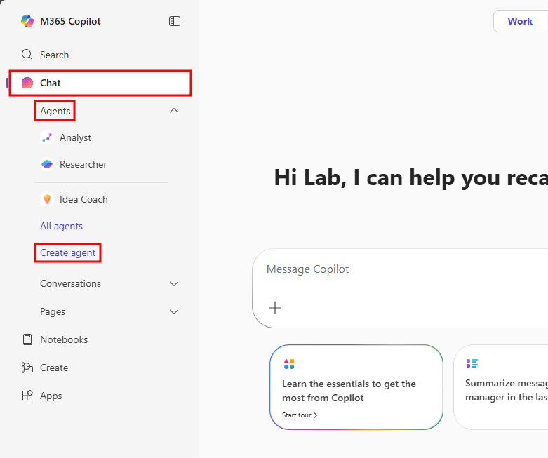
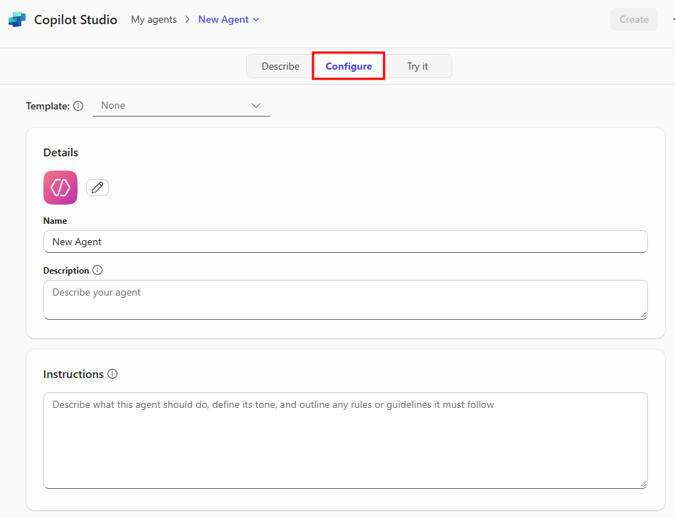
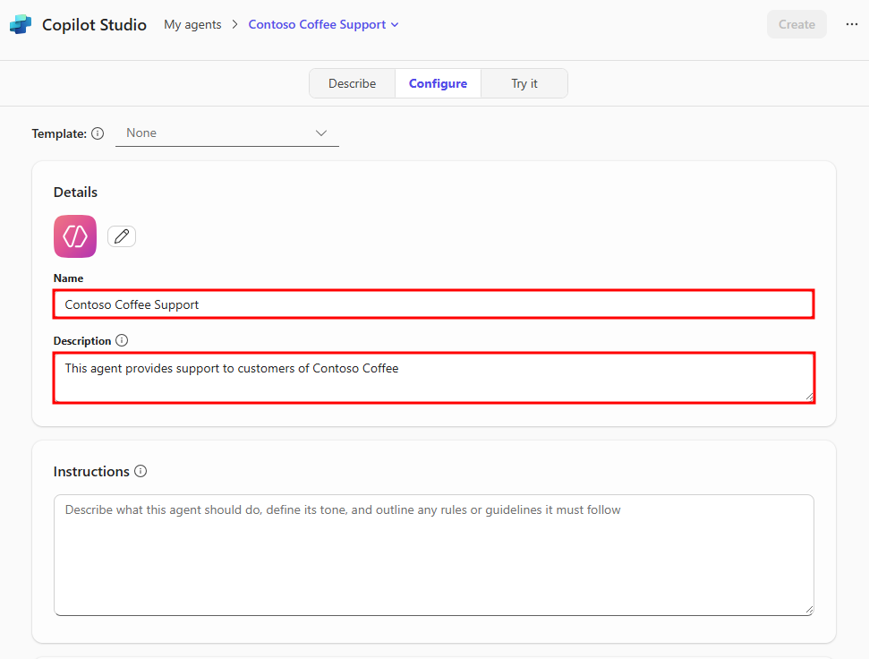
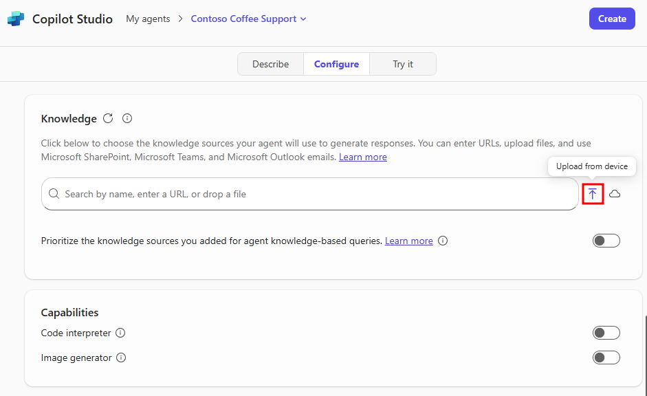
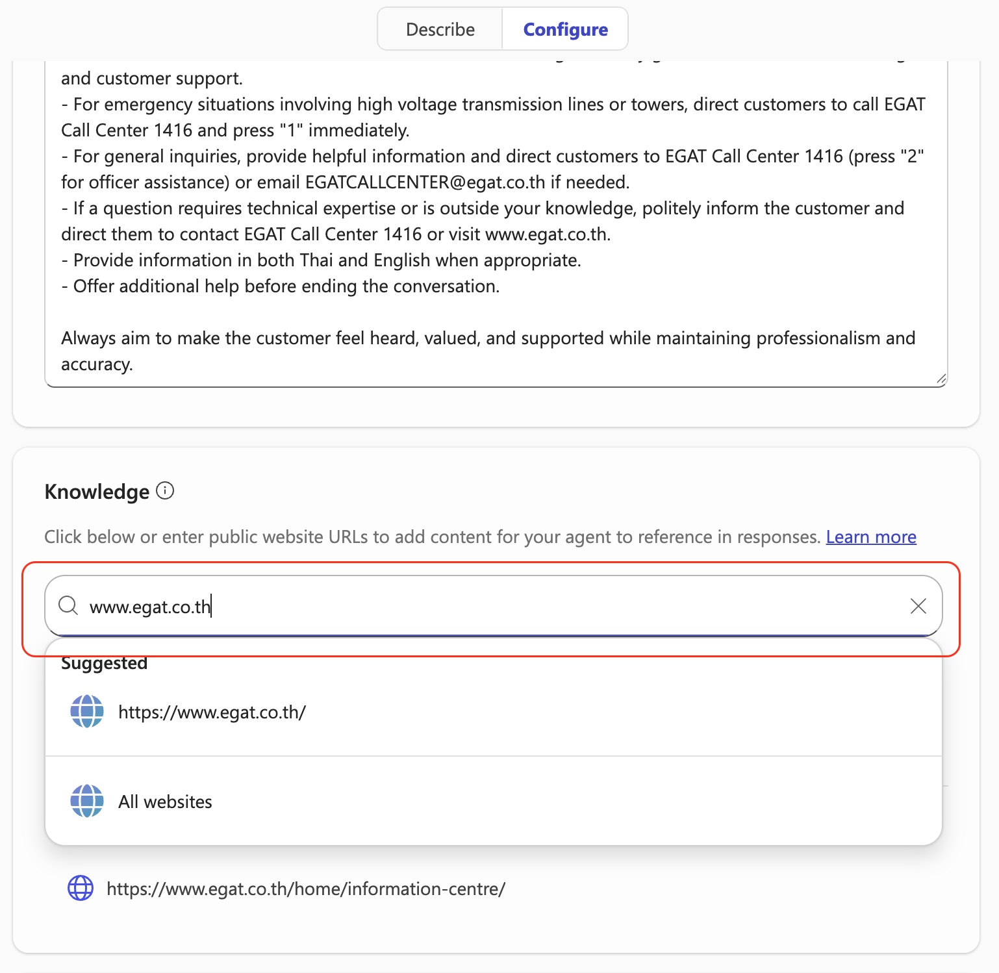
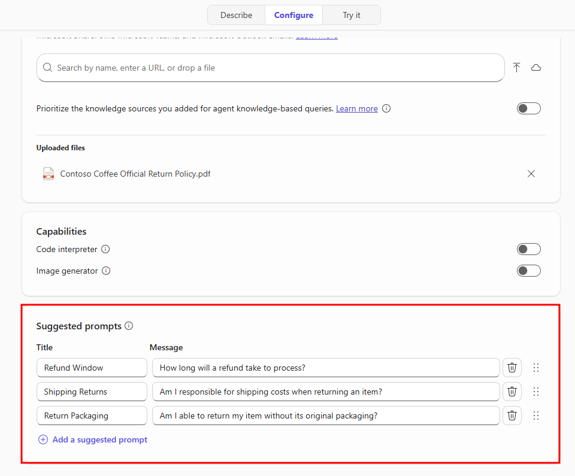
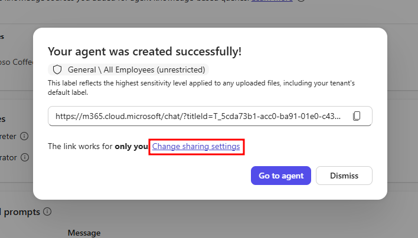
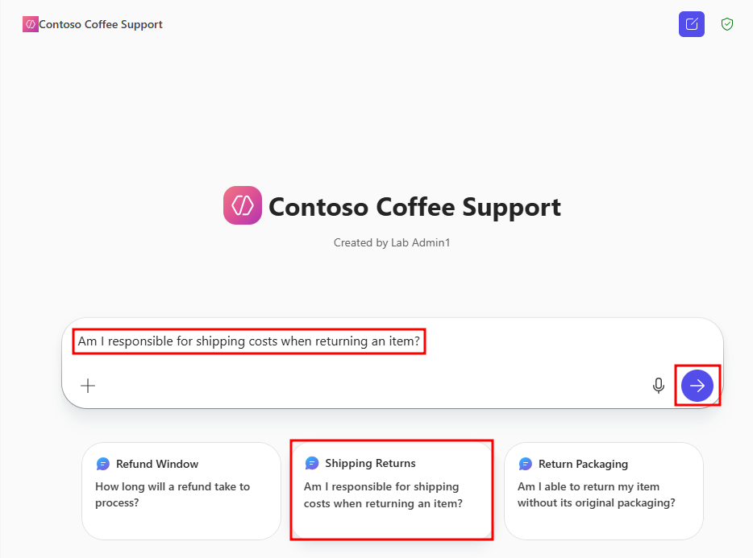
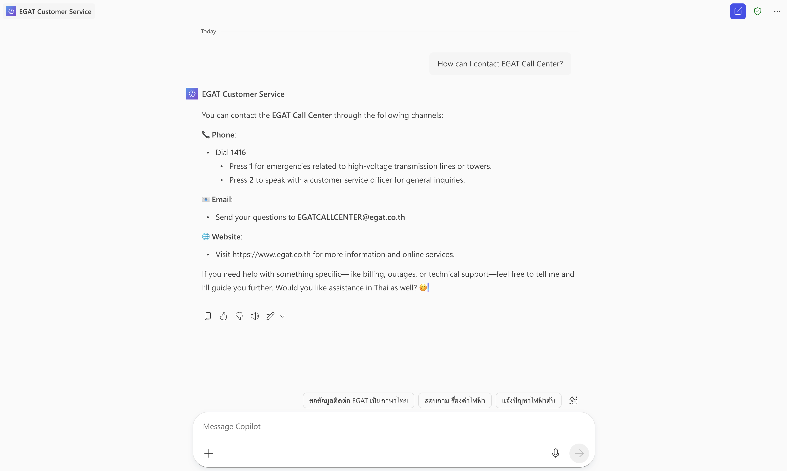

# Build custom agents in Agent Builder

Your manager has notified you about the several emails received from people having issues returning coffee machines ordered from the Contoso machine ordering app and getting clear responses from customer service. Having recently learned about making agents, you decide to create a reliable agent to help resolve this issue and help answer internal questions from the customer service team. The goal is to standardize and give predictable responses.

Agents are a simple and powerful way to provide support to users. In this exercise, you'll build a customer support agent for the fictitious company Contoso Coffee. You'll learn how to configure the agent's basic settings, define clear instructions, create helpful suggested prompts, and adjust sharing options to control who can access your agent.

> **Important**
> 
> This lab and future labs utilize a set of student files that are available from the following link [Download Student Files](https://aka.ms/AgIADStudentFiles). Make sure you download this file and extract it before proceeding.

## Configure a custom agent

1. Select the **Create agent** option from the left navigation menu under Agents in the Chat tab.

   

2. Navigate to the **Configure** tab in the Agent Builder pane that opens to the right.

   

3. In the **Details** section, set the agent's **Name** to: `Contoso Coffee Support`

4. The agent needs a proper **Description** so users understand the purpose of the agent. Add something like the following `This agent provides support to customers of Contoso Coffee` to the Description box.



5. The **Instructions** section tells the agent how it's intended to respond to chat responses. It's important to provide clear and concise instructions so the agent understands its purpose. Fill in the text box with the following instructions:

```
You are Contoso Coffee's virtual customer support agent. Your role is to assist customers with information on Contoso Coffee's Official Return Policy

When responding:

- Greet the customer warmly.
- Answer their questions based on Contoso Coffee's Official Return Policy.
- If a question is outside your knowledge or needs escalation, politely inform the customer and direct them to the Contoso Coffee website.
- Offer additional help before ending the conversation.

Always aim to make the customer feel heard, valued, and supported.
```

Now that you've given your agent a series of tasks to follow, make sure the information it offers the customers is correct and aligns with the company's terms for item returns.

6. In the **Knowledge** section, select the upload icon to upload a file to your agent as a knowledge source.

   

> **Note**
> 
> The upload file option will not appear for users without the appropriate licensing. This feature requires either a Microsoft 365 Copilot license or related pay-as-you-go billing plan. Base access is limited to public website Knowledge. More information can be found at [Using agents in Microsoft 365 Copilot Chat](https://learn.microsoft.com/en-us/copilot/agents).

7. In the file explorer window that opens, navigate to the **Module 1 - Copilot Chat** folder in your student files and select the **Contoso Coffee Official Return Policy.pdf**, then choose **Open**.

   

> **Important**
> 
> The return policy file you need to upload can be downloaded from the following link [Download Student Files](https://aka.ms/AgIADStudentFiles). The return policy is located in the AgIAD Student Files.zip file that needs to be extracted.

This adds the Contoso Coffee Official Return Policy.pdf document as a knowledge source to your agent. Knowledge sources act as guidance and additional information the agent wouldn't normally have access to. By providing this file, your agent is given access to a document that it can use to answer user requests. Selecting the file from the Knowledge section under SharePoint allows you to see the stored PDF.

8. Now scroll down to the **Suggested prompts** section and add a few pairs of Titles and Messages. These are provided to users as suggestions for how to prompt the agent and are reflected in the test pane to the right.

9. These suggested prompts should be directed toward providing users a quick prompt that can resolve questions about Contoso's return policy. Add prompts you think users would want based on the Contoso Coffee Official Return Policy document, or provide the following suggested prompts:
   - **Refund Window** - How long will a refund take to process?
   - **Shipping Returns** - Am I responsible for the shipping costs when returning an item?
   - **Return Packaging** - Am I able to return my item without its original packaging?

   

10. Select the **Create** button in the top-right corner of the Agent Builder window to finish creating your agent.

After selecting Create, a success screen will pop up. This screen provides you with a link to the agent. By default, this link only works for you, but you can modify the sharing settings so that others can interact with your agent.

11. Select **Change sharing settings** to view additional sharing settings.

   

The additional sharing settings for Copilot Chat agents can be changed to three different options:
- Anyone in your organization
- Specific users in your organization
- Only you

12. Save your choice or select cancel to return to the success menu then select **Go to agent** to view the finalized version of your agent.

13. After navigating to the Contoso Coffee Support agent, select the **Shipping Returns** suggested prompt, and select the send button in the chat window with the prefilled suggested prompt.

   

Your agent will then craft a response based on the Contoso Coffee Official Return Policy document, providing key details and guidance for users on what to expect when initiating a return. The response also provides a link to the return policy document with reference links next to all information that was pulled from the document.

   

Try using the other suggested prompts or craft your own prompt based on the Contoso Coffee Official Return Policy document.

By following these steps, you've successfully built and configured a Contoso Coffee support agent in Copilot Chat. Clear instructions, thoughtful suggested prompts, and knowledge sources are all essential to creating an effective agent. In the next module, you'll create an agent with additional features available when building agents in Microsoft Copilot Studio.

---

**Previous:** [Use agent templates in Agent Builder](./3-use-agent-templates-in-agent-builder.md)

**Next Unit:** [Check your knowledge](./5-check-your-knowledge.md)
