# Set up environment

Before building an agent in Copilot Studio, it's important to use a predefined ecosystem where the components of your agent and associated data it pulls from can live together. For this example, we'll be using a prebuilt solution that expands on our Contoso Coffee scenario.

The solution you'll be using comes with a canvas app, model-driven app, and tables. The solution is located in the student files, which can be downloaded from the following link [Download Student Files](https://aka.ms/AgIADStudentFiles).

## Set up and select your environment

The first thing you need to select is what environment you'll be building in. Typically, you'll create in a developer or test environment before you move your solution to the live production environment.

You'll need a Developer environment that has a Dataverse data store to complete these labs, if you already have one for building and testing use that. If you don't have a developer environment to choose from, use the following steps to create a new environment.

1. Navigate to the [Power Platform admin center](https://admin.powerplatform.com).

2. Select **Manage** from the left navigation menu.

3. In the Environments page, select the **+ New** button to create a new environment.

    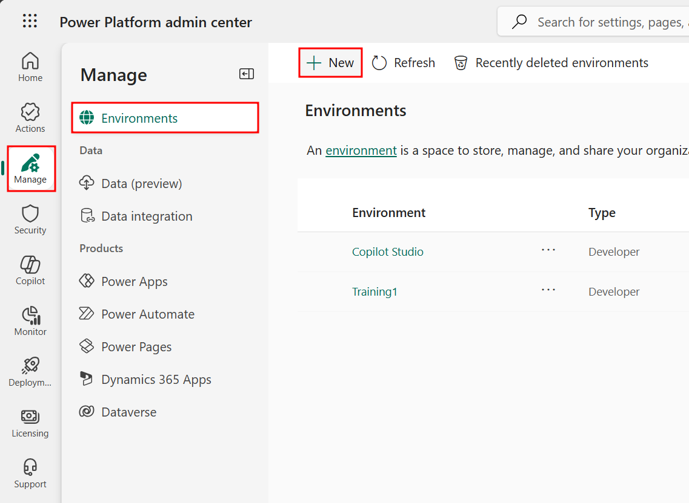

4. In the New environment pane that opens, give the environment a name, set the Type to **Developer**, make sure **Add a Dataverse data store** is set to **Yes**, then select **Next**.

    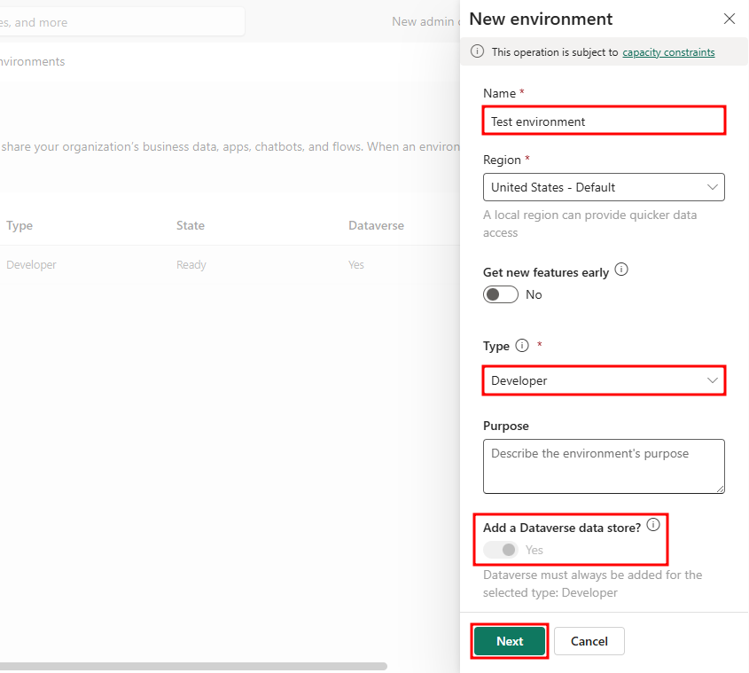

5. Select **Save** in the Add Dataverse step of the dialog to finish creating the environment.

6. Now when your environment finishes provisioning and is in the Ready state, you can select the environment from the environment selector in the top-right corner of Copilot Studio.

    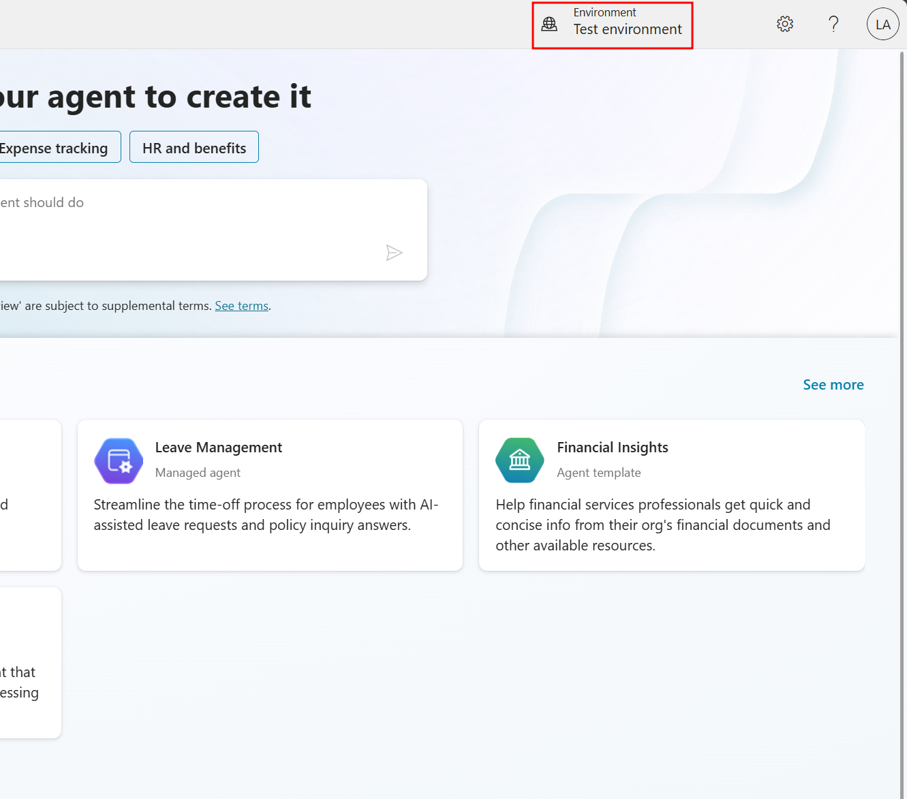

### If you're attending an instructor-led workshop

If you're attending an Instructor led Agent in a Day event, you may be provided an environment to use by your instructor that will be preconfigured for you to use.

1. Sign-in to [Copilot Studio](https://copilotstudio.preview.microsoft.com) and in the top-right corner you'll see an Environment field.

2. Select **Environment**, and from the Select environment pane that opens, choose the environment you have been provided under **Supported environments**.

    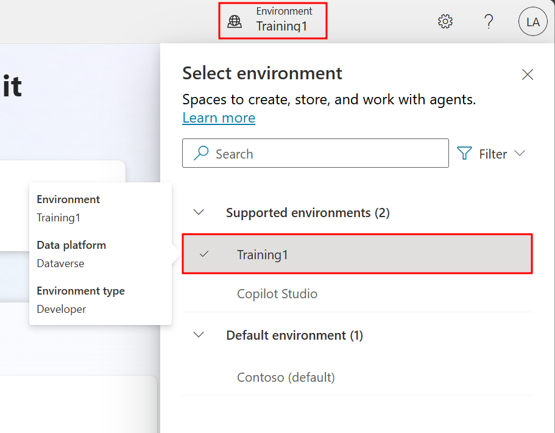

## Application Lifecycle Management

New to Power Platform or Copilot Studio? You might be eager to start building agents right away, but taking a few minutes to set up Application Lifecycle Management (ALM) first will save you hours of headaches later!

Think of ALM as preparing your kitchen before cooking a complex meal:
- **Without ALM:** Ingredients scattered across counters, no recipe plan, impromptu grocery trips mid-cooking
- **With ALM:** Ingredients organized, recipe prepared, everything measured and ready

Common beginner challenges solved by ALM:
- "I built something great in dev, but can't easily move it to production"
- "Someone changed my agent and now it's broken - who did it and how do I fix it?"
- "I need to update my agent but I'm afraid of breaking what works"
- "My team members keep overwriting each other's changes"

The few minutes ALM setup in this lab prevents all these problems!

Application Lifecycle Management (ALM) ensures that your solutions evolve safely and efficiently as they move from development to production. This lab will walk you through the foundational best practices of ALM in Microsoft Copilot Studio—from structuring your solution to managing configurations and source control.

Real-world example: Imagine you've built a great customer service agent in your development environment. Without proper ALM:
1. Moving to production means manually recreating all your work
2. If something breaks, you can't easily roll back to a working version
3. When multiple team members make changes, work gets overwritten

With the ALM practices in this lab, you'll avoid these pitfalls and set yourself up for success!

To learn more about ALM and its importance, visit the [ALM overview - Microsoft Power Platform](https://learn.microsoft.com/en-us/power-platform/alm/alm-overview) documentation.

## Import a solution

With your environment ready and selected in Copilot Studio, the first step in your ALM journey includes importing a solution to the environment. By adding a solution, you're creating an organized directory for the agent's components and other resources like tables and apps, which will be able to interact with and modify your agent's data.

Solutions provide structured containers to manage apps, tables, agents, connectors, and future customization across environments. Adding a solution now, before creating an agent, allows more flexibility in customization. This allows you to keep track of and make changes to components and the agent itself without worrying about how you'll share or move the final product.

The solution you're importing contains Dataverse tables and apps related to the function of the agent you'll build throughout this course. By adding a solution, you're able to start building your agent on top of the framework that powers future functions of your agent. In a live scenario, you may already have solutions related to the use case of your agent and would use those or create a new solution specifically for your agent.

It's important to note that solutions are not required when creating agents. An agent created without an attached solution stores all of its components, flows, and topics in the environment's default solution. Though the agent is functional with its properties stored in the default solution, this configuration can lead to issues when moving the agent from development to production environments and when co-developing the agent with other organization members.

1. In Copilot Studio, select the ellipses (...) in the left navigation menu and choose the **Solutions** option under **Explore**.

    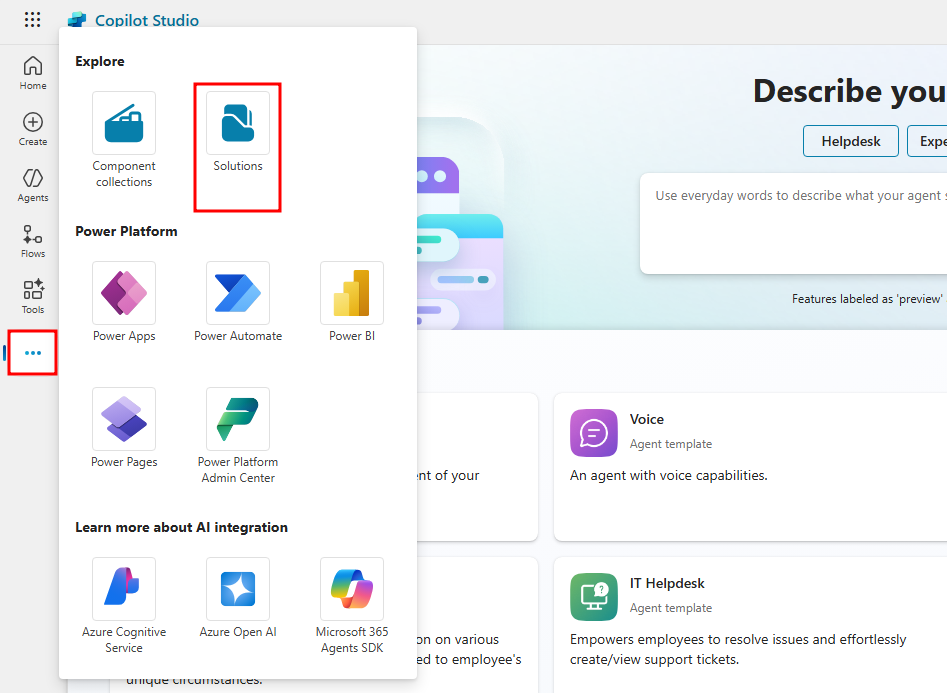

2. In the Solutions page that opens in another browser tab, select the **Import solution** option from the menu at the top of the page.

    

3. Select **Browse** in the Import a solution pane that opens then navigate and choose the `AgentsinaDay_1_0_0_13_DoNotUnzip.zip` file that's located in the Module 2 folder of your student files.

> **Important**
> You can download these student files from the following link [Download Student Files](https://aka.ms/AgIADStudentFiles). The solution file is located in the attached AgIAD Student Files.zip file.

4. With the `AgentsinaDay_1_0_0_13_DoNotUnzip.zip` added next to **Browse**, select the **Next** option at the bottom of the Import a solution pane.

    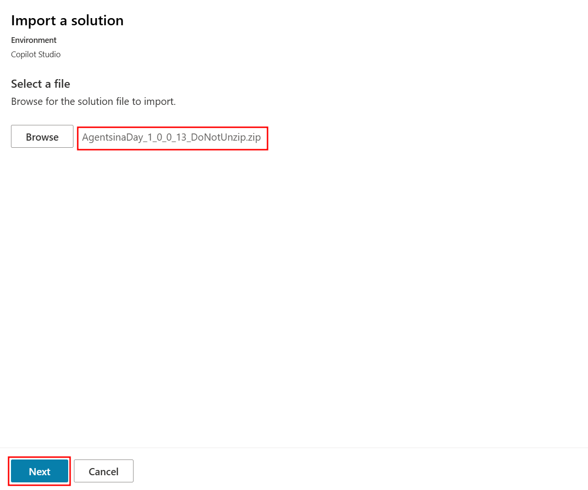

5. Finally, select **Import** to finish importing the solution.

6. The solution can take **up to 10 minutes** to finish importing, you'll notice a green success banner at the top of the page when it finishes.

## Create table records

Now that you have a solution imported, you'll emulate the customer experience by playing the machine ordering app and purchasing a few coffee machines.

1. Open the **Agents in a Day** solution from the Solutions page.

    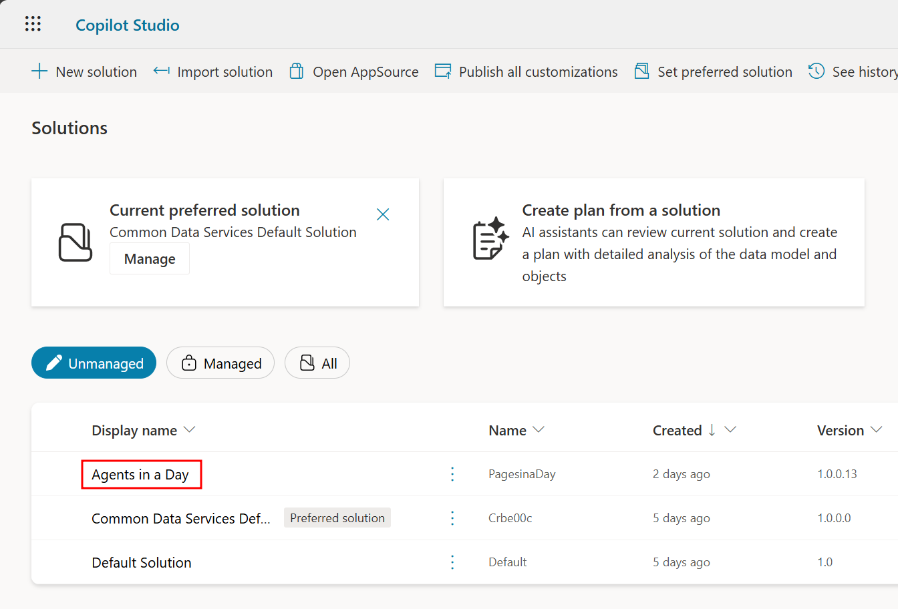

2. Navigate to the **Apps** tab from the left navigation menu, and select the dropdown ellipses menu next to the **Machine Order App** and choose **Play** from the list of options. You can also select the app and choose play from the top menu.

    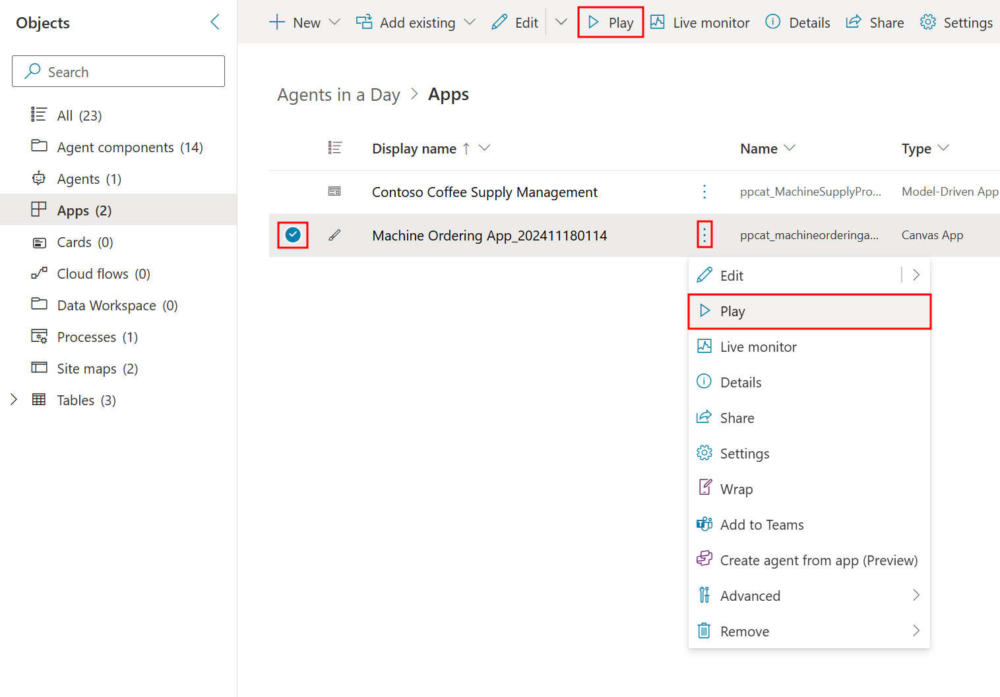

> **Note**
> You may need to allow a connection to Office 365 Users, to do this, select **Allow** in the window that opens when playing the app.

3. Select the compare box under one of the machines you'd like to create an order for then select the **compare items** button in the bottom-right corner of the app to navigate to the compare screen.

    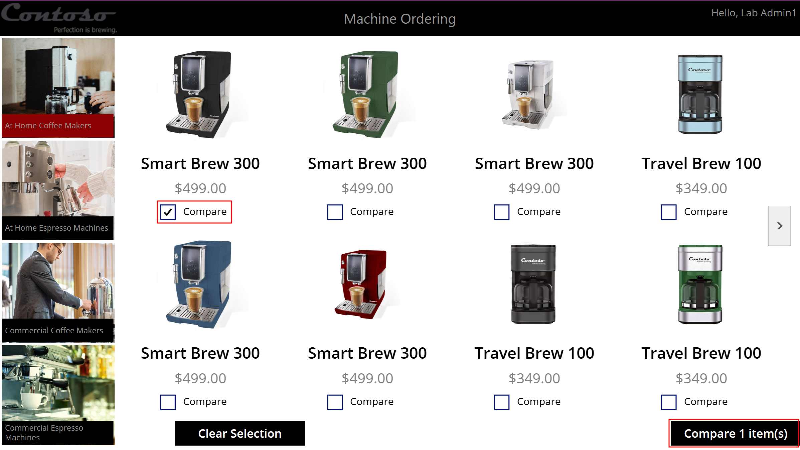

4. From the compare screen, select the **Submit machine request** button in the bottom-right corner to initiate the machine order.

    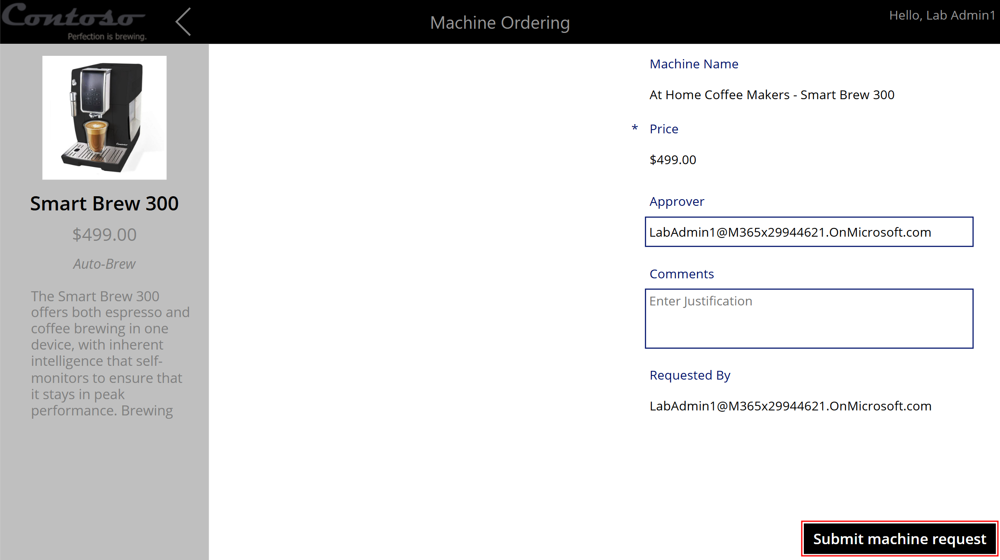

5. After the machine order is submitted, a record will be added to the machine order table. In the success screen, select the **OK** button at the bottom to navigate back to the machines list.

6. Now go through and follow the same steps to submit a couple more machine orders to have multiple machine order records available in the table.

7. Navigate back to the page with your **Agents in a Day** solution and select **Tables** from the left navigation menu to view the tables available in the solution.

8. From the **Tables** page, select the **Machine Order** table to see the records you created earlier.

    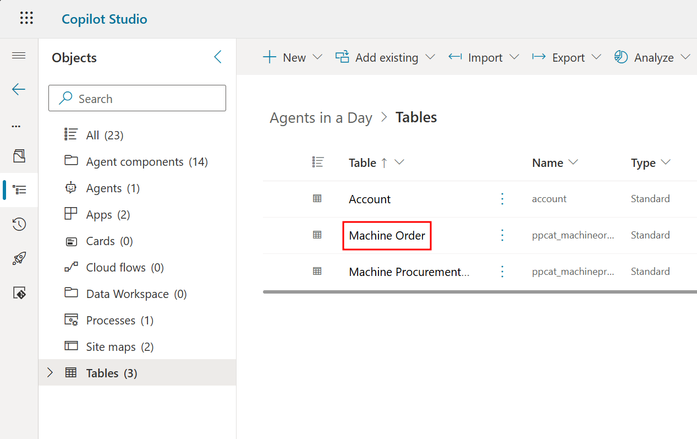

9. In the **Machine Order** table page, you'll see a list of the records you made at the bottom of your screen under the **Machine Order columns and data** section.

    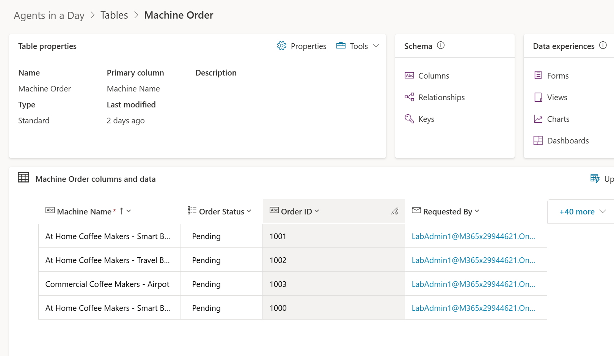

    To see the Order ID and Order Status columns in the **Machine Order columns and data** view, you may need to add them. To do this, select the **more v** drop-down to the right, and select the **Order ID** and **Order Status** columns in the **Show existing column** menu, then select **Save**.

    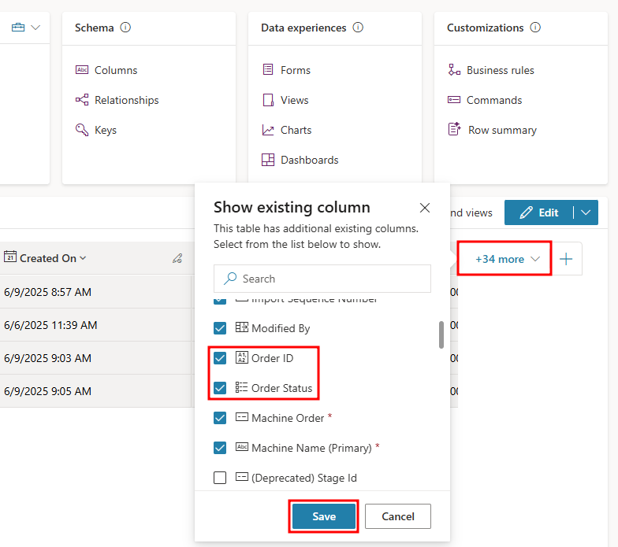

Now that you have a better understanding of the Contoso Coffee machine ordering process and have sample data to work with, in the next unit, you'll create an agent that's intended to expand on this process.

---

**Previous:** [Introduction](./1-introduction.md)

**Next Unit:** [Build an agent in Copilot Studio](./3-build-agent.md)
