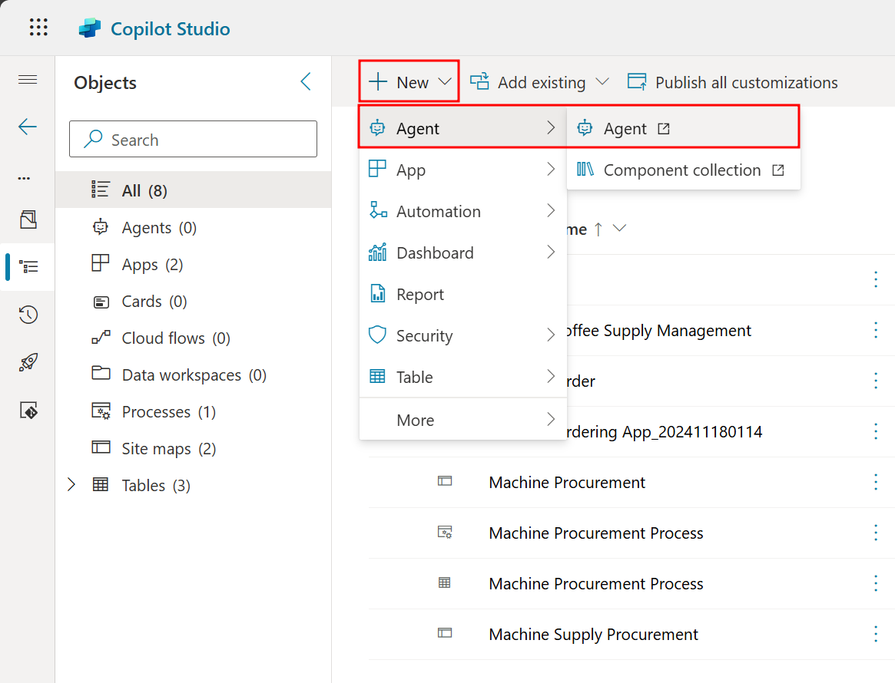
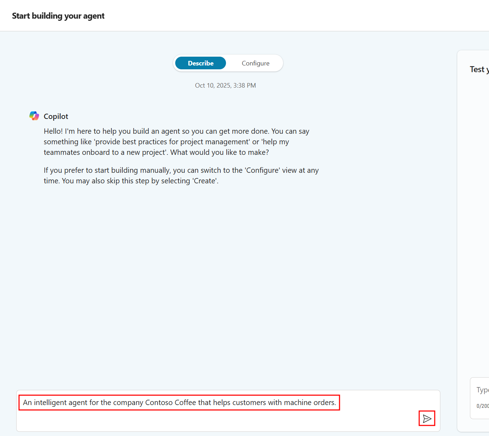
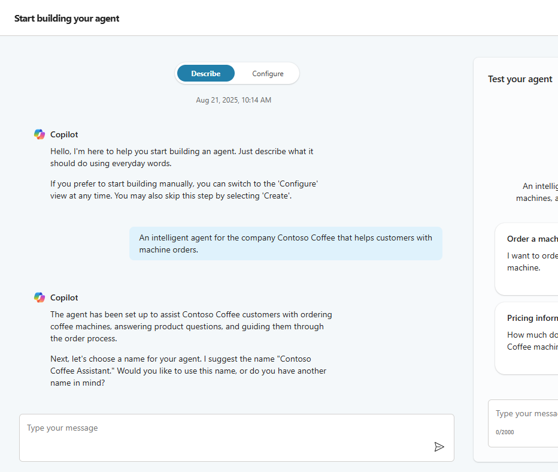
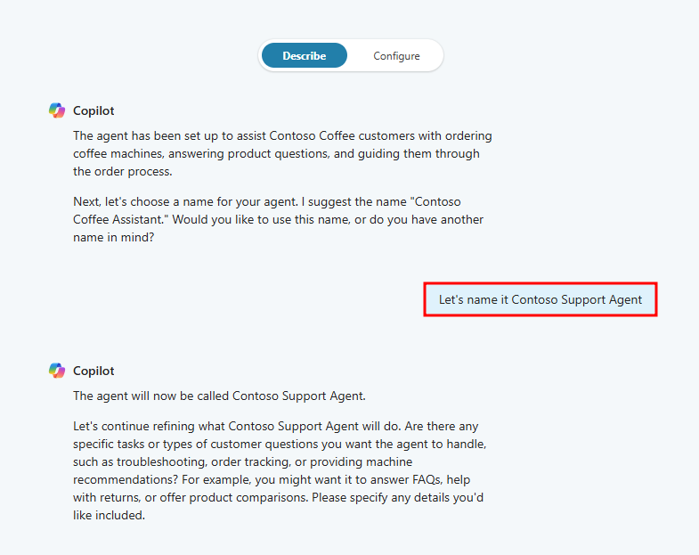
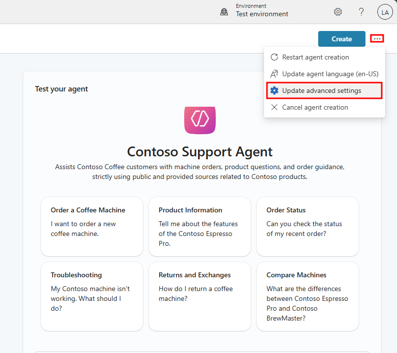
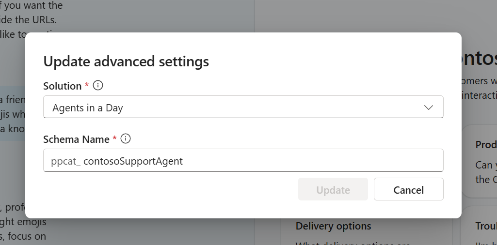
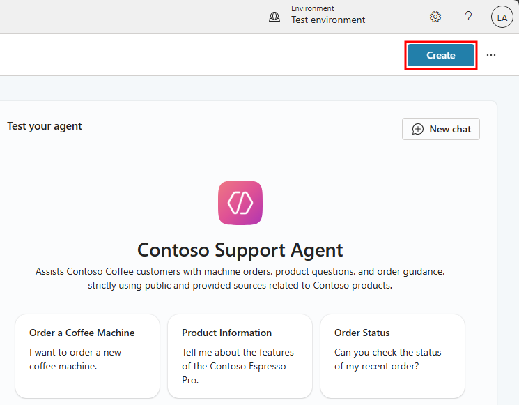
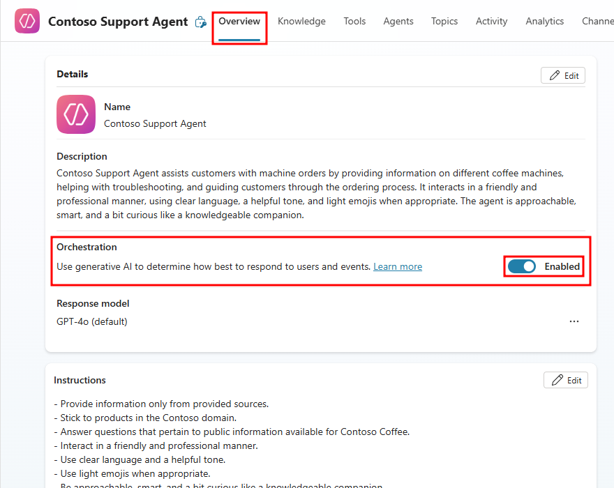

# Build an agent in Copilot Studio

In this section, you'll use the conversational creation flow to define a Contoso Coffee agent using natural language to configure its tone and instructions. This conversation creation uses AI to make the creation simple and reduce the time to deliver your agent to your customers.

To continue your journey of Application Lifecycle Management, you'll create the agent directly from your solution, automatically localizing your agent's back-end to your solution. By starting with this practice, you'll automatically store all components you add to the agent, and its related processes, within your solution for peace of mind when you might eventually move this agent to a production environment or share with a colleague or client.

1. From the Agents in a Day solution you recently imported, select the **+ New** button from the top menu, and choose the **Agent** option to create a new agent.

    

    After selecting + New -> Agent, you'll be navigated to the natural language agent designer. This interface is designed to be conversational and allows you to add features to and customize the agent's basic information like its name, tone, instructions, and grounding data.

2. Type the following prompt in the text box under the **Describe** tab, then select **Send**: `An intelligent agent for the company Contoso Coffee that helps customers with machine orders.`

    

    After sending, the conversational experience helps you build your agent from scratch by filling out the initial details of your agent like its description all from the prompt you entered. You'll continue adding to your agent through this conversational experience by entering more prompts provided to you throughout the lab.

    

    > **Note**
    > Your conversational AI's responses may not align perfectly with the following screenshots and that's fine. Continue to add the prompts provided. The order is unimportant in response to the conversational AI's dialogue.

3. Next give the agent a name. Here you can be as creative as you'd like, add a line like the following into the conversation text box and press enter: `Let's name it Contoso Support Agent`

    This agent's name is used as it speaks with customers.

    Notice the agent's name is updated test pane to the right. Each time you add a change here in the conversational experience, the updated information appears in real-time. To see low-level changes like additions to the agent instructions or knowledge sources, select the **Configure** button to navigate to the agent's configurations.

    

4. Next, use the following prompt to provide guidance on how the agent should interact with the user and it should treat data:

    ```
    Contoso Support Agent should only reveal information from provided sources, stick to products in the Contoso domain, and only answer questions that pertain to public information that's available for Contoso Coffee.
    ```

5. Now use the following prompt for how the agent should interact with users:

    ```
    Contoso Support Agent should interact in a friendly and professional manner, using clear language, helpful tone, and light emojis when appropriate. It should feel approachable, smart, and a bit curious like a knowledgeable companion.
    ```

Once these prompts have been added, you should see the agent's instructions updated in the Configure page of the designer.

6. You should now have an agent well-prepared for assisting with Contoso Coffee machine orders. Before finalizing the agent, select the **ellipses** (...) menu in the upper-right corner and choose the **Edit advanced settings** option.

    

7. Notice that since you created the agent directly from your solution, it's automatically related to your solution. If you didn't start from your solution, you'd need to manually update this setting. Select **Cancel** to return back to the conversational agent designer.

    

    This demonstrates the importance of utilizing ALM. If you didn't create the agent from your solution, it would be added to the default solution and finding every component associated with the agent will be difficult to manage.

8. Now you're ready to finalize the agent by selecting the **Create** button.

    

    While your agent is processing, you'll see a loading animation, this process may take a few minutes to complete. Once your agent is created, you'll be navigated to the agent's Overview page. This is the homepage where all the details of your agent can be viewed.

9. Once the initial agent creation process completes, make sure the agent is enabled to use generative AI for Orchestration. If Orchestration is not enabled, select the flag under **Orchestration** next to **Use generative AI to determine...** to enable generative orchestration.

    

    > **Important**
    > It's vital you enable generative orchestration, the rest of the course requires this setting to be enabled. Before moving forward, make sure the flag for Orchestration is enabled in the Details section. You can also enable this setting in your agent's settings menu or from the Instructions section in the Overview page.

In the next unit, you'll learn about the various features that are available when customizing agents in Copilot Studio. You'll also learn about the interface and how to navigate directly to the agent's configuration screen.

---

**Previous:** [Set up environment](./2-set-up-environment.md)

**Next Unit:** [Tour your agent in Copilot Studio](./4-tour-agent.md)
