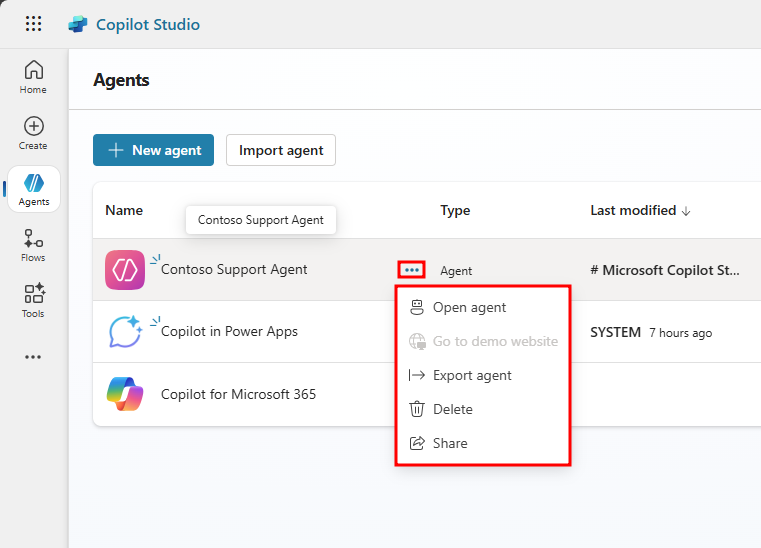
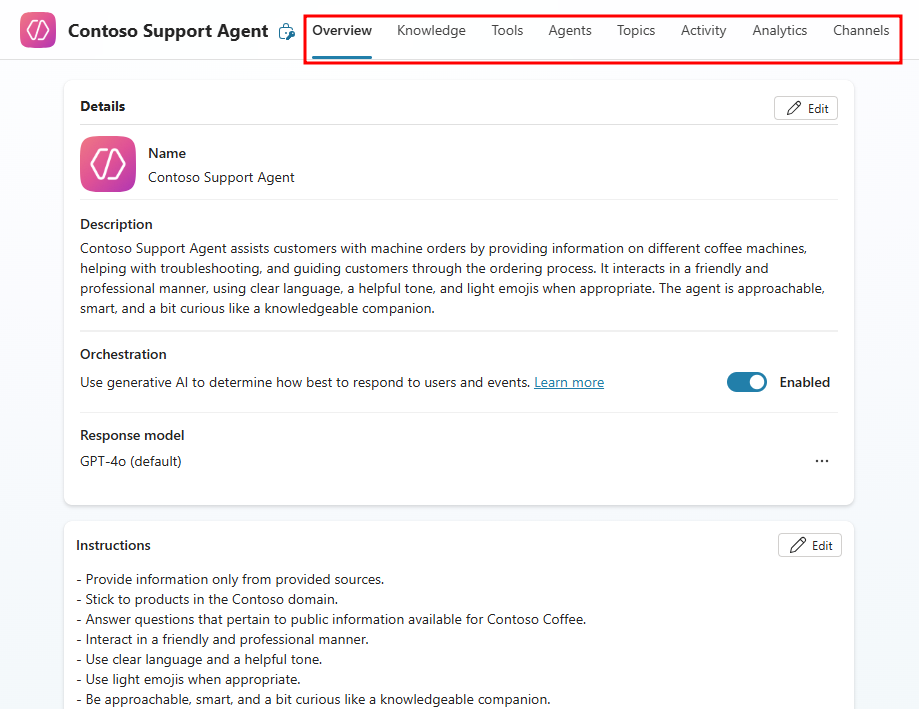
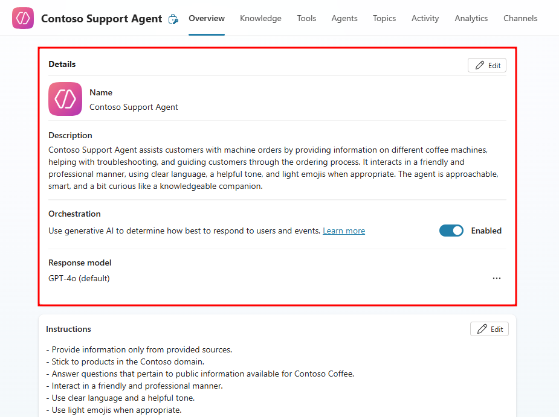
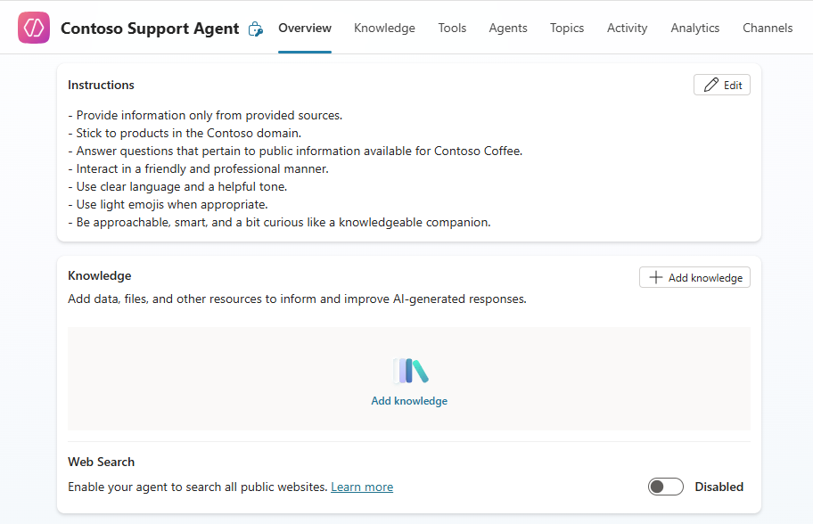
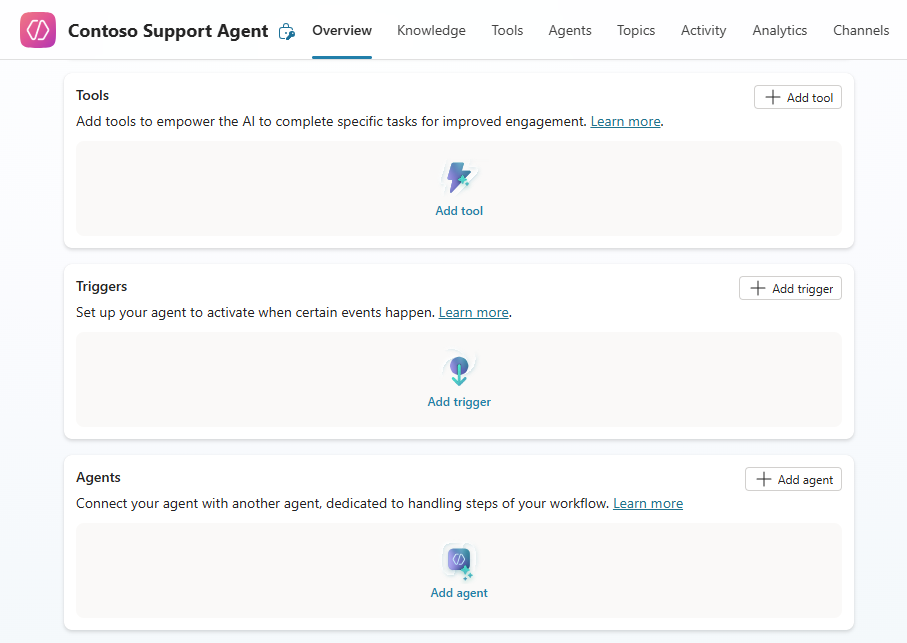
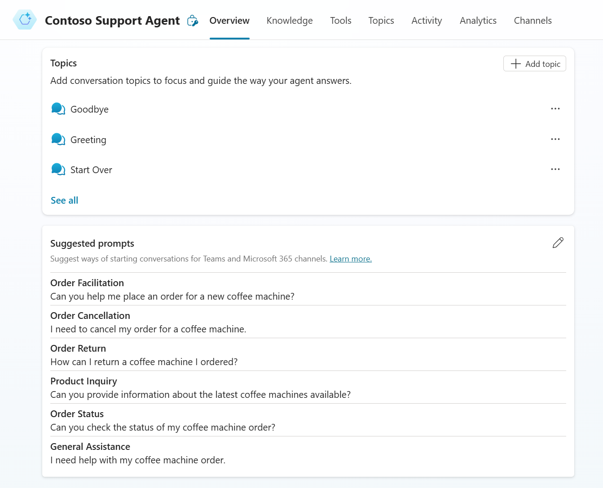

# Tour your agent in Copilot Studio

**Duration:** 10 minutes

Before diving into building and enhancing your agent's functionality, it's helpful to understand the layout and capabilities of the Copilot Studio interface. This unit walks you through opening an agent and navigating the key areas of the Overview page and navigation menu so you can confidently explore and manage your agent. Whether you're reviewing conversation topics, adding actions, or monitoring performance, the intuitive UI puts everything within reach.

1. Navigate to the **Agents** tab of the left navigation menu in Copilot Studio. For non-government customers, you would go to [https://copilotstudio.microsoft.com/](https://copilotstudio.microsoft.com/).

2. Within the **Agents** menu, you can view agents that are available to you. Selecting the ellipses next to an agent brings up a drop-down with options to open, export, delete, or share the agent.

    

3. Select the name of the **Contoso Support** agent you created.

4. After selecting the agent, you'll be taken to the **Overview** tab of your agent that acts as a homepage for all the current features present in your agent.

## Tour the interface

Microsoft Copilot Studio makes it easier for you to build basic to advanced agents with an updated UI that neatly places all the most-used functionalities in the forefront. Put your attention towards the top navigation menu, think of this as your taskbar, which contains all the different pages available when customizing an agent in Copilot Studio.

  

The navigation menu has the following pages:

- **Overview** - Displays your homepage, including a summary of the agent's Details, Knowledge, Topics, Tools, Triggers and Suggested Prompts.

- **Knowledge** - Allows you to provide public and private data as knowledge sources to ground your agents responses in current data.

- **Tools** - Gives access to tools added to your agent. Tools are similar to Power Automate flows that give agents the ability to perform real-world actions like sending emails, modifying Dataverse tables, and sending approvals.

- **Agents** - For implementing multi-agent orchestration. By adding additional sub-agents to your current agent, you're able to call these other agents for collaborative behaviors. As your agent gets more complex, you're able to off-load specific conversation intentions to agents that are concisely built to handle these requests, like a mini-organization of agents that live under the umbrella of the current parent agent.

- **Topics** - Lists the available topics your agent has access to. Topics are conversation paths developed to indicate how your agent should respond to specific scenarios.

- **Activity** - Displays the recent sessions users had with the agent and the potential Generative AI compute used during the session. Requires Generative AI to be enabled.

- **Analytics** - Provides metrics to monitor how well your agent is operating. The various analytics sections include: Customer satisfaction, Sessions, Billing, and Boost conversations.

- **Channels** - Lets you publish and connect your agent to websites, web services, and other integrations.

Most of the agent's direct functionality can be accessed from the Overview page, with each separate section covering a degree of customization.

- **Details** - Provides a general overview of, and the ability to edit, the agent's detail information. This includes the agent's Name, Icon, Description, Orchestration model, and Response model. Selecting the **Edit** button allows you to make changes to these sections.

Agents in Copilot Studio have two orchestration modes available: Generative and Classic. When the orchestration toggle is **Enabled** in the agent details, the agent is set to generative orchestration mode. This course is using generative orchestration throughout, so make sure it's enabled in the details section.

  - **Generative Orchestration** - When an agent is configured to use generative orchestration, it can select one or more tools or topics, or choose from its knowledge sources, to handle user queries (including multi-intent queries), or to autonomously respond to events. If multiple tools or topics are selected, the agent calls them in sequence, after generating any questions to ask the user for missing information.
  
  - **Classic Orchestration** - Requires all agent interactions to be defined within topics. Topics are selected based on matching a user query with trigger phrases. Tools can only be called explicitly from within a topic. Knowledge can be used as a fallback when no topics match a user's query (or called explicitly from within a topic). When no matching topic or knowledge source is found, the agent falls back to a generative answers topic.

  

- **Instructions** - Displays the currently configured instruction set for your agent. The instructions indicate to the agent how it's intended to act and behave. Instructions can include tools, topics, variables, and PowerFx functions you're able to include as dynamic content to further zoom in on individual use-cases.

- **Knowledge** - Shows the currently added knowledge sources which are public or private data the agent can generate responses from. New knowledge sources can also be added from here as well as defining if the agent has access to public websites via the **Web Search** toggle.

  

- **Tools** - Displays tools the agent has access to and the ability to add new ones. These are the actions your agent can perform like modifying Dataverse tables or sending emails.

- **Triggers** - These are defined parameters that signal the agent to perform a specific function, like receiving an email with an attachment or when a Dataverse table row is modified.

- **Agents** - Displays currently connected agents. These agents serve as child agents with the currently edited agent considered as the parent of these. Adding child agents to your agent provides extended customization capabilities that allow you to zero-in on functionalities that may muddy the high-level functions of your parent agent.

  

- **Topics** - Displays a short list of conversation topics the agent has access to with the ability to Edit, Delete, or Disable each topic and create new ones.

- **Suggested prompts** - A list of prompts suggested to users when they first interact with an agent. It's a best practice to provide specific responses the agent is expected to understand. These consist of a title that describes the prompt and the prompt itself, which are then entered into the text box and sent to the agent.

  

Now that you've toured the agent interface and learned how to navigate key sections of the Overview page, you're ready to begin customizing your agent's capabilities. In the next unit, you'll build on this foundation by configuring knowledge sources that enhance how your agent responds and performs.

---

**Previous:** [Build an agent in Copilot Studio](./3-build-agent.md)

**Next Unit:** [Add agent knowledge sources](./5-add-agent-knowledge-sources.md)
