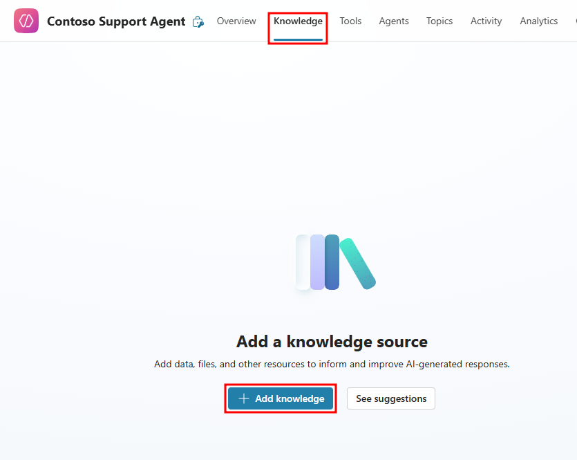
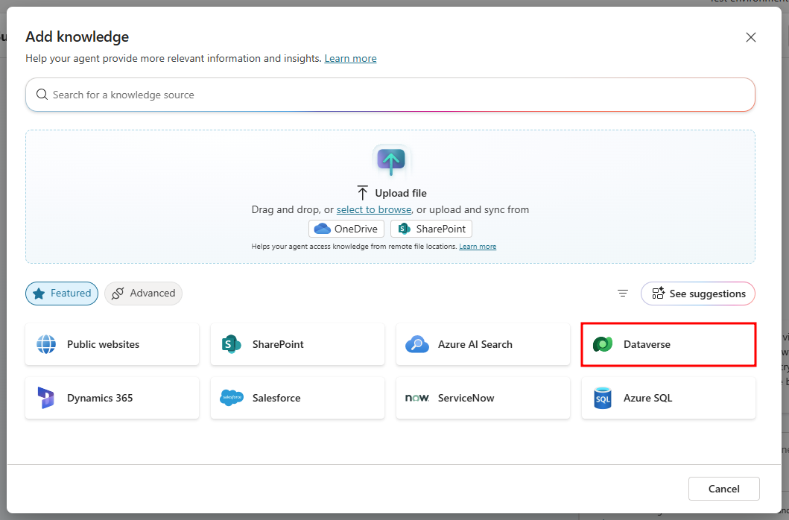
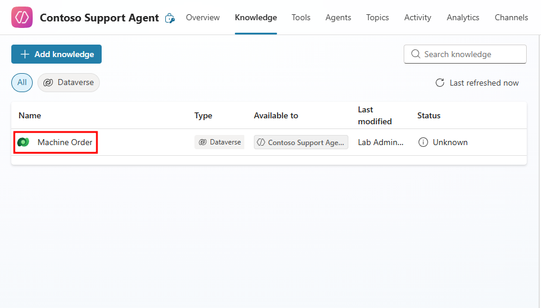
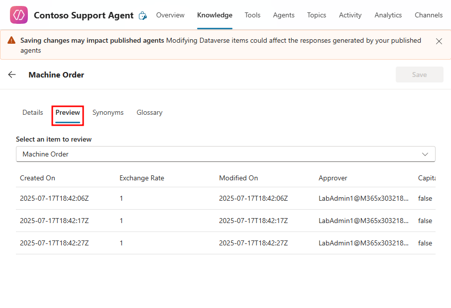
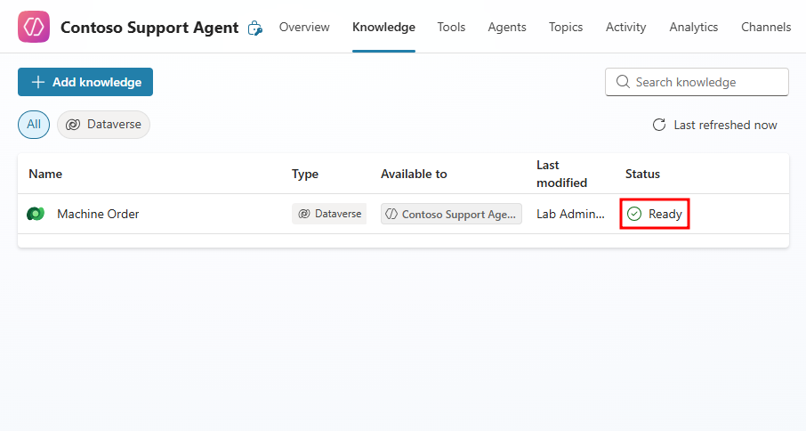
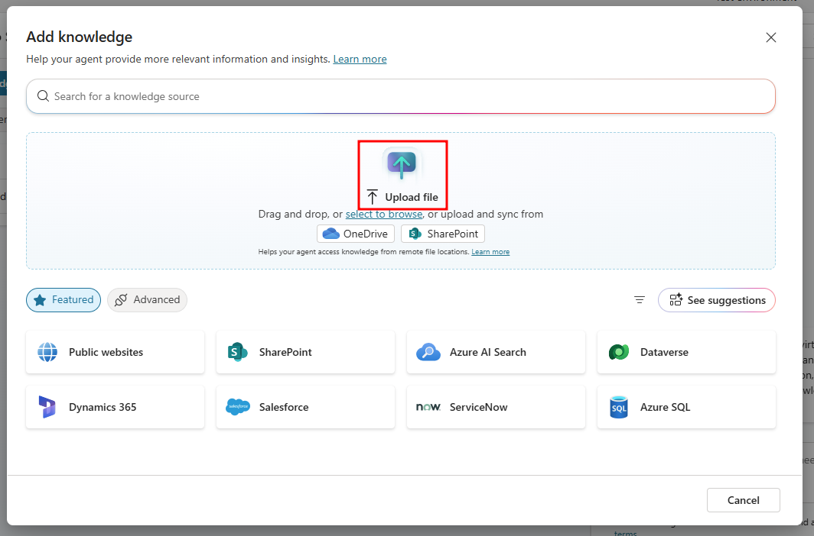
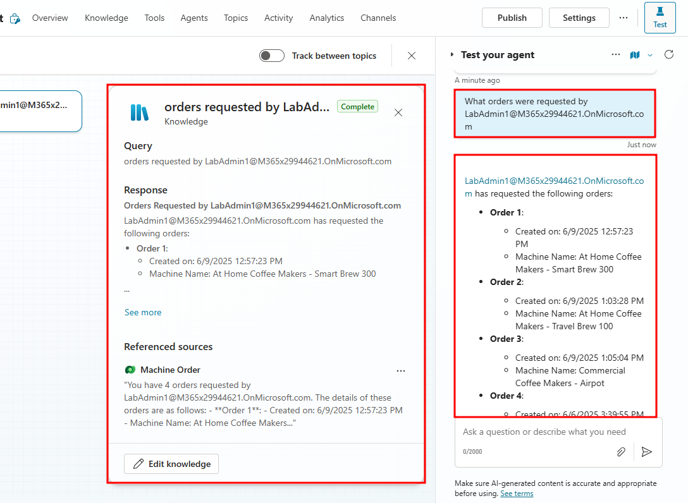
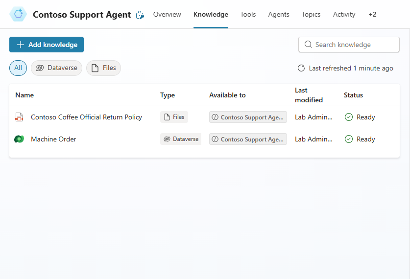
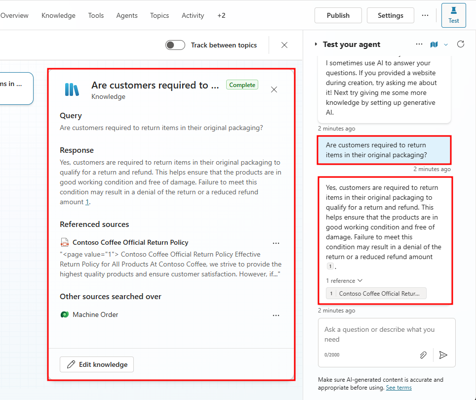

# Add agent knowledge sources

**Duration:** 10 minutes

Many of the coffee machines returned to Contoso are damaged or missing the box they were originally sold in. You're interested in training the qualifications for valid returns into the agent so that it's clear on what condition the returned product should be in.

As you enhance your agent's capabilities in Copilot Studio, access to relevant data becomes a key differentiator in delivering useful, grounded responses. In this unit, you'll learn how to add Dataverse tables from the solution you imported earlier and configure them as knowledge sources for your agent. You'll also explore how to bring in external knowledge in the form of the return policy PDF you used in the Copilot Chat agent, enabling your agent to respond to a wider range of questions with real-world context.

## Add Dataverse knowledge

In our scenario, Contoso Support Agent helps users access machine orders information by pulling data from the associated Machine Orders table. Adding the Machine Orders table to an agent as a knowledge can be achieved by walking through the following steps.

1. From your agent's homepage, navigate to the **Knowledge** tab from the top navigation menu.

2. In the Knowledge page, select the **+ Add knowledge** button to add a new knowledge source.

    

3. From the **Add knowledge** window that opens, select **Dataverse**.

    

4. In the search bar, search for the **Machine Order** table and select it, then select the **Add to agent** button at the bottom of the screen.

    

    The Machine Orders Dataverse table from your environment should now be linked to your agent. It may take a few minutes to load. The *Status* column informs you if the knowledge source is ready for testing. Select the refresh button at the top of the Knowledge page and wait until the source is **Ready**.

5. Select the **Name** of the Machine Orders table to open additional settings available when adding Dataverse tables.

    

6. From the additional settings menu that opens, select the **Preview** tab to see the available data the agent has access to. All of these rows and columns are able to be referenced by your agent.

    

7. Navigate back to the **Knowledge** page and check if the Dataverse table is set to **Ready** under the **Status** column.

    

Now that you have internal data provided in the form of a Dataverse table, in the next section we'll import external data in the form of an uploaded PDF.

## Upload knowledge

Beyond attaching preconfigured Dataverse tables, Copilot Studio also allows you to directly upload your own documents to help it gain additional knowledge. For our Contoso scenario, we'll be uploading an official return policy for Contoso Coffee machines. Additional information can be found by browsing the [Upload files as a knowledge source](https://learn.microsoft.com/en-us/microsoft-copilot-studio/knowledge-add-file-upload) documentation.

The following document types and their valid extensions are supported to be uploaded:
- Word (doc, docx)
- Excel (xls, xlsx)
- PowerPoint (ppt, pptx)
- PDF (pdf)
- Text (txt, md, log)
- HTML (html, htm)
- CSV (csv)
- XML (xml)
- OpenDocument (odt, ods, odp)
- EPUB (epub)
- Rich Text Format (rtf)
- Apple iWork (pages, key, numbers)
- JSON (json)
- YAML (yml, yaml)
- LaTeX (tex)

> **Note**
> Files larger than 512 MB aren't supported to be uploaded.

Walk through the following steps to learn about uploading documents as knowledge sources.

1. Navigate back to the Knowledge page of your agent and select the **+ Add knowledge** button to add another knowledge source.

2. In the **Add knowledge** window that opens, select the highlighted **select to browse** text to open up a file explorer window. You can also drag-and-drop the file directly from your desktop.

    

3. In the file explorer window that opens, navigate to your student files and select the **Contoso Coffee Official Return Policy.pdf** file.

> **Important**
> You can download these student files from the following link [Download Student Files](https://aka.ms/AgIADStudentFiles). The return policy is located in the attached AgIAD Student Files.zip file.

4. Provide a **Name** and **Description** for the knowledge source, this helps the agent and co-creators understand the purpose of a knowledge source. Finally, select **Add** at the bottom of the window to add the PDF to your agent.

5. After selecting add, you'll navigate back to the Knowledge page for your agent, with the newly added PDF added. Notice the file shows up as **In progress** in the status column to indicate it needs time to finish processing before testing.

## Test knowledge

Once your Knowledge sources are ready, you're able to test their functionality in the Test pane on the right. When the orchestration mode is set to Generative the agent can call knowledge sources directly and ground its responses on their data.

1. To test your agent's Dataverse knowledge, enter a prompt about the Machine Orders table in the test pane on the right.

2. In the test pane, enter the following prompt:

```
What orders were requested by <your email>
```

Replace `<your email>` with the email of the tenant you're currently logged-in to. When you place a machine order in the machine ordering app, your order is attached to a **Requested By** field, this pulls the email of the currently signed in user.



You should be provided with all the machine orders that were requested by the provided email. You can see how simply giving your agent access to Dataverse tables can provide immense value without needing to manually update, create, or transfer any of the relevant information to your agent.

When testing an agent that's set to generative orchestration, an activity map is provided by default. Activity maps track the back-end querying and response generation the agent goes through. When testing the machine orders table, it shows the referenced sources, the initial query, and the generated response.

3. Once the **Contoso Coffee Official Return** Policy file is finished processing, you can test its functionality in the test pane.

    

> **Note**
> The return policy may take over 10 minutes to finish processing. In this case, it's alright to go ahead and test the file before it's finished processing.

4. Next, start a new chat in the test pane, and send the following prompt based on the Official Return Policy document:

```
Are customers required to return items in their original packaging?
```

5. After sending the prompt, an activity map will open showing the knowledge source triggered, initial trigger query, the agent's response, and the referenced text from the file.



> **Note**
> The activity map is a feature only available when agents have generative orchestration enabled. This feature can be extended by enabling the track between topics functionality, allowing the agent to display the different topics that are triggered. Agents in classic orchestration will only be able to see the triggered topics and nodes that are currently executed in the topic.

Now your Contoso Support Agent is able to reference internal data in the form of direct machine orders and external data like the official return policy. In the next module, you'll expand your agent's capabilities by giving it access to tools that allow it to perform actions beyond the conversational experience.

---

**Previous:** [Tour your agent in Copilot Studio](./4-tour-agent.md)

**Next Unit:** [Check your knowledge](./6-check-your-knowledge.md)
