# 2. Build a custom prompt tool

In this exercise, you'll add your first tool. We'll be using the prompt tool to attend to users that are frustrated and require a more empathetic response than typically indicated by the agent's instructions. Prompt tools are customized generative answers triggered under specific circumstances. In this case, the custom message will provide more empathetic depth than the agent is already defined to portray and point them toward resources like the Contoso website.

## Add the prompt tool

To add a tool, you'll first need to navigate to the Tools page of your agent. Optionally you can also add tools from the agent's Overview page, but for this exercise, we'll be using the Tools page.

From the top navigation menu of your agent, select the **Tools** tab to navigate to the Tools page.

In the Tools page, select the **+ Add a tool** button to add a new tool.

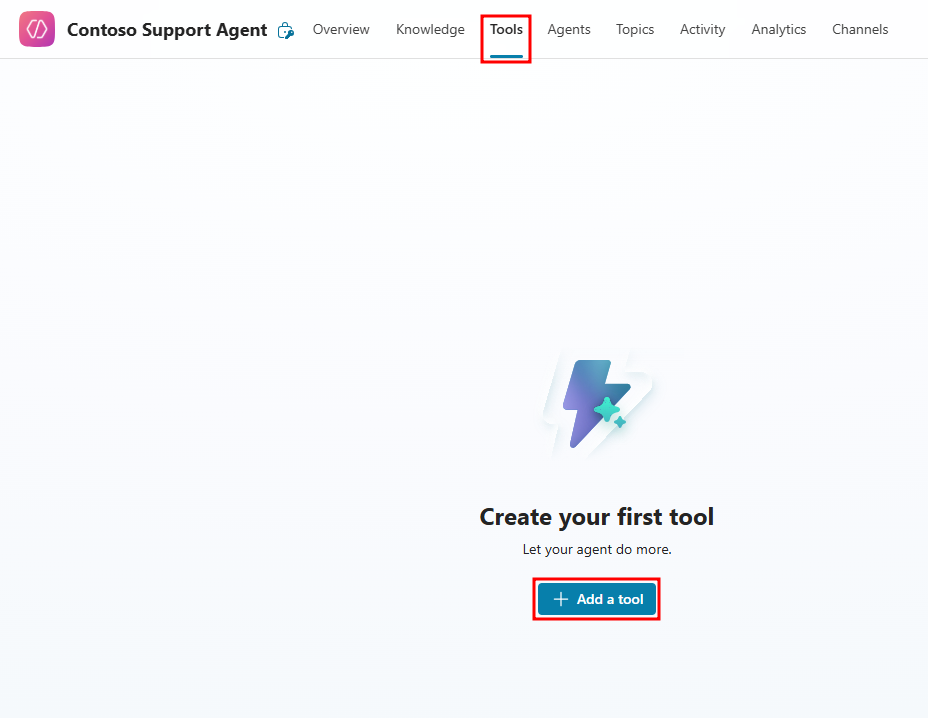

Select the **+ New tool** button in the top-right of the Add tool window that opens.

After selecting new tool, you'll be given a list of options available when adding a tool. Here's a quick overview of each of these options:

- **Prompt** - Analyze and transform text, documents, images, and data, with natural language and AI reasoning.
- **Agent flow** - These automations utilize Power Automate cloud flows to automate back-end tasks that extend your agent's capabilities to common tasks you would perform like initiating an approval and sending Teams notifications.
- **Custom connector** - Connect your agent to external services and data sources outside the Power Platform and Dataverse architectures.
- **REST API** - Flexible and scalable ways to connect your agent to custom internal programming logic.
- **Model Context Protocol (MCP)** - Connect your agent to an MCP server that handles LLM tooling.

From the list of options for new tools, select the **Prompt** card.

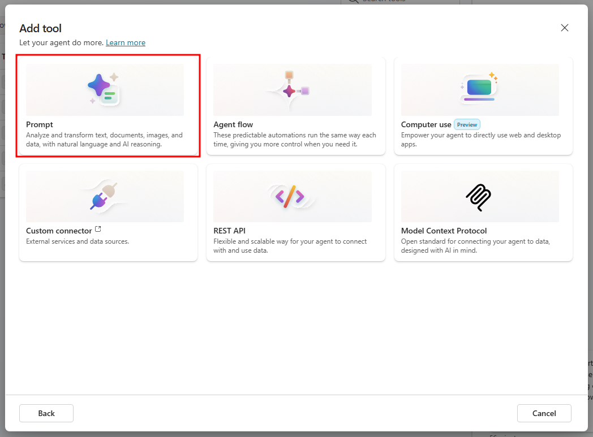

After selecting the prompt card, you'll be taken to the prompt tool setup page. This page has two main sections:

- **Instructions** - Sub-agent instructions that are intended to be used specifically for this prompt. These instructions will only be used when this prompt tool is called and directs the agent how to respond under the defined circumstances you'll configure later. You're also able to control the AI model that's used to generate this response and provide content the agent will detect and use as dynamic content for the response.
- **Model response** - This section is your testing area. When you provide sample data for included content, the agent will craft a response using the instructions adapted to your sample data.

First, select the name of the prompt in the top-left and rename the prompt to **Customer Issue Prompt**.

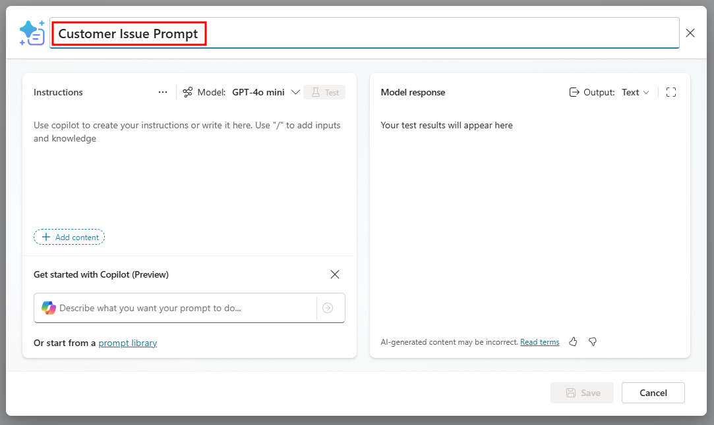

In the Instructions section, select the **+ Add content** button to add a text input.

In the Input menu that opens, select the **Text** option.

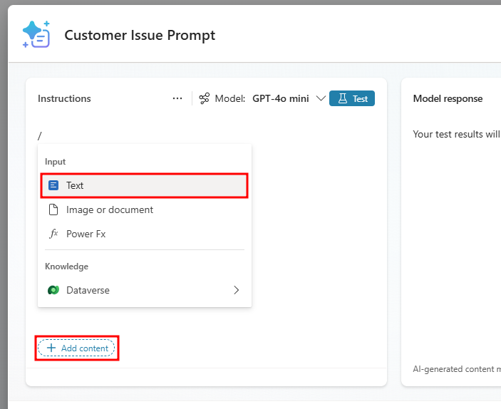

Set the input's Name to **Customer Issue**.

Add the following prompt into the Sample data field: **I'm having issues with my AirPot not heating to the desired temperature.** then select Close to add the input to your instructions.

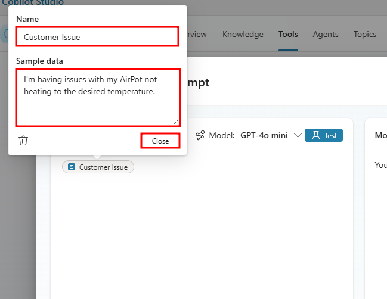

Now that you have an input configured, you're able to craft an instruction set that's intended to use this input as dynamic content, replacing the Customer Issue bubble with the user's prompt.

Update the Instructions section to include the following text: **Using [Customer Issue], provide a thoughtful and empathetic response to show your concern for their issue. Make sure to direct them to the Contoso Coffee website that includes hardware malfunction documentation.**

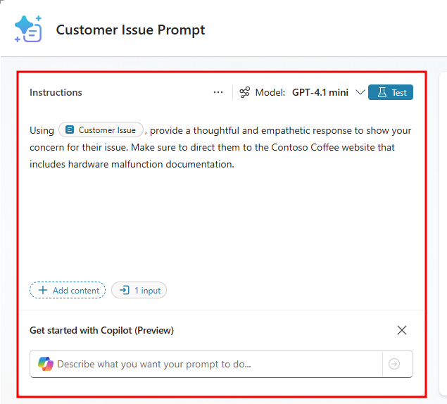

You're now ready to test this prompt tool in action, to do this, select the **Test** button.

After testing, the model response will generate with the provided sample data.

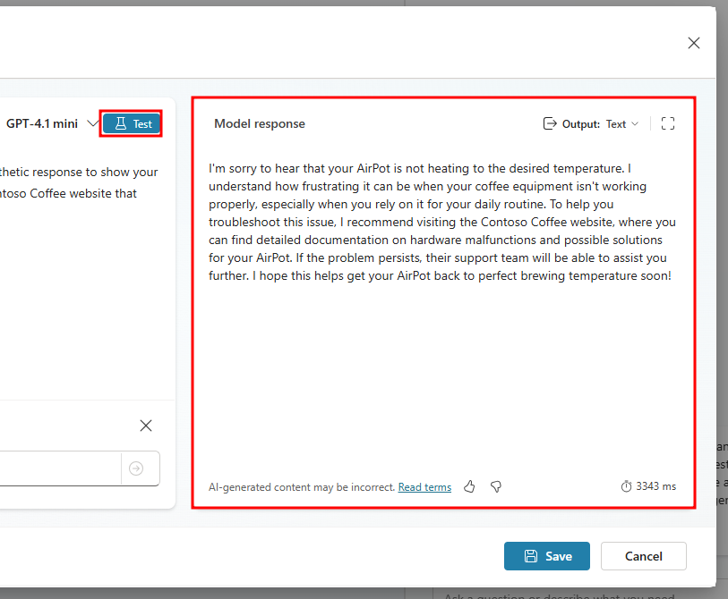

Now that you've tested the prompt and you feel the response is adequate, select the **Save** button to save the prompt.

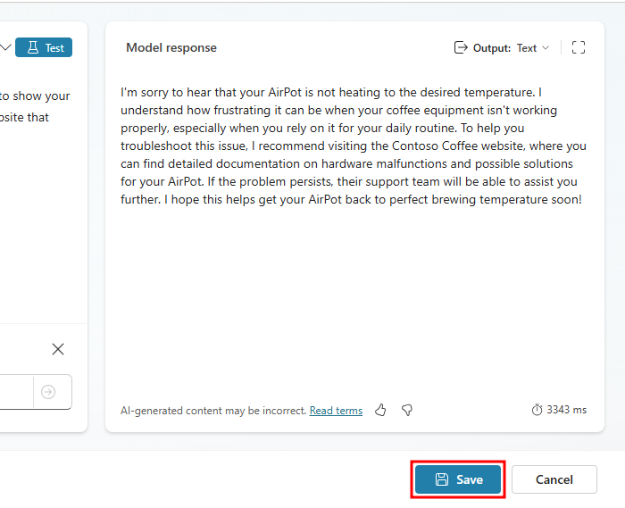

You'll then be navigated to the Add tool window. From the bottom of the window, select the **Add to agent** option. Your prompt should now show up in the Tools page of your agent.

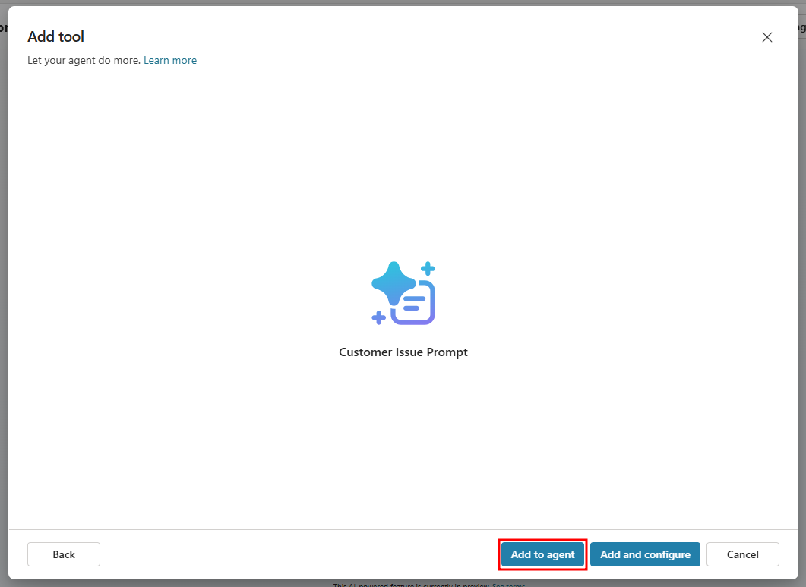

Next, you need to modify the agent's instructions and let the agent know when to use this prompt. Navigate to the Overview page of your agent and select the Edit pencil icon in the Instructions section.

To add the Customer Issue Prompt directly to your agent's instructions, you need to enter a forward slash / to open the dynamic content menu, then select the Customer Issue Prompt.

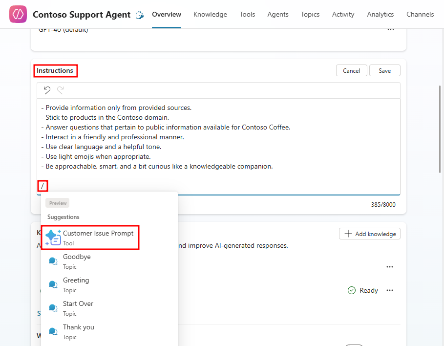

In the Instructions section, add the following text at the bottom, then select Save in the top-right corner of the Instructions section:

**When a user presents an issue with a machine:**  
**- Use the [Customer Issue Prompt]**

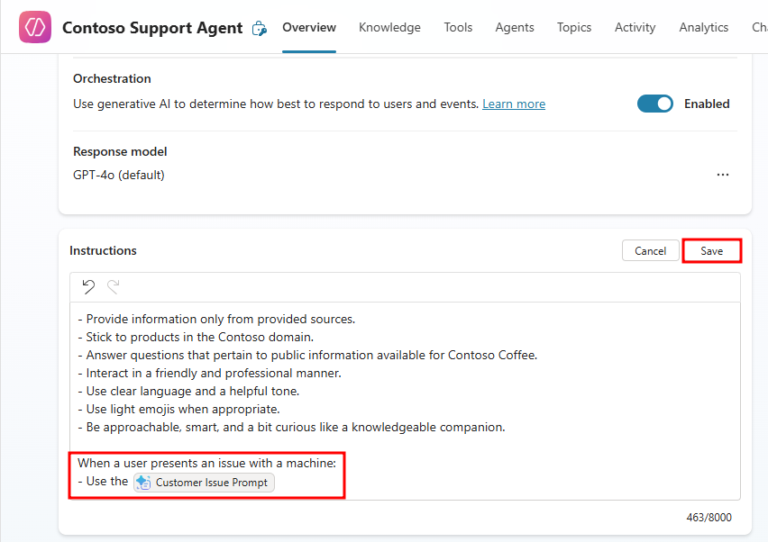

Now test the prompt in the test pane on the right, enter the following prompt: **I'm having issues with my Travel Brew 100 machine.**

If the agent asks for the issue to report, reply with a prompt like: **It's not turning on after I press the power button.**

You should be provided with a custom empathetic response to having issues with a machine. The activity map will also display the associated data including the collected Customer Issue that was used in the prompt and the output from the prompt tool.

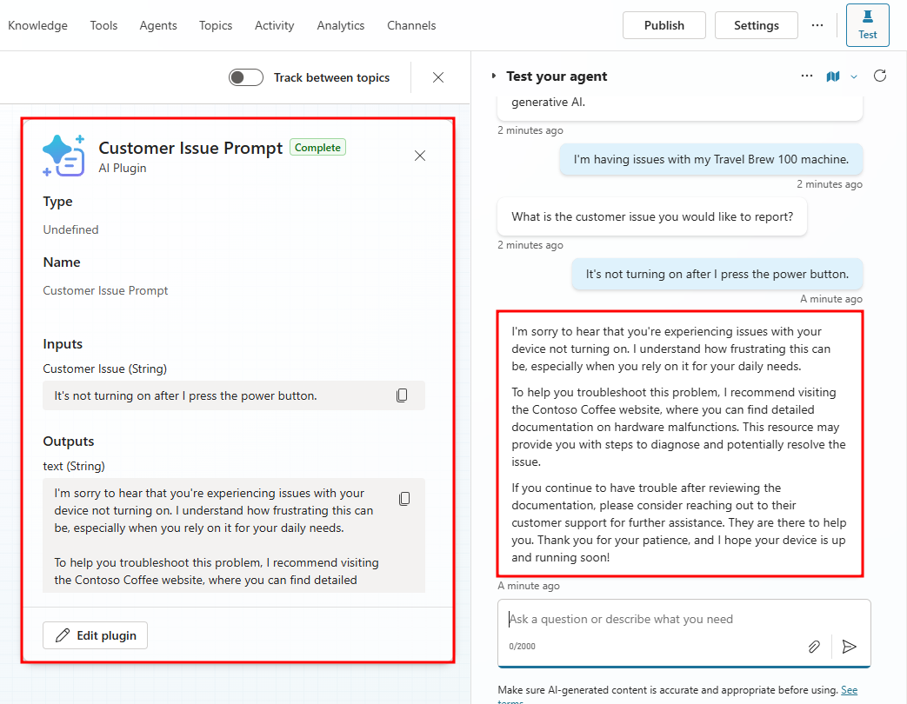

Prompt tools give your agent more flexibility in responses where provided knowledge is limited, while also giving you more control over the elicited reaction depending on the business scenario.

Now that you've added your first tool for customer service scenarios, in the next unit, you'll build a solution that helps facilitate order cancellation by utilizing agent flows.

## Next Section

[Continue to Exercise 3: Build an agent flow →](5-exercise-build-agent-flow.md)
