# 3. Build an agent flow

**Completed**  
**100 XP**  
**15 minutes**

Agent flows are tools in Microsoft Copilot Studio that allow you to extend your agent's capabilities through custom Power Automate workflows. In this unit, you'll learn how to create a flow that responds to users canceling a machine order by updating a record in a Dataverse table. You'll configure inputs, filter for specific records, and use dynamic expressions to modify data based on user prompts. By the end of this unit, you'll understand how agent flows serve as powerful tools that bridge conversational experiences with backend logic and data manipulation.

## Build an agent flow

From the agent's Tools page, select the **+ Add a tool** button.

Select **+ New tool** from the Add tool window that opens to add a new tool.

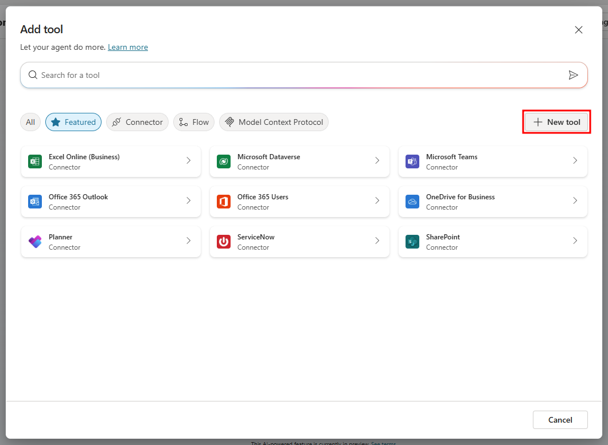

Select **Agent flow** in the next screen to create a new agent flow.

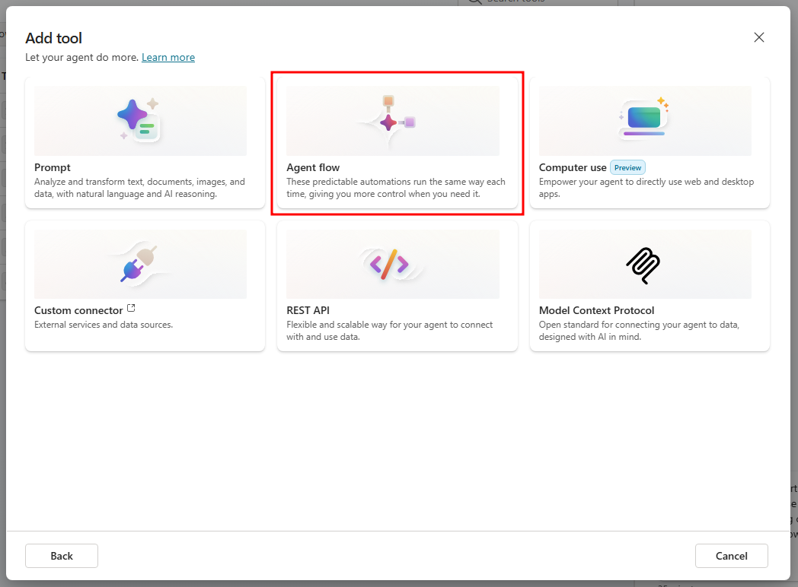

A new Agent Flow has been created that will allow Copilot to take action on behalf of your customer or staff like cancel an order. You'll see that there are two items already on the screen: one that starts the process and receives inputs from Copilot Studio and an ending one that sends a response back to Copilot Studio after the actions have been run. To start, you'll add a list of inputs that will be sent into the Agent Flow. Select the When an agent calls the flow trigger card, then in the pane that opens to the left, select the **+ Add an input** option to add an input variable.

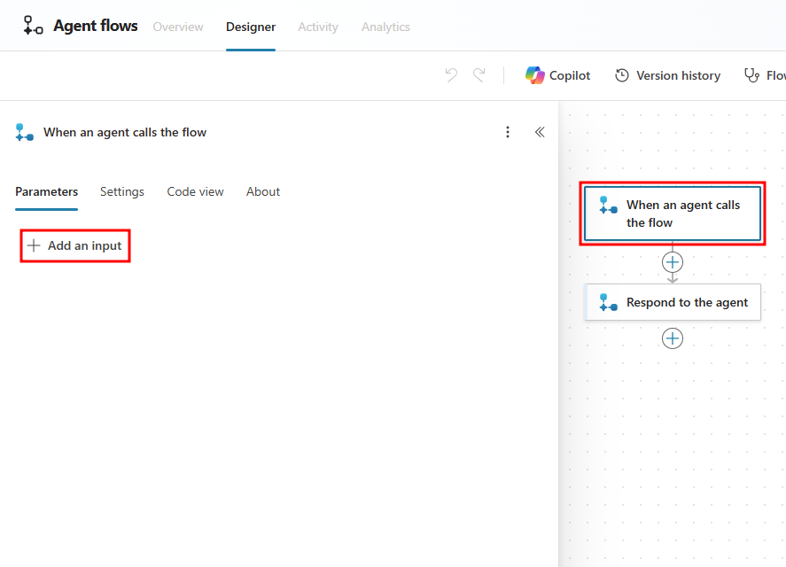

The input we plan on using is the Order ID field in the Machine Orders table. This field is an autonumber type, though the data type for this field is actually text, we'll be using the Number input for our agent flow. This is due to our Order ID only containing number characters, so in our agent flow input, we'll have the agent look for a Number to parse from user responses.

In the When an agent calls the flow pane, select the **Number** option under the Choose the type of user input menu.

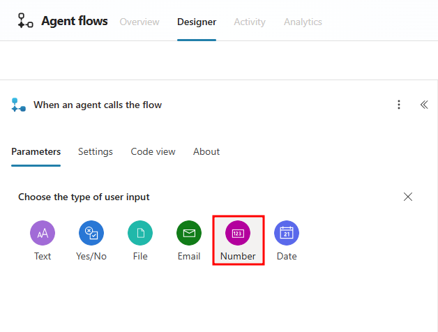

Change the name of the input on the left to **Order ID**. This tells the agent that it's expecting a number as an input and that its name is Order ID.

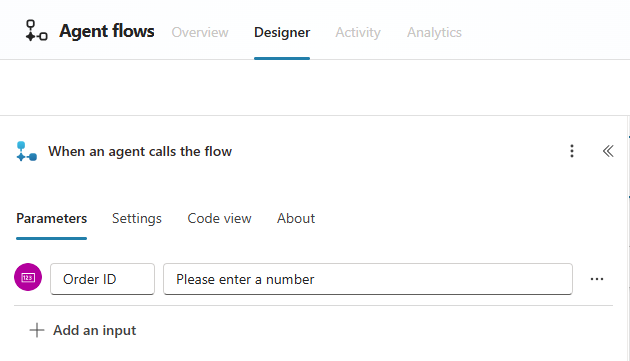

Now that you have an input variable set, you need to add an action that's able to find the record that matches the supplied Order ID in the Machine Orders table.

Select the **+** symbol between the trigger card and the Respond to the agent action to add a new action.

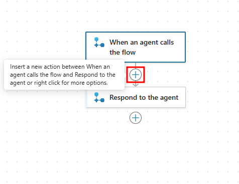

In the Add an action pane that opens to the left, search for **List rows Dataverse**, then select the List rows action under the Microsoft Dataverse section.

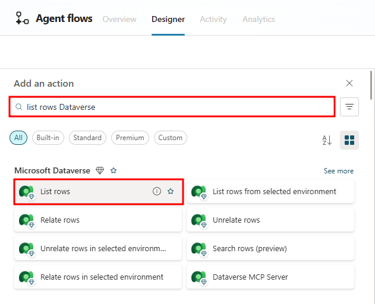

This action looks through a Dataverse table and allows you to modify or pull data from individual records from that table.

If a Create connection screen opens, set a Connection name, choose Oauth for Authentication type, and select Sign in.

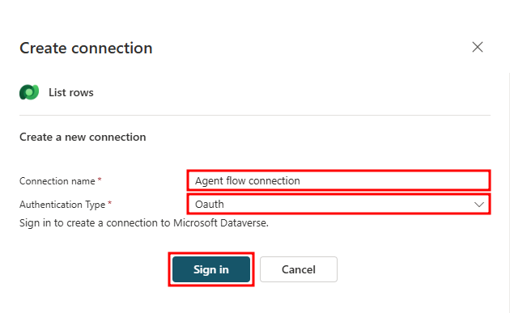

You may need to allow pop-ups for Copilot Studio to create this connection.

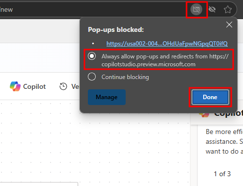

Then select the Microsoft account you've been using throughout the course in the account picker screen and choose Allow access.

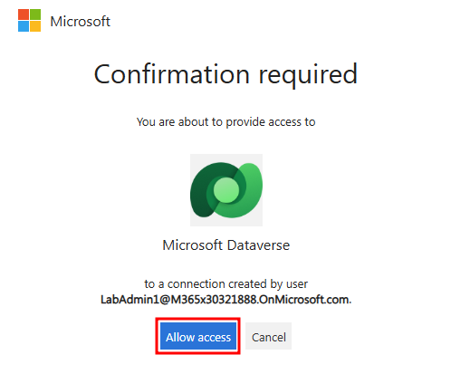

Set the Table name field to our Machine Orders table, this tells the action that we want it to look at the records of the Machine Orders table.

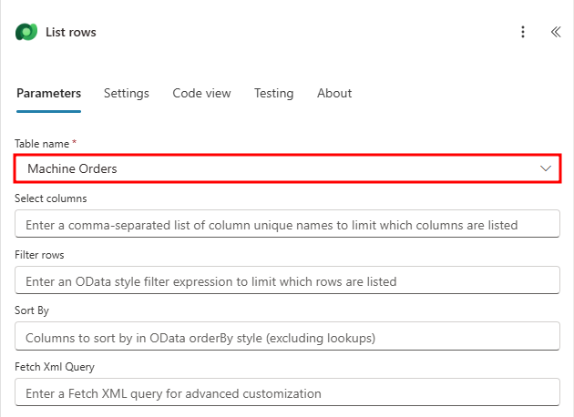

In the next step, you'll add a filter expression that indicates to the action to only pull the record that matches our supplied Order ID.

Select the Filter rows field and enter the following text: **ppcat_orderid eq ''**. This tells the action that we only want rows that are equal to what's between the single quotes.

ppcat_orderid is the logical name of the Order ID column and eq is the filter query expression to indicate is equal to. You can find the logical name of every column by going to the columns section of a Dataverse table. The reason we have single quotes is to indicate that the dynamic content we're providing is a text string.

Now put your cursor position in-between the single quotes and select the lightning bolt icon on the right to insert dynamic content between the single quotes.

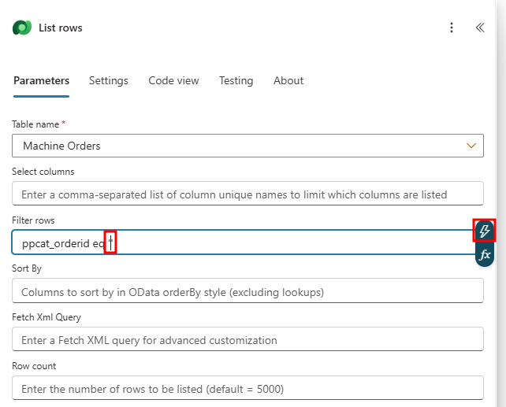

In the dynamic content menu that opens, choose the Order ID dynamic content under When an agent calls the flow. Make sure the dynamic content is in-between the single quotes.

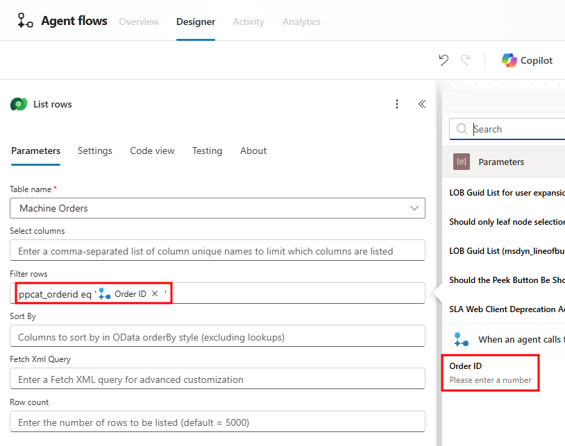

Our List rows action is now complete and ready to pull the record that matches the supplied Order ID. In the next step, you'll add an Update a row Dataverse action to set the matching record's Order Status field to Canceled.

Select the **+** symbol below the List rows action to insert a new action.


In the Add an action pane that opens to the left, search for **Update a row Dataverse**, then select the Update a row action under Microsoft Dataverse.

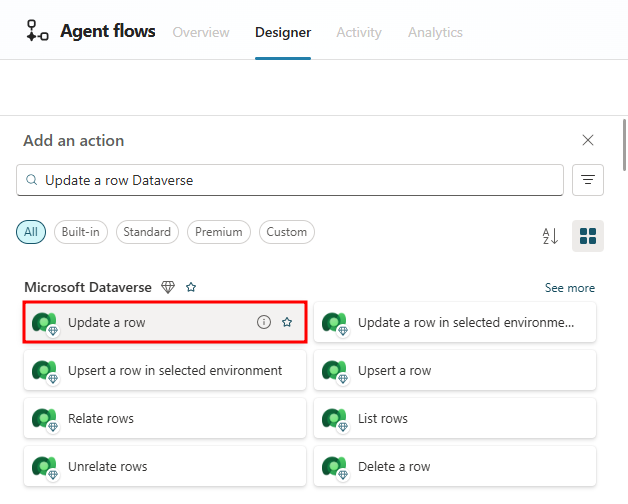

> **Note**: If a Change connection window opens, select the connection you previously formed.

In the Update a row pane that opens to the left, choose the Machine Orders table to indicate that the row updated will be in the Machine Orders table. Choose the connection you created previously if prompted.

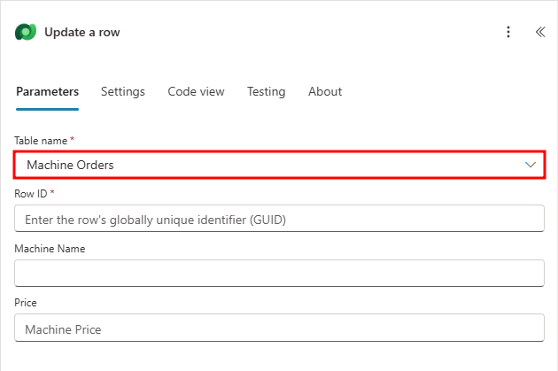

Now that we have the Machine Orders table selected, we need to tell the action what record it's updating. Typically when you look at the outputs of a List rows action, it creates a loop so that you can interact with each matching record. But in our case, we only want to pull one record due to our Order ID column being unique values, for example, each machine order has its own unique Order ID that no other machine order can have.

In the next step, we'll use a Power Fx expression to tell the Update a row action to only use the first record that's retrieved from the List rows action.

Select the Row ID field then select the fx symbol to the right to open the Power Fx expression editor.

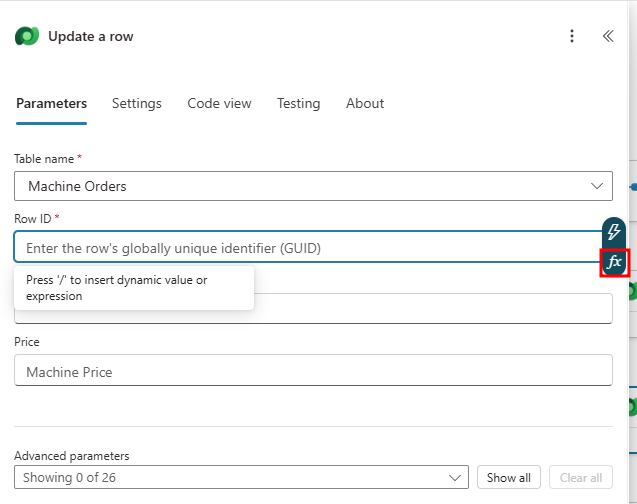

In the Power Fx editor window, copy and paste the following expression, then select the Add button to add it to your Row ID field.

```
first(outputs('List_rows')?['body/value'])?['ppcat_machineorderid']
```

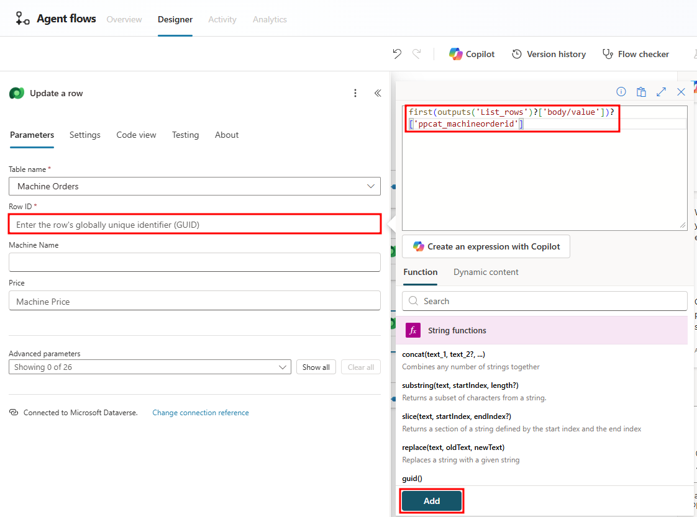

This expression checks for the first record retrieved from the List rows action then uses the Machine Order ID for that record as the Row ID. A Row ID is a globally unique identifier (GUID) that's attached to each record in a table.

In the Row ID field, you should now have a pink fx symbol with first(...) next to it. When selecting this pink box, it should open the editor and confirm the expression you added.


If the locale of your environment is causing issues with the expression used above, you can optionally build this expression manually with the following steps:

In the expression editor, add the first() function.
Place your cursor within the parentheses, select Dynamic content, and choose the body/value field under List rows.
Next, place your cursor after the closing parenthesis, and add the following: ?['ppcat_machineorderid']
Select Add in the expression window to add the expression.

Now that we have the record we intend to update selected, we need to indicate what field we'd like to update. Select the Show all button under the Advanced parameters section in the Update a row action.

Select the Order Status field and set it to **Canceled**. This updates the row of the provided Order ID to an Order Status of Canceled when a user triggers this agent flow by asking the agent to cancel an order.

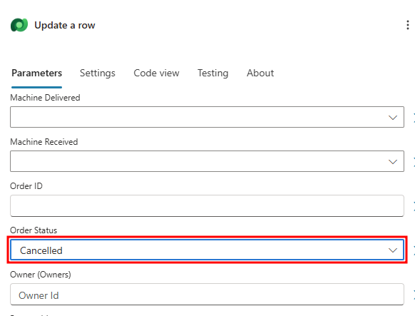

Your agent flow is now ready to be published. In the top-right corner, select the **Publish** button to finalize the flow.

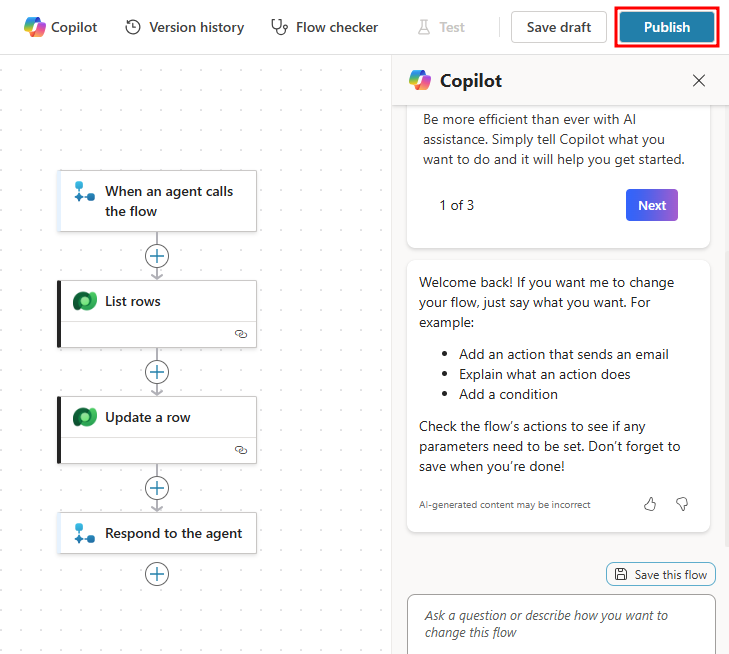

After your flow publishes, you'll be served a success window. Select the blue **Go back to agent** button to exit the flow designer and navigate back to the Tools page of your agent.

After a few seconds, your agent flow will show up as **Untitled** in the Tools page. Select this flow to open its details.

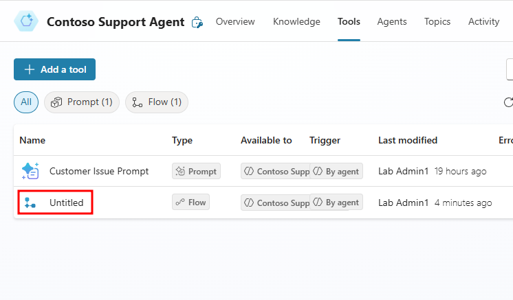

In the Details section, set the Name to **Order Cancellation Flow**.

Give the flow a Description like **This flow sets a Machine Order record to canceled when a user asks to cancel an order.**

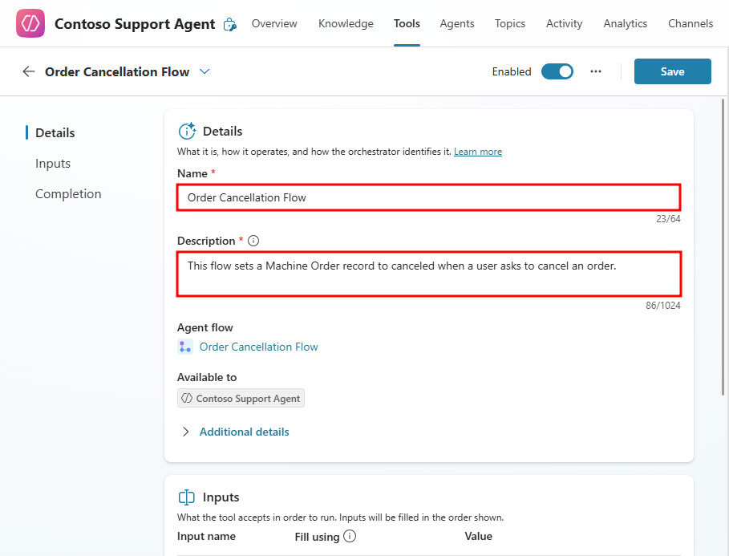

Now scroll down to the Completion section. Select the drop-down under **After running:** and choose the **Send specific response** option. In the Message to display field, add the following text: **Your order has been canceled, thank you for choosing Contoso Coffee!**

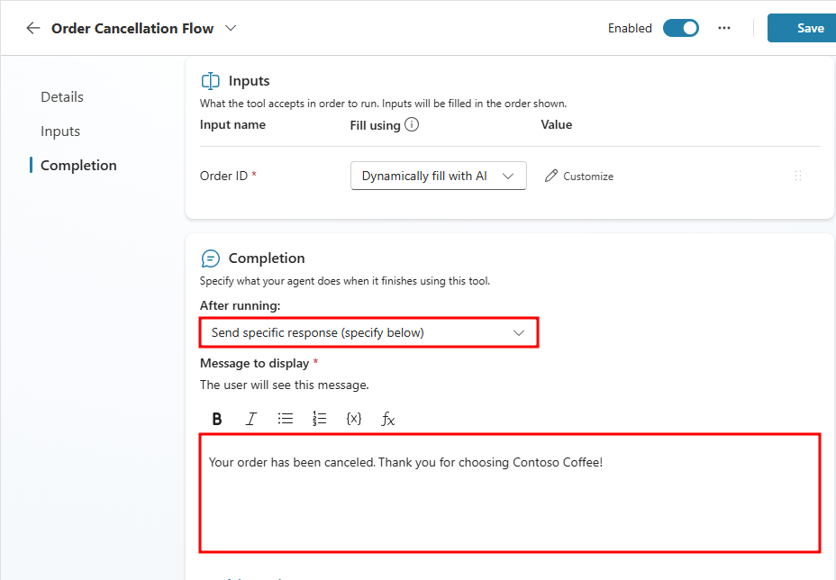

Select the **Save** button in the top-right corner of the flow details to submit these changes. The last thing you need to do now is add the tool to your agent's instructions.

After saving, navigate to your agent's Overview page and add the tool to your instructions. You can do this by inserting a forward slash and choosing the Order Cancellation Flow, then providing an instruction description like **When a user wants to cancel an order, use Order Cancellation Flow** and selecting Save.


> **Note**: To add a tool as dynamic content in the instructions, enter a forward slash / to open the dynamic content window, then select the Order Cancellation Flow.

## Test the flow

Now that your agent has access to the agent flow and knows how to use it, you can test it using the sample data you created earlier when you simulated making machine orders in the Machine Ordering app. This emulates the process end-users would be going through, once they order a machine, a record gets created for that order with an associated Order ID.

First you'll need to get an Order ID from one of the records in the Machine Orders table.

Navigate back to the browser tab that has your Agents in a Day solution opened. If you need to get back there, select the ellipses from the left navigation menu in Copilot Studio and select Solutions at the top.

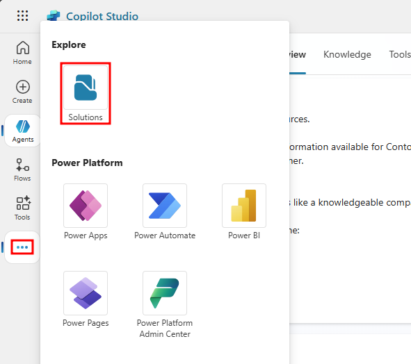

With the Agents in a Day solution opened, navigate to the Machine Orders table so you can see the records that are available to you.

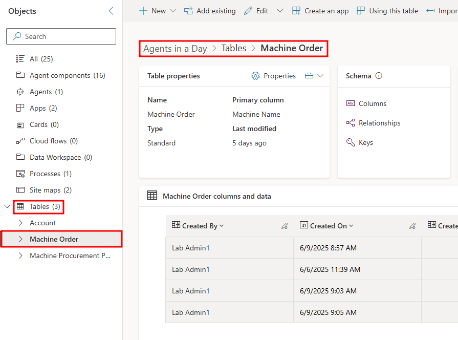

To see the Order ID and Order Status columns in the Machine Order columns and data view, you may need to add them. To do this, select the more v drop-down to the right, and select the Order ID and Order Status columns in the Show existing column menu, then select Save.


Now scroll to the right in the table to see the Order IDs. Choose one of the Order IDs you'll use for testing.

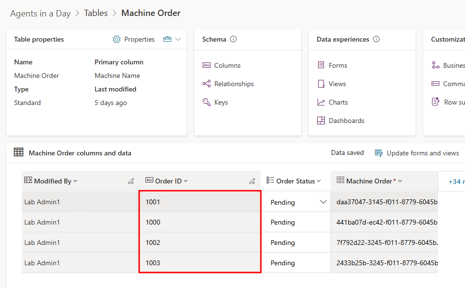

Navigate back to the browser tab with your agent open in Copilot Studio. In the test pane on the right, send a prompt asking to cancel an order like **I'd like to cancel a machine order.**

When the agent asks for the Order ID, provide the Order ID number that you'd like to test.

You should receive the success message you provided in the flow completion details. The activity map will also show the flow as complete with the Order ID input you provided.

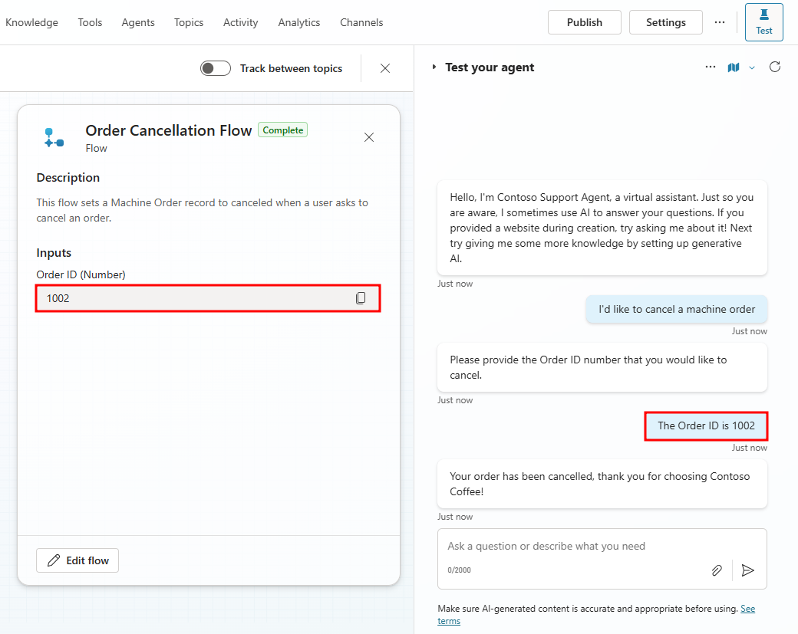

Navigate back to the tab with your Machine Orders table opened in the Agents in a Day solution. The record with the Order ID you provided to the agent should now have an Order Status of Canceled. You may need to refresh the page to see the updated changes.

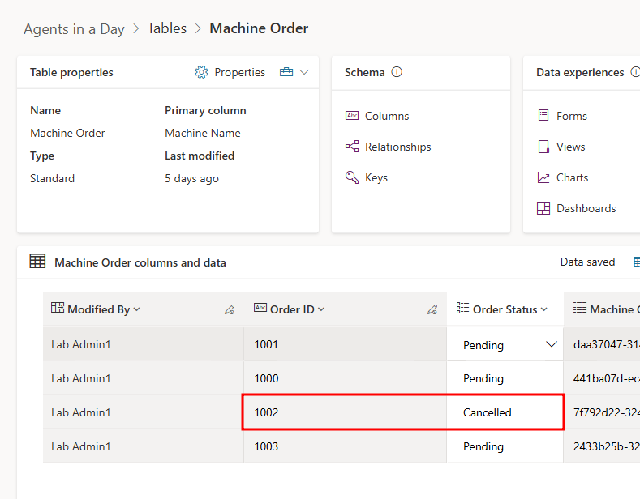

Agent flows bring automation and flexibility to Copilot Studio by allowing your agent to call external logic through Power Automate. In this unit, you created a cancellation workflow that uses a user-provided Order ID to locate and update a record in the Machine Orders table. You learned how to pass input parameters, filter records, apply Power Fx expressions, and define custom responses. With your agent now equipped with this tool, users can interact with it conversationally while triggering sophisticated data operations in the background.

Now that you have a solid grasp of tools and their use in Copilot Studio, in the next module, you'll give your Contoso Support Agent autonomous functionality. Autonomous agents utilize triggers that listen for external events to execute defined tools.

## Next Section

[Continue to Summary →](6-summary.md)
