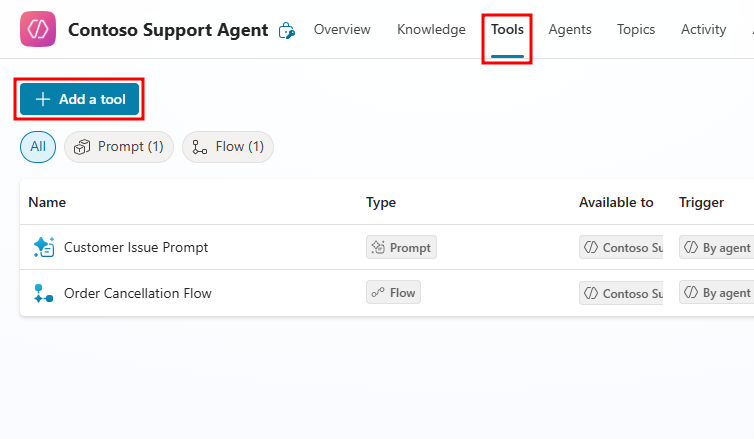
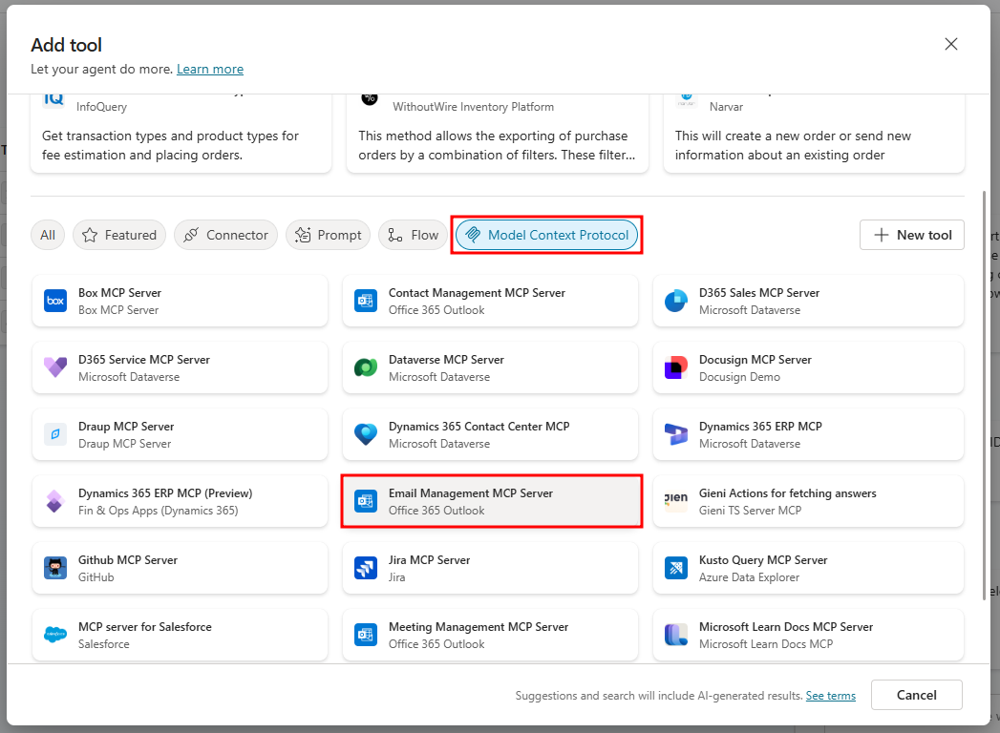
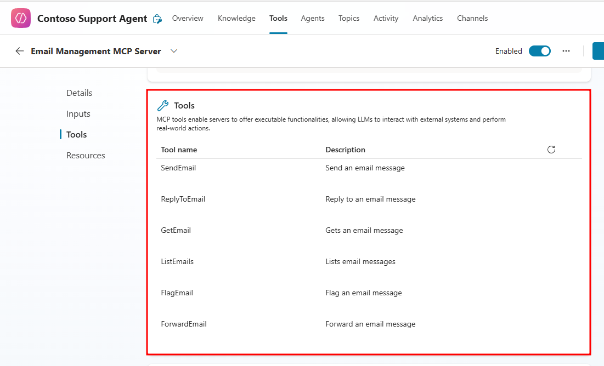
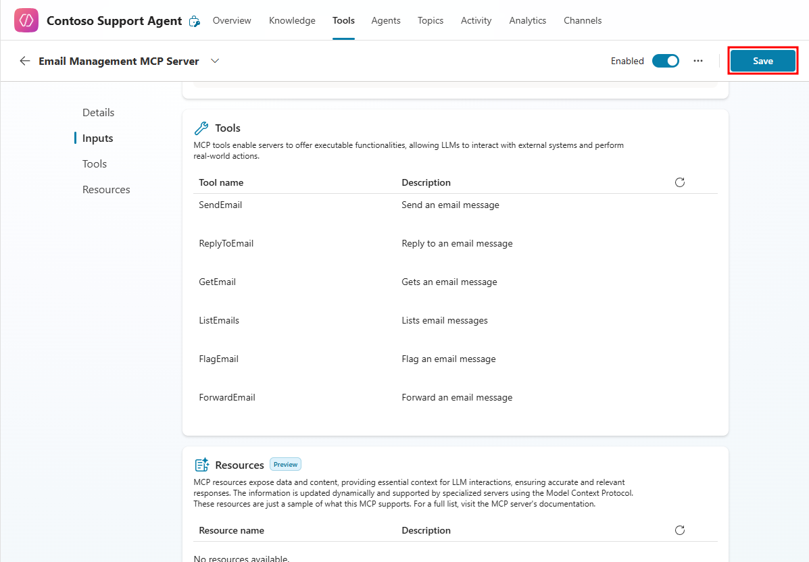
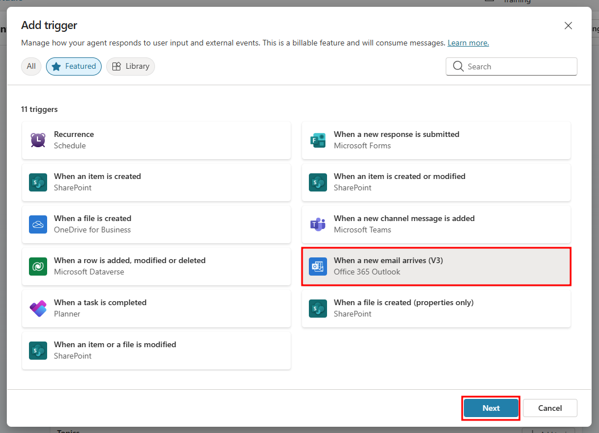
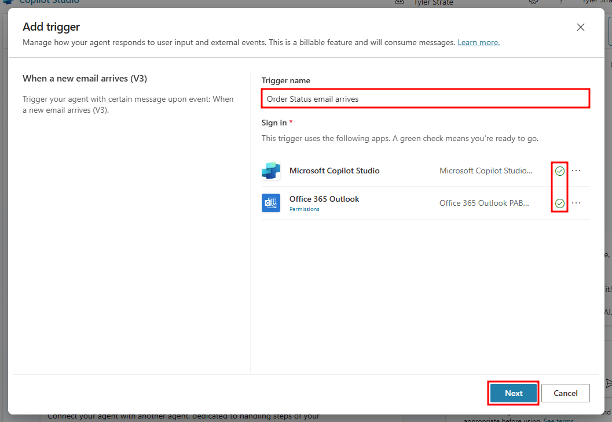
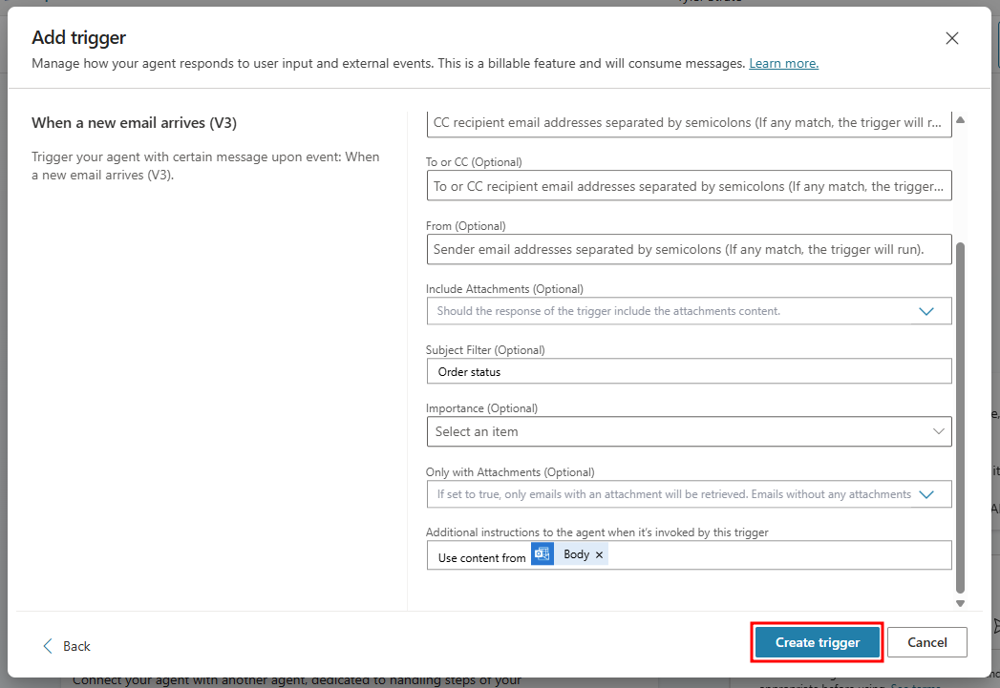
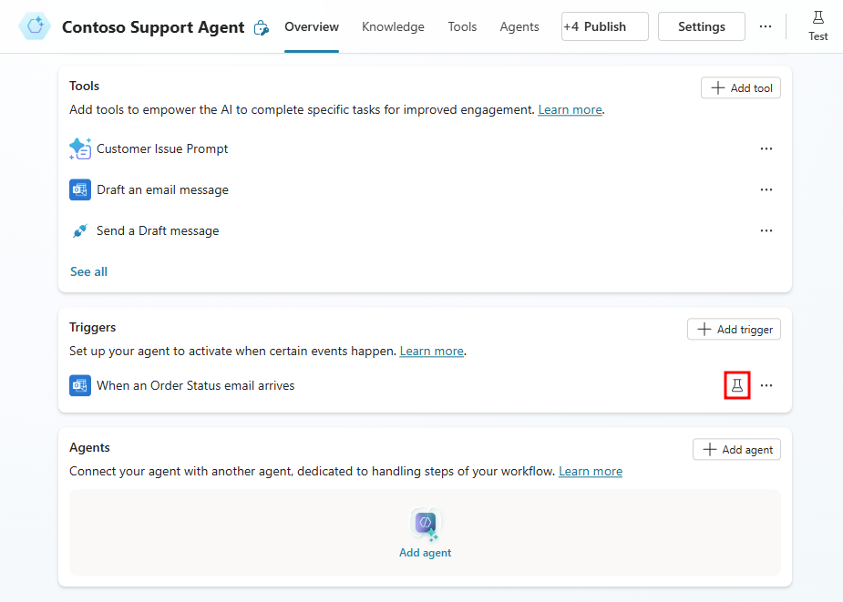
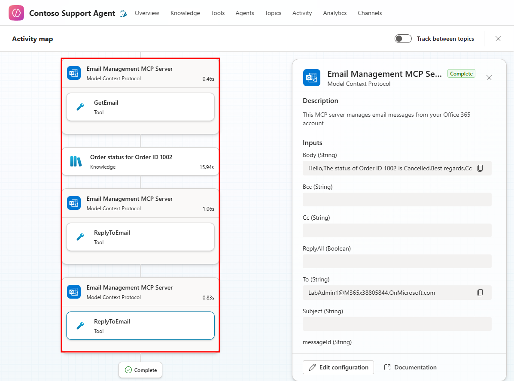
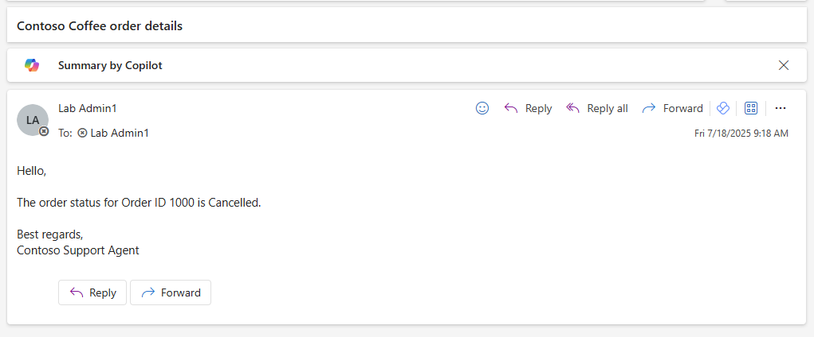

# 2. Make your agent autonomous

For our Contoso Support Agent scenario, we'd like the agent to be able to read and respond to emails from users that ask for the status of a machine they ordered via the machine ordering app.

First, we'll give our agent access to the Outlook Model Context Protocol (MCP) server. We'll then add a trigger to our agent that collects the order information from the received email by monitoring the inbox of our Office 365 Outlook connection and filtering by messages that have an order status subject. This trigger will also instruct the agent to pull the order's record data from our provided Machine Orders knowledge source to tailor the message for the user's machine order.

## Add Outlook MCP

Start by giving your agent access to the Outlook MCP server to enable its usage of Outlook for drafting and sending emails.

From your agent's Tools page, select the + Add a tool button to add a new tool.

In the Add tool window that opens, from the Model Context Protocol tab, choose the Email Management MCP Server connector.

Finally, make sure you create a valid connection for the connector by selecting Create new connection then Create in the Connect to Office 365 Outlook screen. You know it's a valid connection when there's a green checkmark next to it. This is the email that is used for drafting.

After creating and verifying the connection, select Add and configure to further modify the MCP's settings.

In the Email Management MCP Server configuration screen, scroll down to the Additional details section.

Expand the Additional details settings and set the Credentials to use option to Maker-provided credentials.

This setting enables the agent to send emails on-behalf of your email server. Setting this to end-user credentials would interfere with our use-case, as the email should be sending from the Contoso domain, not the end-user.

Next, scroll down to the Tools section of your Email Management MCP Server.

The Office 365 Outlook Email Management MCP Server connects your agent to Microsoft Outlook, enabling it to manage email interactions dynamically.

When added to an agent in Copilot Studio, this server automatically provides a suite of tools that let your agent send, read, and organize email messages directly through Outlook without manual configuration required.

These tools extend the agent's capabilities to perform real-world actions securely within your Microsoft 365 tenant.

### Tools overview

| Tool name    | Description                                                                          | Typical usage                                                                                                                                          |
| ------------ | ------------------------------------------------------------------------------------ | ------------------------------------------------------------------------------------------------------------------------------------------------------ |
| SendEmail    | Sends a new email message.                                                           | Use when your agent needs to initiate an outbound communication—for example, confirming a support case or sending a status update to a customer.       |
| ReplyToEmail | Replies to an existing email thread.                                                 | Enables contextual responses. For instance, your agent can automatically reply to a customer inquiry while keeping the original message thread intact. |
| GetEmail     | Retrieves a single email message by ID or criteria.                                  | Use this when the agent must analyze a specific email. For example, to extract details from a purchase order or identify attachments.                  |
| ListEmails   | Lists multiple email messages that match filters such as folder, sender, or subject. | Allows your agent to scan a mailbox for relevant information, such as all unread support requests or the latest messages from a priority client.       |
| FlagEmail    | Flags or unflags an email message for follow-up.                                     | Helpful for prioritizing or marking messages that require further review by a human agent.                                                             |
| ForwardEmail | Forwards an existing email message to another recipient.                             | Allows your agent to escalate issues automatically. For example, forwarding customer complaints to a supervisor or a specialized support queue.        |

### How these tools work

Each of these MCP tools is powered by the Outlook MCP Server and uses Microsoft Graph API under the hood. When the server is enabled:

- The agent can execute Outlook actions in response to user queries or workflow triggers.
- Contextual information (such as conversation history or customer details from Dataverse) can be used to craft dynamic email content.
- Security and compliance are preserved and actions occur within your organization's Microsoft 365 environment using authenticated service connections.

### Example scenario

**Scenario:** A customer emails your Contoso Support Agent about a delayed shipment.

The Outlook MCP Server tools allow your agent to:

- ListEmails in the "Support Inbox" to locate the message.
- GetEmail to read the order number and customer details.
- ReplyToEmail with a templated response confirming the new estimated delivery date.
- Optionally FlagEmail for a human follow-up if escalation is required.

> **Tip**: You don't need to add each Outlook action manually. When the Email Management MCP Server is added to your agent, all the above tools are included automatically and ready for use in topics, actions, and plugins.

After reviewing the integrated MCP tools, select Save in the top right of the tool editor to save your changes to the tool.

After the connector is added to your agent, it now has all the tools necessary to both draft an email and send it autonomously without help from topics or manual message drafting. This is due to the generative orchestration mode our agent is set to. Now we'll be able to instruct the agent to read the email, draft a response to that email using the email content and our provided knowledge sources, then send that draft to the requested user. In the next steps, we'll add a trigger that monitors an Outlook inbox to ground our drafted emails information on.

## Add an email trigger

For our agent to autonomously know when to use our Outlook MCP server, and from what information it should utilize, it needs a trigger that monitors our Outlook inbox.

From the agent's Overview page, scroll down to the Triggers section and select the + Add trigger button to add a new trigger.

In the Add trigger window that opens, select the When a new email arrives (V3) Office 365 Outlook trigger, then select Next.

Set the trigger's Name to Order Status email arrives, check that your Office 365 Outlook connection is valid and set to the email you'd like to monitor, then select Next.

Now configure the trigger so that it matches our use-case. First, set the Folder field to your email's Inbox. You can select the email folder by selecting the folder icon to the right of the Folder field.

Then, add Order status to the Subject Filter field. This is how your agent knows what emails to take action from, emails that have order status in the subject line.

Now with your trigger configured, it's ready to be added to the agent. Select the Create trigger button to add it to your agent.

Now navigate to the Instructions section from the agent's Overview page and add the following instructions:

When an Order Status email arrives is triggered:

- Collect the Order Status field from the Machine Orders table using the matching Order ID supplied in the triggered email, make sure to include other information related to the order like the Requested By, Price, and Created On fields.
- Use the Email Management MCP Server to reply to the triggering email, informing the user their Order Status and any related fields.

These instructions indicate to the agent that it needs to draft an 'Order Status' email with the content provided from the triggering email. The agent will then pull the Order ID from the triggered email and match this order with the associated record in our Machine Orders knowledge source. After finding the matched record, the agent will draft an email with information on that order's status, and send the email to the requesting user with the MCP server we gave it in the previous steps.

With the help of generative orchestration, our agent is able to autonomously perform all these functions by simply providing access to our various tools, triggers, and knowledge sources then instructing the agent how and when to use them.

## Test the trigger

Now that our tools and trigger are configured and added to our agent, we need to follow some first-run testing. Whenever you add a new trigger, you need to allow the connection to run before it can function autonomously. In the following steps, we'll test our trigger and confirm its connections.

> **Note**: Typically you would publish your agent before testing autonomous functionality, this allows the agent to automatically respond to external events like the email trigger and execute the tool usage you defined in the agent instructions. For the purpose of this course, we'll manually test this functionality by utilizing the trigger test functionality in Copilot Studio. A published agent would automatically respond to the triggered email, but to narrow the scope of our agent's capabilities, we'll keep the agent unpublished.

First, you need to create an event that your trigger is intended to react to. This can be done by simply sending an email with 'Order status' in the subject line and an inquiry in the message asking for the status for a specific Order ID to the monitored inbox. For this lab, we'll simply send an email to yourself in the monitored inbox to test this functionality.

> **Important**: This section requires you to have a machine order record in the Machine Orders table of your Agents in a Day solution. If you didn't create test records during the Agent Creation module, you'll need to play the Machine Ordering canvas app in that solution and order a machine to have an Order ID to test with.

Select the waffle menu in the top-left corner of the Copilot Studio interface and choose Outlook form the list of apps to navigate to the Outlook account of the currently logged-in account.

Select the New mail button in the top-right corner of Outlook.

For the new email, set the To field to your monitored email account, set the Subject to Order status, and in the body of the email enter What's the order status for Order ID. Make sure to add the Order ID of the machine order you'd like to test. Then select Send.

Now that you have a triggering email sent, navigate back to the Overview page of your agent in Copilot Studio.

Scroll down to the Triggers section and select the flask icon to the right of your When an Order Status email arrives trigger to test the trigger.

Select the most recent trigger instance, then choose Start testing to test the trigger. If you don't see a trigger instance, you may need to refresh the page by selecting the refresh button in the top-right of the Test your trigger window.

After you start the test, the agent will pull the order's status with your Dataverse knowledge source and sequentially reply to the requesting user via the Email Management MCP Server. All these steps can be checked and verified within the Activity map that opens to the left of the test pane.

If you navigate back to Outlook, you should see an email sent to you from the agent with the order's status details.

> **Note**: When using a LabAdmin account, the email might be denied. You'll still be able to see the correct email above the replied denial.

By configuring autonomous features in your Contoso Support Agent, you're now equipped with the tools for successfully implementing autonomous features to your own agents.

## Next Section

[Continue to Summary →](5-summary.md)
